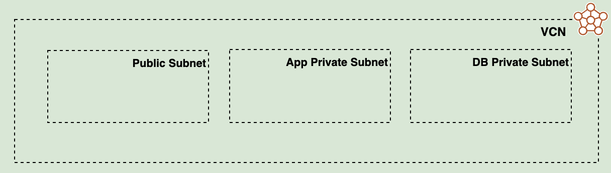
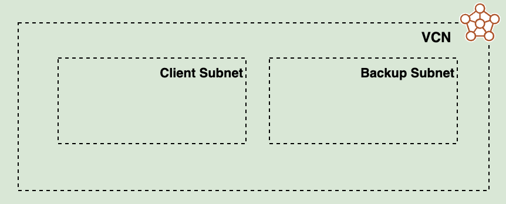

# Table of Contents

1. [Introduction](#introduction)
1. [Considerations](#considerations)
1. [Architecture](#architecture)
1. [Deployment Scenarios](#scenarios)
1. [Ways to Deploy](#ways_to_deploy)
1. [Customizing the Landing Zone](#custom_lz)
1. [Deployment Samples](#samples)

# <a name="introduction"></a>1. Introduction

Customers often ask us about best practices when deploying to OCI and how to automate that deployment for creating a secure tenancy. In response, we have created the OCI CIS Landing Zone Reference Implementation.

This reference implementation (referred to as the **Landing Zone** in the rest of this document) is a blend of CIS (Center for Internet Security) Foundations Benchmark for OCI recommendations with OCI architecture best practices, provided as Terraform code, resulting in an opinionated, configurable, and automated deployment approach for OCI.

The [CIS Oracle Cloud Infrastructure Foundations Benchmark
]( https://www.cisecurity.org/benchmark/oracle_cloud) provides prescriptive guidance when working with OCI as it defines fundamental security principles that do not require any further mapping or refinement. The benchmark recommends: *"Ensure service level admins are created to manage resources of particular service"*, *"Ensure no network security groups allow ingress from 0.0.0.0/0 to port 22"*, *"Ensure Cloud Guard is enabled in the root compartment of the tenancy"*. The benchmark also defines configuration profiles, relating to criticality levels of particular security controls. Version 1.1 of the document defines two configuration profiles: level 1 and level 2. Items in Level 1 intend to be practical and prudent, providing security focused best practice hardening of a technology. Level 2 extends level 1 and is intended for environments where security is more critical than manageability and usability, acting as defense-in-depth measure.

The benchmark document does not include guidance on architectural best practices for OCI, for example: compartment design, network topology, connectivity/routing patterns, lifecycle environments, and how these aspects fit together into a cohesive implementation. The Landing Zone accounts for all these requirements and can be used *as is*, customized or used as a model for other implementations.

Customers do not incur any costs when deploying the Landing Zone and the code is publicly available in GitHub [https://github.com/oracle-quickstart/oci-cis-landingzone-quickstart](https://github.com/oracle-quickstart/oci-cis-landingzone-quickstart) under the Oracle Quick Start project. The main idea behind Landing Zone as a Quick Start is to allow for the fast enablement of security guard rails where workloads can be subsequently deployed safely. Users are not required to have extensive Terraform knowledge to use the Landing Zone *as is* and should be able to deploy it after entering a few configuration variables.

Landing Zone does not provision any resources where workloads are directly executed on, like Compute instances, Databases, Containers, or Functions. Instead, it provides the appropriate placeholders and attachment points for such resources. As a mental model, picture the Landing Zone as an airport, where choppers (workloads) can land safely. For example, the Landing Zone provides the compartment where databases are expected to be created along with the OCI IAM policies and groups that allow database administrators to manage databases. Additionally, it provides the network structures that database administrators should use when provisioning a database, like subnets and NSGs (Network Security Groups). On top of that, Landing Zone configures various OCI services for a strong security posture. 

The Landing Zone team monitors OCI services and evaluates new additions and updates, balancing simplicity and flexibility for providing a secure and well architected tenancy for enterprises in OCI.

# <a name="considerations"></a>2. Considerations

## 2.1 Access Permissions

The Landing Zone can be run as the tenancy administrator (any user that is a member of the Administrators group) or as a user with narrower permissions.

By default, Landing Zone requires tenancy administrator permissions in the tenancy to deploy because it needs to create policies and compartment at the **root** compartment. Depending on a customer’s specific requirements, it also be created in an enclosing compartment up to 5 levels under the **root** compartment with the groups and dynamic groups residing in the **root** compartment. 

If for some reason the user provisioning the Landing Zone does not have tenancy administrator permissions (which is common in proo- of-concept scenarios), the tenancy administrator should provision the required tenancy level resources first. The Landing Zone has a *pre-config* helper module that tenancy administrators can use for such a purpose. Subsequently, the Landing Zone can be provisioned by a user with narrower permissions. For details, see *Deploying Without Full Permissions* in [Deployment Scenarios](#scenarios) section.


## 2.2 Green Field and Brown Field Deployments

The Landing Zone can be used in new OCI tenancies (Green Field) and existing OCI tenancies (Brown Field). To avoid name clashing, the Landing Zone has a configuration variable called *service_label* that is prefixed to the name for all provisioned resources. 

For a Green Field OCI tenancy deploying becomes a matter of provisioning the Landing Zone and then adding any other resources on top of it. This is the simplest deployment scenario. 

One option for Brown Field OCI tenancy is to deploy the Landing Zone and then existing resources can be manually moved to Landing Zone compartments, which makes them automatically subject to Landing Zone segregation of duties implementation.  Another is to deploy the Landing Zone alongside the existing workload(s) and use the Landing Zone for new workloads.  

As we will see in the next section, the Landing Zone can provision different network topologies. However, some customers may want to bring in their own VCN (Virtual Cloud Network) and this may disrupt Landing Zone network architecture principles, as best practices may have not been followed. These pre-existing VCNs can be moved to Landing Zone Network compartment. In this case, a thorough review of routing and security rules is required for ensuring connectivity paths are properly secured.

An existing DRG can be brought into Landing Zone just by supplying its OCID to *existing_drg_id* configuration variable. This is useful for customers who already have setup connectivity to their on-premises network via FastConnect or Site-to-Site IPSec VPN.

Routing rules or network security rules required by specific workloads are handled by customizing the Landing Zone configuration (*config/net_vcn.tf* and *config/net_nsgs.tf*).

## 2.3 Networking

The Landing Zone can provision a variety of network topologies to meet the needs of different organizations.  While many resources in Landing Zone including networking can easily be updated by changing variables, these changes may cause a resource like a VCN (Virtual Cloud Network) or a subnet to be destroyed.  However, these resources cannot be destroyed if they contain resources in them, like Compute instances or databases. Due to this, it is recommended to consider the following areas before you begin your deployment:

1. Type of Workload
1. Number of Workloads
1. Network Security between Workloads
1. Connectivity to the Internet
1. Connectivity to the organization's corporate network

### Type of Workload
The Landing Zone supports two workload types: a Three-tier Web Application and Exadata Cloud Service (ExaCS). 

#### **3-tier Application**


A Three-tier application is a type of multitier application. The three tiers are commonly defined as the presentation tier, the application processing tier and the data management tier. Each of the tiers is segmented into a network subnet to isolate them from one another.  In the Landing Zone, the three subnets are as follows: the presentation tier is the `Web Subnet`, the application presentation tier is the `App subnet` and the data management tier is the `DB Subnet`.  

#### **Exadata Cloud Service**


Exadata Cloud Service allows you to leverage the power of Exadata in the cloud. Exadata Cloud Service systems integrate Oracle's Exadata Database Machine hardware with the networking resources needed to securely connect to your organization’s on-premise network and to other services in the Oracle cloud. 

Exadata Cloud Service instances require a VCN with at least two subnets in the VCN. The two subnets required are the *Client* subnet and the *Backup* subnet.

## 2.4 Managing State
When working with Terraform, a key consideration is how to manage state. Terraform works by reconciling differences between the desired state of the infrastructure with the actual state of infrastructure. The desired state is expressed in the configuration files (the *.tf* files), while the actual state is managed by Terraform, typically expressed in *terraform.tfstate* file.

There are a few crucial aspects to consider when managing state:

- **Terraform state must be protected against unintentional changes**: as stated in [https://learn.hashicorp.com/tutorials/terraform/refresh]( https://learn.hashicorp.com/tutorials/terraform/refresh), *"Terraform relies on the contents of your workspace's state file to generate an execution plan to make changes to your resources. To ensure the accuracy of the proposed changes, your state file must be up to date."*. Terraform state is readable text. Unless you have 100% confidence in what you are doing, do not update state manually. Let Terraform manage it or use [Terraform CLI state management commands](https://www.terraform.io/cli/commands/state) if you absolutely need to make a manual change.

    Terraform automatically backs up the state file in *terraform.tfstate.backup* in the same folder as *terraform.tfstate*. Use that in case you cannot recover from a corrupted or lost *terraform.tfstate*.

- **One state tracks one and only one configuration**: when you provision a Landing Zone environment with one set of configuration variables, Terraform manages that infrastructure in one state file. It is normal and expected to change variable values over time. Terraform would simply update your infrastructure accordingly and those changes are reflected in the state file. **Do Not** manage a new Landing Zone environment in a new region using the same configuration by simply changing the region variable and running it. That would destroy the previous environment because there is a single state file. 

- **To manage different environments with the same Terraform configuration:**
    
    You have two options:
    -	Via Terraform CLI, use [Terraform workspaces](https://www.terraform.io/language/state/workspaces). 
    -	Via OCI Resource Manager, create a separate Stack for each Landing Zone environment.


- **Terraform may overwrite changes made via other means to its managed resources**: when you provision infrastructure resources with Terraform, it is expected that those resources are going to be managed via Terraform. However, there are situations where quick changes are made outside Terraform, like via the OCI Console. If you resume using Terraform later, those changes will be detected and Terraform will inform you that those changes will be overwritten. You can either accept that or import those resource changes into the state file. Terraform can import existing resources into the state, but it does not generate configuration. Therefore, before importing existing resources, it is necessary to manually add the imported resources into the configuration files. This approach is recommended for advanced users only and is out of the scope of this document.

> **_NOTE:_** one common pattern is using the Landing Zone template to get a tenancy bootstrapped securely and subsequently use different means to manage the resources. This pattern is prevalent in organizations who are still maturing their Infrastructure as Code practices or in proof-of-concept scenarios.

- **Source-controlling state is risky**: when working in a team environment, it's tempting to source control the state file along with the *.tf* files. Resist this temptation. Terraform state can contain sensitive information and working against the same version of the state file is challenging, as there maybe parallel work occurring at any point in time. The recommended approach is using a remote backend with state locking (which is out-of-box available in OCI Resource Manager).


# <a name="architecture"></a>3. Architecture

The Landing Zone architecture starts with a compartment design for the tenancy along with OCI IAM user groups and OCI IAM policies for segregation of duties. Landing Zone compartments may also be deployed within a designated enclosing (parent) compartment. Each Landing Zone compartment is assigned a group with the appropriate permissions for managing resources in the compartment and for accessing required resources in other compartments.

> **_NOTE:_** using an enclosing compartment reduces the blast radius of the IAM Administrator group to the enclosing compartment.

The Landing Zone can provision one or more VCNs, either in standalone mode or as constituent parts of a Hub & Spoke architecture. The VCNs can either follow a general-purpose standard n-tier network topology or oriented towards specific topologies, like supporting Oracle Database Exadata Cloud Service deployments. VCNs are automatically configured with the necessary routing and with the necessary inbound and outbound interfaces properly secured.

The Landing Zone includes multiple pre-configured security services that can be deployed in tandem with the overall architecture for a stronger security posture. These services are *Oracle Cloud Guard*, *Flow Logs*, *Service Connector Hub*, *Vault*, *Vulnerability Scanning*, and *Bastion*. 

From a governance perspective, *Notifications* and *Alarms* are setup to use *Topics* and *Events* for alerting administrators about changes and exceeded metric thresholds for deployed resources. The Landing Zone provisions tag defaults to automatically determine resource owner and creation timestamp. Based on user choice, a foundational *Budget* for cost tracking purposes can be created as well.

As an important aspect to governance, logging is also considered by the Landing Zone. Per CIS Oracle Cloud Infrastructure Benchmark, VCN flow logs and Object Storage logging are enabled by default. Landing Zone takes a step forward and, upon user choice, uses Service Connector Hub service to consolidate OCI log sources into a single designated target, which is an Object Storage bucket by default but can also be an OCI Stream or an OCI Function. Such feature makes it easier for making OCI logs available in 3rd-party SIEM solutions, like Splunk.

The diagrams below shows Landing Zone overall architecture: 

**With Simple Networking**


**With Hub & Spoke Networking**


## 3.1 Identity & Access Management (IAM) Configuration

The Landing Zone’s IAM model seeks to enforce segregation of duties and the least privilege principle, by defining compartments, policies, groups and dynamic groups. Existing users can be optionally added to groups, but are not created. The segregation of duties concept is implemented by granting groups *manage* permissions over specific resources on specific compartments. At the same time, other groups are entitled narrower permissions on those same resources. For instance, network administrators are granted *manage* permission over the networking resources in the *Network* compartment. Other groups, like database administrators, are granted *read* permission on *virtual-network-family* in the *Network* compartment and *use* permission on *vnics*, *subnets* and *network-security-groups*, so the databases they provision can make proper use of the network.

### Compartments

At least four compartments are provisioned:

- **Security**: holds security resources that are primarily managed by security administrators. Services and resources include Cloud Guard, Vaults, Keys, Vulnerability Scanning, Bastion, and Service Connector Hub.

- **Network**: holds network resources that are primarily managed by network administrators. Services include VCN (Virtual Cloud Network) and DRG (Dynamic Routing Gateway).

- **AppDev**: designed to hold services oriented for the application portion of workloads that are primarily managed by application administrators. Services include Compute instances, Storage, Functions, and Kubernetes clusters.

- **Database**: designed to hold database services that are primarily managed by database administrators.

Two extra compartments can be provisioned based on user choice:

- **Exainfra**: designed to hold Exadata infrastructure resources that are primarily managed by Exadata administrators. It is recommended for customers where Exadata infrastructure and databases are managed by different groups.

- **Enclosing compartment**: designed to enclose the aforementioned compartments in a single top compartment. When deploying as a non administrator, an enclosing compartment is mandatory.

### Groups

By default, the Landing Zone defines the following personas that account for most organization needs:

- **IAM Administrators**: manage IAM services and resources including compartments, groups, dynamic groups, policies, identity providers, authentication policies, network sources, tag defaults. However, this group is not allowed to manage the out-of-box *Administrators* and *Credential Administrators* groups. It's also not allowed to touch the out-of-box *Tenancy Admin Policy* policy.
- **Credential Administrators**: manage users capabilities and users credentials in general, including API keys, authentication tokens and secret keys.
- **Cost Administrators**: manage budgets and usage reports.
- **Auditors**: entitled with read-only access across the tenancy and the ability to use cloud-shell to run the *cis_reports.py* script. 
- **Announcement Readers**: for reading announcements displayed in OCI Console.
- **Security Administrators**: manage security services and resources including Vaults, Keys, Logging, Vulnerability Scanning, Web Application Firewall, Bastion, Service Connector Hub.
- **Network Administrators**: manage OCI network family, including VCNs, Load Balancers, DRGs, VNICs, IP addresses.
- **Application Administrators**: manage application related resources including Compute images, OCI Functions, Kubernetes clusters, Streams, Object Storage, Block Storage, File Storage.
- **Database Administrators**: manage database services, including Oracle VMDB (Virtual Machine), BMDB (Bare Metal), ADB (Autonomous databases), Exadata databases, MySQL, NoSQL, etc. 
- **ExaCS Administrators** (only created when ExaCS compartment is created): manage Exadata infrastructure and VM clusters in the ExaCS compartment.
- **Storage Administrators**: the only group allowed to delete storage resources, including buckets, volumes and files. Used as a protection measure against inadvertent deletion of storage resources.

> **_NOTE:_** following least privilege principle, groups are only entitled to manage, use, read or inspect the necessary resources to fulfill their duties.

### Dynamic Groups

The Landing Zone defines four dynamic groups to satisfy common needs of workloads that are eventually deployed:

- **Security Functions**: to be used by functions defined in the Security compartment. The matching rule includes all functions in the Security compartment. An example is a function for rotating secrets kept in a Vault.
- **AppDev Functions**: to be used by functions defined in the AppDev compartment. The matching rule includes all functions in the AppDev compartment. An example is a function for processing of application data and writing it to an Object Storage bucket.
- **Compute Agent**: to be used by Compute's management agent in the AppDev compartment.
- **Database KMS**: to be used by databases in the Database compartment to access keys in the Vault service.

### Policies

The Landing Zone policies implement segregation of duties and follow least privilege across the different personas (groups). Segregation of duties is implemented by granting specific permissions to a single target group on a single target compartment. For example, only *Network Administrators* can manage the network family, and this is done only in the *Network* compartment. Only *Database Administrators* can manage databases, and this is done only in the *Database* compartment. Least privilege is followed when deploying a database, *Database Administrators* are entitled to use the network managed by *Network Administrators* in the *Network* compartment. Some policies are common to all groups, like the ability to use Cloud Shell in tenancy and to manage Resource Manager stacks in their specific compartments. The policy list is extensive, comprehensive, and human-readable. We recommend reviewing *config/iam_policies.tf* for additional details.  

Policies are attached at different compartments depending on the presence of an enclosing compartment. If Landing Zone compartments are deployed directly under the Root compartment (thus no enclosing compartment), all policies are attached to the Root compartment. If Landing Zone compartments are deployed within an enclosing compartment, some policies are attached to the Root compartment, while some are attached to the enclosing compartment itself. This is to allow for free movement of Landing Zone compartments without the need to change policy statements. The policies at Root compartment are applied to resources at the tenancy level.

In OCI, services also need to be explicitly granted. The Landing Zone provisions policies authorizing Cloud Guard, Vulnerability Scanning Service and OS Management Service the necessary actions for their functioning. We recommend reviewing *config/iam_service_policies.tf* for additional details.


## 3.2 Network Configuration

The Landing Zone supports a variety of networking models:

- **Standard Three-tier Web Application VCN**: three subnets are provisioned, one to host load balancers and bastion hosts, one for application servers (middle-tiers) and one for database servers. The load balancer subnet can be made either public or private. The application servers' and database servers' are always created private. Route rules and network security rules are configured based on provided connectivity settings.

- **Exadata Cloud Service (ExaCS) VCN**: two private subnets are provisioned, according to ExaCS requirements. One subnet for the Exadata client (the database itself) and one for database backups. Route rules and network security rules are configured based on ExaCS requirements and provided connectivity settings.

Regardless the networking model, VCNs can be deployed standalone or all connected via OCI DRG V2 service in a Hub & Spoke topology. When deploying Hub & Spoke, either a DMZ VCN can be provisioned or the DRG itself used as the hub. The DMZ VCN can be configured for firewall deployments and OCI security partners have developed [Landing Zone ready Terraform configurations](https://blogs.oracle.com/cloud-infrastructure/post/adding-our-security-partners-to-a-cis-oci-landing-zone).

The VCNs can also be configured with no Internet connectivity or for on-premises connectivity. Inbound access to the SSH port from 0.0.0.0/0 IP range is strictly prohibited.

Due to very nature of Terraform, it is possible to add, modify and delete VCNs.

Landing Zone allows for switching back and forth between standalone and Hub & Spoke, however it is recommended to plan for a specific design, as manual actions might be needed when switching.

## 3.3 Governance

The strong governance framework established by Landing Zone IAM foundation is complemented by monitoring, cost tracking and resources tagging capabilities.

### Monitoring

CIS OCI Foundations Benchmark strongly focuses on monitoring. It's very important to start with a strong monitoring foundation and make appropriate personel aware of changes in the infrastructure. The Landing Zone implements the Benchmark recommendations through a notifications framework that sends notifications to email endpoints upon infrastructure changes. This framework is 100% enabled by OCI Events and Notifications services. When an event happens (like an update to a policy), a message is sent to a topic and topic subscribers receive a notification. In Landing Zone, subscribers are email endpoints, that must be provided for IAM and network events, as mandated by CIS Benchmark. IAM events are always monitored in the home region and at the Root compartment level. Network events are regional and monitored at the Root compartment level.

Landing Zone extends events monitoring with operational metrics and alarms provided by OCI Monitoring service. Landing Zone queries specific metrics and sends alarms to a topic if the query condition is satisfied. Topic subscribers receive a notification. This model allows for capturing resource level occurrences like excessive CPU/memory/storage consumption, FastConnect channel down/up events,  Exadata infrastructure events, and others.    

As mandated by CIS Benchmark, Landing Zone also enables VCN flow logs to all provisioned subnets and Object Storage logging for write operations.

Last, but not least, Landing Zone uses OCI Service Connector Hub to consolidate logs from different sources, including VCN flow logs and Audit logs. This is extremely helpful when making OCI logs available to 3rd-party SIEM (Security Information and Event Management) or SOAR (Security Orchestration and Response) solutions. OCI Service Connector Hub can aggregate OCI logs in Object Storage, send them to an OCI Stream or to an OCI Function. By default, the Landing Zone uses Object Storage as the destination. 

### Cost Tracking

The resources created by the Landing Zone are free of charge, costs nothing to our customers. If there's a possibility of cost, Landing Zone does not enable the resource by default, leaving it as an option. This is the case of Service Connector Hub, for instance, as customers may incur in costs if large amounts of logs are sent to an Object Storage bucket. For this reason, Service Connector Hub has to be explicitly enabled by Landing Zone users.

After setting the basic foundation with Landing Zone, customers deploy their workloads, by creating cost consuming resources, like Compute instances, databases, storage. For avoiding surprises with costs, Landing Zone allows for the creation of a basic budget that notifies a provided email address if a forecasted spending reaches a specific threshold. If an enclosing compartment is deployed, the budget is created at that level, otherwise it is created at the Root compartment.

### Resources Tagging

Resources tagging is an important component of a governance framework, as it allows for the establishment of a fine-grained resource identification mechanism, regardless of the resource compartment. In OCI, this enables two critical aspects: cost tracking and tag-based policies.

Landing Zone implements three facets of resources tagging:

- **Tag Defaults**: Landing Zone provisions *CreatedBy* (who) and *CreatedOn* (when) tag defaults in a brand new tag namespace if the *Oracle-Tags* namespace is not available in the tenancy. Tag defaults allow for automatic tagging on any subsequently deployed resources. This is mandated by CIS Foundations Benchmark and it is extremely useful for identifying who created a particular resource and when.
- **Landing Zone tag**: Landing Zone uses a freeform tag to tag all provisioned resources with the simple objective of identifying them as Landing Zone resources.
- **Customer-defined tags**: Customers can also tag Landing Zone resources as they wish, either via defined tags or freeform tags. Defined tags imply the creation of a tag namespace, while freeform tags do not. This is the approach that customers take when aiming for tag-based policies and cost tracking. As Landing Zone cannot predict namespaces and tag names, custom tags are considered a customization. Check [Customizing Landing Zone](#custom_lz) section for a complete example.

# <a name="scenarios"></a>4. Deployment Scenarios

In this section we describe the main deployment scenarios for the Landing Zone and how to implement them. 

## 4.1 Identity & Access Management

### Using an Enclosing Compartment

By default, the Landing Zone compartments are deployed in the tenancy root compartment. In such case, all Landing Zone policies are attached to the root compartment. This behavior is changed by the following configuration variables:

- **use_enclosing_compartment**: a boolean flag indicating whether or not to provision the Landing Zone within an enclosing compartment other than the root compartment. When provisioning the Landing Zone as a narrower-permissioned user, it must be set to true.

- **existing_enclosing_compartment_ocid**: The OCID of a pre-existing enclosing compartment where Landing Zone compartments are to be created. If *use_enclosing_compartment* is false, the module creates the Landing Zone compartments in the root compartment as long as the executing user has the required permissions. If *use_enclosing_compartment* is true, but *existing_enclosing_compartment_ocid* is not set, a default enclosing compartment is created under the root compartment with the name *<service_label>-top-cmp*.

If an enclosing compartment is deployed, Landing Zone policies that are not required to be attached at root compartment are attached to the enclosing compartment. This allows the enclosing compartment to be later moved anywhere in the compartments hierarchy without any policy changes.

### Reusing Existing Groups and Dynamic Groups

By default, the Landing Zone provisions groups and dynamic groups. These groups are assigned various grants in Landing Zone policies. However, some circumstances may require the reuse of existing groups and dynamic groups, as in:
- customers who already have defined their groups;
- customers who work with federated groups;
- when Landing Zone deployers do not have permissions to create groups; 
- when granting multiple Landing Zone compartments ownership to the same group: this is especially useful when creating distinct Landing Zones for multiple lifecycle compartments (Dev/Test/Prod), but requiring the same groups to manage them. In this case, you provision the Landing Zone three times, one for each environment. In the first run, all groups are created. In the next two, groups are reused and granted the appropriate permissions over the environment compartments. If a different set of groups is required for each environment, simply do not reuse existing groups, letting new groups to be provisioned. 
    
In these cases, simply provide the existing OCI group names to the appropriate configuration variables and they are reused in Landing Zone policies. Here are the variable names:

#### Groups

- **existing_iam_admin_group_name**: the name of an existing group for IAM administrators.
- **existing_cred_admin_group_name**: the name of an existing group for credential administrators.
- **existing_security_admin_group_name**: the name of an existing group for security administrators.
- **existing_network_admin_group_name**: the name of an existing group for network administrators.
- **existing_appdev_admin_group_name**: the name of an existing group for application development administrators.
- **existing_database_admin_group_name**: the name of an existing group for database administrators.
- **existing_cost_admin_group_name**: the name of an existing group for cost management administrators.
- **existing_auditor_group_name**: the name of an existing group for auditors.
- **existing_announcement_reader_group_name**: the name of an existing group for announcement readers.

#### Dynamic Groups

- **existing_security_fun_dyn_group_name**: existing dynamic group for calling functions in the Security compartment.
- **existing_appdev_fun_dyn_group_name**: existing dynamic group for calling functions in the AppDev compartment.
- **existing_compute_agent_dyn_group_name**: existing dynamic group for Compute management agent access.
- **existing_database_kms_dyn_group_name**: existing dynamic group for databases to access OCI KMS Keys.

### Custom Group Names

By default, the group names are following the convention `${var.service_label}-group_name` using the `service-label` defined in the `tfvars` file. When a different naming convention should be used, for example, to match an established naming convention, these names can be customized using the Terraform Override technique.

The supported variables are:
- **custom_iam_admin_group_name**
- **custom_cred_admin_group_name**
- **custom_cost_admin_group_name**
- **custom_auditor_group_name**
- **custom_announcement_reader_group_name**
- **custom_network_admin_group_name**
- **custom_security_admin_group_name**
- **custom_appdev_admin_group_name**
- **custom_database_admin_group_name**
- **custom_exainfra_admin_group_name**
- **custom_storage_admin_group_name**

For an example see [Example 4: Using Custom Group Names](#example-4-using-custom-group-names)

### Extending Landing Zone to a New Region

When you run Landing Zone's Terraform, some resources are created in the home region, while others are created in a region of choice. Among home region resources are compartments, groups, dynamic groups, policies, tag defaults and an infrastructure for IAM related notifications (including events, topics and subscriptions). Among resources created in the region of choice are VCNs, Log Groups, and those pertaining to security services like Vault Service, Vulnerability Scanning, Service Connector Hub, Bastion. The home region resources are automatically made available by OCI in all subscribed regions.

Some customers want to extend their Landing Zone to more than one region of choice, while reusing the home region resources. One typical use case is setting up a second region of choice for disaster recovery, reusing the same home region Landing Zone resources. A more broad use case is implementing a single global Landing Zone across all subscribed regions. The configuration variable controlling this Landing Zone behavior is self explanatory:

- **extend_landing_zone_to_new_region**: whether Landing Zone is being extended to a new region. When set to true, compartments, groups, dynamic groups, policies and resources pertaining to home region are not provisioned.

> **_NOTE:_** when extending the Landing Zone, the Terraform code has to be deployed in a new region. Therefore, a distinct set of configuration variables is needed. If using Terraform CLI, use Terraform workspaces. If using OCI Resource Manager, use a separate Stack. Check [Ways to Deploy](#ways_to_deploy) section for more details. 

## 4.2 Networking
### Standard Three-tier Web Application VCNs

By default, the Landing Zone provisions a single VCN that is suited for the deployment of a three-tier web application. The VCN is made of a public subnet and two private subnets. The public subnet ("web") is home for load balancers and bastion hosts. As for the private subnets, one is for middle-tiers ("app") and the other for databases ("db"). The VCN CIDR (Classless Inter-Domain Routing) range defaults to 10.0.0.0/20 and the subnets CIDR ranges are calculated by adding 4 bits to the CIDR's network mask (the number after the "/", a.k.a the CIDR prefix). The web, app and db subnets are thus assigned CIDRs 10.0.0.0/24, 10.0.1.0/24 and 10.0.2.0/24, respectively. 

This behavior can be completely overriden through the following variables:

- **vcn_cidrs**: required, determines the VCNs CIDR ranges, where one CIDR corresponds to one VCN. If multiple CIDRs per VCN are needed, skip to [Customizing Landing Zone Networking](#network_customization).
- **subnets_names**: optional, determines the number and names of subnets in the VCNs defined by **vcn_cidrs**. Note that the first subnet element is assumed to be public. If that is required to be private, set variable **no_internet_access** to true.
- **subnets_sizes**: optional, determines the CIDRs of the subnets defined by **subnet_names**. Each element is the number of bits added to the **vcn_cidrs** network portion for that subnet. There must be one element to each element in **subnets_names**, where the *nth* element in **subnets_sizes** matches the *nth* element in **subnet_names**.

> **_NOTE:_** by default, Landing Zone creates VCNs with an auto-generated name formed as *service-label*-*index*-vcn, where *service-label* is the value assigned to *service-label* variable and *index* is the CIDR range position within **vcn-cidrs** variable. In order to override these names, use the **vcn_names** variable, where its *nth* element matches the *nth* element of **vcn_cidrs**. For a single VCN, simply provide the desired VCN name to the **vcn_names** variable.

Deploying multiple three-tier VCNs is straighforward: simply provide multiple CIDR ranges to **vcn_cidrs** variable. Each CIDR range defines one VCN. All VCNs are created equal, according to the values given to **subnet_names** and **subnets_sizes**. Also note that the VCNs are not peered. For peering the VCNs, have them in a Hub & Spoke topology, as described in *Hub & Spoke Topology*.

### Exadata Cloud Service VCNs

Exadata Cloud Service (ExaCS) has particular networking requirements. As such, Landing Zone manages ExaCS networking separately. 

The VCN(s) created for ExaCS are comprised of two regional private subnets, *client* and *backup*. All routing and security rules are configured in tandem with the overall Landing Zone setup. Landing Zone creates all required rules for ICMP, SQLNet, ONS (Oracle Notification Service) and SSH connectivity.

Landing Zone defines the following input variables for ExaCS configuration:

- **exacs_vcn_cidrs**: required, list of CIDR ranges to be used when creating the VCNs. Each CIDR range indicates the creation of one VCN. Make sure they do not overlap with 192.168.128.0/20.
- **exacs_vcn_names**: optional, list of VCN names that override the default names. Each name applies to one VCN, the *nth* element corresponding to **exa_vcn_cidrs**' *nth* element.
- **exacs_client_subnet_cidrs** : optional, list of CIDR ranges for the *client* subnets. Each CIDR range applies to one VCN, the *nth* element corresponding to **exa_vcn_cidrs**' *nth* element.
- **exacs_backup_subnet_cidrs**: optional, list of CIDR ranges for the *backup* subnets. Each CIDR range applies to one VCN, the *nth* element corresponding to **exa_vcn_cidrs**' *nth* element.

If **exacs_client_subnet_cidrs** and **exacs_backup_subnet_cidrs** are not provided, the Landing Zone calculates the subnets CIDR ranges by adding 4 bits to the network mask (a.k.a the CIDR prefix) and 1 (one) to populate the net number, representing the bits added to prefix, starting with the client subnet. For a VCN CIDR range of 10.0.0.0/20, the client subnet CIDR range would be 10.0.0.0/24, while the backup subnet CIDR would be 10.0.1.0/24. Landing Zone accomplishes this using the [cidrsubnet built-in Terraform function](https://www.terraform.io/docs/language/functions/cidrsubnet.html).

For deploying multiple ExaCS networks, simply provide multiple CIDR ranges to **exacs_vcn_cidrs** variable and optionally assign values to **exacs_vcn_names**, **exacs_client_subnet_cidrs** and **exacs_backup_subnet_cidrs**.

For more details, see [How to Deploy OCI Secure Landing Zone for Exadata Cloud Service](https://www.ateam-oracle.com/post/how-to-deploy-oci-secure-landing-zone-for-exadata-cloud-service).

### Hub & Spoke Topology

Landing Zone VCNs can be deployed in a Hub & Spoke topology. Multiple spokes can be connected via a single peering connection to a central Hub VCN. This deployment type is particularly prevalent in organizations that require packet inspection firewall appliances to monitor incoming external traffic (North/South) and/or traffic across the spoke VCNs (East/West). The peering is implemented via DRG (Dynamic Routing Gateway) v2, that can peer VCNs in same or different regions. The DRG can either be provisioned by Landing Zone or an existing DRG can be taken. This is important to customers that have already set connectivitity to their on-premises network. The Hub VCN is also referred as the DMZ VCN, as it is typically the entry point to the spoke VCNs for requests originating from untrusted perimeters, like the Internet. Note, however, that a DMZ VCN is not required in this topology, as the DRG itself can act as the Hub. The Hub & Spoke topology is governed by these input variables:

- **hub_spoke_architecture**: when set to true, the spokes VCNs are peered via a DRG, that is either provisioned or reused.
- **existing_drg_id**: the OCID of an existing DRG. If provided, the existing DRG is used to peer the spoke VCNs. Otherwise, a brand new DRG is provisioned. If no **dmz_vcn_cidr** is provided, the DRG itself acts as the hub.
- **dmz_vcn_cidr**: if provided, a DMZ (Hub) VCN is provisioned with the given CIDR range and all traffic is routed through this VCN.
- **dmz_for_firewall**: determines is the DMZ VCN will be used for deploying 3rd-party firewalls, in which case DRG attachments are not created.
- **dmz_number_of_subnets**: major firewall appliances have different requirements regarding the number of subnets to deploy. Check the vendor's documentation or OCI reference architecture to determine the number of subnets required.
- **dmz_subnet_size**: the number of bits with which to extend the DMZ VCN CIDR prefix. For instance, if **dmz_vcn_cidr**'s prefix is 20 (/20) and **dmz_subnet_size** is 4, subnets are going to be /24.

### Deploying a DMZ VCN for Firewall Appliances

When deploying the Landing Zone with the intent of deploying network firewalls later, DRG attachments are not created for any of the VCNs (Virtual Cloud Network) because this is done by the security partner. Their configuration will create the DRG attachments for the VCNs and route the traffic through the firewall appliance, creating a choke point. The only routing the Landing Zone will do is the spoke VCN routing. This choke point will be used to monitor traffic in and out of OCI as well as between VCN spokes. Each partner requires a different number of subnets in the DMZ VCN. Use the below chart to determine how many subnets you will need in your DMZ VCN:

Security Partner   | Number of Subnets 
-------------------|-------------------
Check Point        |         2         
Cisco              |         5         
Fortinet           |         4         
Palo Alto Networks |         4         

Besides the variables described in the previous section, adding a firewall appliance requires an extra variable:

- **dmz_for_firewall**: determines if the DMZ VCN will be used for deploying 3rd party firewalls. When set to true, DRG attachments are not created.

### Multiple Three-tier Web Application VCNs with Multiple Exadata VCNs in Hub & Spoke Topology

These different VCN configurations can be deployed and peered together. This is useful when deploying an application layer that connects to ExaCS databases. You would typically use the "web" and "app" subnets in the three-tier VCN for the application tier and the Exadata VCN for the database tier. As for deploying such configuration, enter values for **vcn_cidrs**, **exacs_vcn_cidrs** and set **hub_spoke_architecture** to true, as described above. The referred VCNs are peered through a DRG (a new one or existing one depending on **existing_drg_id** variable). If a DMZ VCN is required to act as the Hub, enter the *dmz* related variables, as described in the previous section. The DMZ VCN also gets peered through the DRG, effectively becoming the network hub.

### Connecting Landing Zone VCNs with an On-Premises Network

Landing Zone can be pre-configured to connect to an on-premises network through a DRG, regardless of its network topology (single, multiple standalone or peered VCNs). Note that the actual connectivity model between OCI and the on-premises network is **not** in Landing Zone scope. In other words, Landing Zone does not provision anything related to FastConnect or IPSec VPN. These must be managed through other means. Landing Zone sets up the access path from the perspective of its VCNs, creating the route and security rules based on these input variables:

- **is_vcn_onprem_connected**: when set to true, either creates or reuses a DRG depending on **existing_drg_id** variable. 
- **onprem_cidrs**: list of on-premises CIDR ranges allowed to make HTTPS inbound connections. When set, these CIDR ranges are the destination of a route rule back to on-premises through DRG and used for granting ingress HTTPS access to Landing Zone Network Security Groups.
- **onprem_src_ssh_cidrs**: list of on-premises IP ranges allowed to make SSH inbound connections. When set, these CIDR ranges are the destination of a route rule back to on-premises through DRG, and used for granting ingress SSH access to Landing Zone Network Security Groups.

### Blocking Internet Access

By default, Landing Zone's Three-Tier Web Application VCN deploys out a public subnet (the "web" subnet) with routes to the VCN Internet Gateway. That may not be desirable sometimes, as customers may want a fully private setup, where they can deploy private load balancers accessible only to other VCNs on from their data centers. There is a single input variable controlling this behavior:

- **no_internet_access**: when set to true, it makes all "web" subnets private and does not attach an Internet Gateway to any of the Three-Tier VCNs. Note the variable does not apply to ExaCS VCNs, as the subnets in that case are already private. 

## 4.3 Governance
### Operational Monitoring
#### Alerting
The Landing Zone deploys a notification framework to alert administrators about infrastructure changes. By default, only IAM and networking events are enabled, as mandated by CIS Foundations Benchmark. Events for other resources can be enabled by Landing Zone users. OCI Events service monitors OCI resources for changes and posts a notification to a topic. Topic subscribers are then notified about such changes. This framework is deployed in each compartment including the Root compartment where IAM events are configured. Examples of such events are updates to a policy or the creation of a new VCN.

Landing Zone also gives insights into the health of infrastructure resources used by cloud applications through metrics and alarms in OCI Monitoring service. Classic examples are raising an alarm to Compute administrators if an instance's CPU/memory comsumption goes over 80% and raising an alarm to network administrators if FastConnect or VPN is down. Check blog post [How to Operationalize the CIS Landing Zone with Alarms and Events](https://www.ateam-oracle.com/post/operational-monitoring-and-alerting-in-the-cis-landing-zone) for a list of metric conditions and events that can raise an alarm in Landing Zone.

Landing Zone exposes this functionality through variables with a list of email addresses to notify:

- **security_admin_email_endpoints**: required, a list of email addresses to receive notifications for security (including IAM) related events. IAM events and topic are always created in the home region at the Root compartment.
- **network_admin_email_endpoints**: required, a list of email addresses to receive notifications for network related events. Network events and topic are regional and created at the Root compartment.
- **storage_admin_email_endpoints**: optional, a list of email addresses for all storage related notifications. If no email addresses are provided, then the topic, events and alarms associated with storage are not created.
- **compute_admin_email_endpoints**: optional, a list of email addresses for all compute related notifications. If no email addresses are provided, then the topic, events and alarms associated with compute are not created.
- **budget_admin_email_endpoints**: optional, a list of email addresses for all budget related notifications. If no email addresses are provided, then the topic, events and alarms associated with governance are not created.
- **database_admin_email_endpoints**: optional, a list of email addresses for all database related notifications. If no email addresses are provided, then the topic, events and alarms associated with database are not created.
- **exainfra_admin_email_endpoints**: optional, a list of email addresses for all Exadata infrastructure related notifications. If no email addresses are provided, then the topic, and alarms associated with Exadata infrastructure are not created. If a compartment for Exadata is not created, then Exadata events are created in the database compartment and sent to the database topic.

With the exception of notifications for security and network, the other categories also depend on the user explitly asking for enabling events and alarms:

- **create_events_as_enabled**: when set to true, events rules are created and enabled. If left as false, events rules are created but will not emit notifications.
- **create_alarms_as_enabled**: when set to true, alarms are created and enabled. If left as false, alarms are created but will not emit notifications.

An extra variable allows Landing Zone users to determine how OCI should format the alarms messages:

- **alarm_message_format**: default is *PRETTY_JSON* (after all everybody seeks beauty in things). Other possible values are *ONS_OPTIMIZED* (optimized for Oracle Notification Service) and *RAW*.

> **_NOTE:_** Monitoring IAM and network events are a CIS Foundations Benchmark Level 1 requirement.

#### Logging
Logging is another Landing Zone operational monitoring facet. As mandated by CIS Foundations Benchmark, Landing Zone automatically enables VCN flow logs for all provisioned subnets. Flow logs are useful for detecting packet flow issues across the network. Landing Zone also enables Object Storage logging for write operations.

Another important log source is OCI Audit log as it records all requests to OCI services control plane APIs. The Audit log is automatically enabled by OCI.

Landing Zone channels VCN flow logs and Audit logs through Service Connector Hub (SCH) to Object Storage (by default), thus providing a consolidated view of logging data and making them more easily consumable by customers' SIEM and SOAR systems. Optionally, SCH's target can be an OCI Streaming topic or an OCI Function. Preserving Landing Zone always free tenet, SCH must be explicitly enabled as costs can be triggered on Object Storage consumption. 

Check blog post [Security Log Consolidation in CIS OCI Landing Zone](https://www.ateam-oracle.com/post/security-log-consolidation-in-cis-oci-landing-zone) for details on Landing Zone SCH configuration.

> **_NOTE:_** VCN flow logs and Object Storage write logs are CIS Foundation Benchmark Level 2 requirements. Service Connector Hub is not mandated.

### Cost Tracking (Tagging and Budgets)

Landing Zone deploys a pair of tag defaults if the *Oracle-Tags* namespace is not already present in the tenancy. This pair is made of *CreatedBy* and *CreatedOn* tags. *CreatedBy* is configured for cost tracking and identifies the Terraform executing user. *CreatedOn* is the resource creation timestamp. There is no input variable controlling this behavior.

> **_NOTE:_** *CreatedBy* and *CreatedOn* tags are a CIS Foundations Benchmark Level 1 requirement, but not from a cost tracking perspective.

Landing Zone also allows for the definition of custom tags, that can be created as cost tracking tags. Custom tags is implemented as a customization and a complete example is provided in [Customizing the Landing Zone](#custom_lz) section.

A foundational budget can be deployed to alert customers on their OCI spending. The input variables controlling this behavior are:

- **create_budget**: if checked, a budget is created at the Root or enclosing compartment and based on forecast spending.
- **budget_alert_threshold**: the threshold for triggering the alert expressed as a percentage of the monthly forecast spending.
- **budget_amount**: the amount of the budget expressed as a whole number in the customer rate card's currency.
- **budget_alert_email_endpoints**: list of email addresses for budget alerts.

> **_NOTE:_** Budgeting is not mandated by CIS Foundations Benchmark.

## 4.4 Security Services

Landing Zone enables the following OCI security services for a strong security posture. 

### Cloud Guard

Cloud Guard is a key component in OCI secure posture management. It uses detector recipes to monitor a target (compartment hierarchies) for potentially risky configurations and activities. It then emits findings known as problems. These problems can be rectified with responders. Landing Zone enables Cloud Guard only if it's not enabled. When enabling, a target is provisioned for the Root compartment with the out-of-box *Configuration* and *Activity* detector recipes and *Responder* recipe. Once enabled by Landing Zone, it can be later disabled using the following variable:

- **cloud_guard_configuration_status**: determines whether Cloud Guard should be enabled in the tenancy. If set to 'ENABLE', a Cloud Guard target is created for the Root compartment, but only if Cloud Guard is not already enabled.

> **_NOTE:_** Enabling Cloud Guard is a CIS Foundations Benchmark Level 1 requirement.

### Vaults

Some customers want more control over the lifecycle of encryption keys. By default, Landing Zone provisions a *Vault* with a *Key* that is used to encrypt a sample Object Storage bucket. While this key could be used by other clients, we recommend creating different keys for security and lifecycle reasons. Currently, Landing Zone does not expose any variables to control the provisioning of vaults and keys.

**Note**: Encrypting with customer-managed keys is a CIS Foundations Benchmark Level 2 requirement.

### Vulnerability Scanning

At a high level, OCI Vulnerability Scanning service (VSS) works by defining recipes and targets. A recipe sets the scanning parameters for a resource, including what to scan and how often. A target represents the resource to scan with a recipe, such as compute instances. A nice shortcut is defining a compartment as a target. In which case, all compute instances further deployed in that compartment are automatically made scanning targets.

As VSS is free, it is enabled by default in Landing Zone, that creates a default recipe and one target for each deployed compartment. The default recipe is set to execute weekly on Sundays, which can be easily changed when provisioning the Landing Zone.

With such target settings, any hosts deployed in the Landing Zone compartments are guaranteed to be scanned. All targets are created in the *Security* compartment, which means the vulnerabilities reports are also created in the *Security* compartment. The Landing Zone grants Security admins the right to manage these reports while allowing other admins the ability to read them. 

The input variables for VSS are:

- **vss_create**: whether Vulnerability Scanning Service recipes and targets are to be created in the Landing Zone. Default is true.
- **vss_scan_schedule**: the scan schedule for the Vulnerability Scanning Service recipe, if enabled. Valid values are WEEKLY or DAILY. Default is WEEKLY.
- **vss_scan_day**: the weekday for the Vulnerability Scanning Service recipe, if enabled. It only applies if vss_scan_schedule is WEEKLY. Default is SUNDAY.

For more details on VSS in Landing Zone, check blog post [Vulnerability Scanning in CIS OCI Landing Zone](https://www.ateam-oracle.com/post/vulnerability-scanning-in-cis-oci-landing-zone).

> **_NOTE:_** VSS is not mandated by CIS Foundations Benchmark.

### Bastion

OCI Bastion service eliminates the need of deploying jump hosts for accessing resources without public endpoints. The service creates time-bound, IAM-protected managed SSH and SSH port forwarding sessions to designated private target resources, like Compute instances and Database systems placed in private subnets.

By default, Landing Zone provisions a *Bastion* resource in the *Security* compartment for standalone VCNs. In the case of Three-tier Web Application VCN, the Bastion resource is placed in the *app* subnet. In the case of ExaCS VCN, the Bastion resource is placed in the *client* subnet. 

If VCNs are deployed in Hub & Spoke topology with a DMZ VCN or connected to an on-premises network, the *Bastion* resource is not provisioned, as the service does not allow cross VCN connections. In the case of Hub & Spoke, it is expected that customers deploy jump hosts in the DMZ VCN. In the case of on-premises network, access to Landing Zone VCNs should be provided directly to on-premises hosts.

Landing Zone also requires input variable **public_src_bastion_cidrs** set to create the *Bastion* resource, using it in the Bastion access control list. As mandated by CIS Foundations Benchmark, CIDR range 0.0.0.0/0 is not allowed.  

Landing Zone does not create any *Bastion* sessions. As sessions are short-lived (3 hours max), customers are responsible for deploying them on the provisioned *Bastion* resource. Landing Zone admin personas are all entitled to create *Bastion* sessions in their owned compartments.

> **_NOTE:_** Bastion is not mandated by CIS Foundations Benchmark.

## 4.5 Deploying Lifecycle Environments

Lifecycle environments refer to the different stages a workload goes through in the course of its life. Typically, development, test and production. Or simply dev, test, prod.

These environments can take different forms based on customer requirements, ranging from full isolation to no isolation (or full sharing). Some organizations may require completely segregated, where resources are deployed in separate compartments, managed by different groups in different regions (full isolation). Others may want to share a few Landing Zone resources, like networking and security services (middle ground). Others may need to share all Landing Zone resources and segregate environments based on the resources (instances, clusters, functions, databases, storage) where workloads are executed (no isolation). As a best practice we do not recommend no isolation mode, as changes in lower stages may affect production workloads. Say for instance you need to make changes to routing and security rules. A small distraction may get your production service innacessible. No isolation is a bad choice for blast radius reasons and it limits customers ability to innovate. 

Full isolation is a much superior option and is straightforward to implement, thanks to **service_label** input variable. The value assigned to this variable is used as prefix to all provisioned resources. Therefore, for creating a dev environment, you can assign it "dev". For a test environment, "test", and so on. For more isolation, **service_label** can be paired together with the **region** variable, and you get Landing Zone environments in a different regions.  

A development environment in Phoenix:
```
region = "us-phoenix-1"
service_label = "dev"
```
A production environment in Ashburn:
```
region = "us-ashburn-1"
service_label = "prod"
```

Fully isolated environments require distinct Terraform configurations, therefore distinct variable sets and distinct Terraform state files. With Terraform CLI, create a separate Workspace to each environment. With OCI Resource Manager, create a separate Stack to each environment. Check [Ways to Deploy](#ways_to_deploy) section for more details.

The middle ground approach is typically used by organizations that see network and security as shared services and want to provide separate environments for application and database resources. This is coming soon in the Landing Zone.

## 4.6 Deploying Without Full Permissions

By default, Landing Zone deployment requires a user with full tenancy admin permissions, as resources like compartments, groups and policies need to be created at the Root compartment level. However, this is not always possible. Some organizations will restrict resource management at the Root compartment to a few power users and will only allow Landing Zone to be provisioned by a user with narrower permissions within a designated compartment. This is commonly encountered in proof of concept scenarios. 

Landing Zone solves this problem with a separate Terraform module that is executed by a tenancy admin. This module, called *pre-config*, provisions the Landing Zone required IAM resources: groups and policies are created in the Root compartment, while designated top-level compartments are created at specific points in the compartments hierarchy upon user choice. These top-level compartments are also known as enclosing compartments, as the actual Landing Zone compartments are later created enclosed in them. Among the groups that are created by *pre-config* are the typical Landing Zone groups plus special groups with full management permissions in the enclosing compartments. These special groups are further used to actually deploy the Landing Zone resources with the *config* module. 

Check blog post [Tenancy Pre Configuration For Deploying CIS OCI Landing Zone as a non-Administrator](https://www.ateam-oracle.com/post/tenancy-pre-configuration-for-deploying-cis-oci-landing-zone-as-a-non-administrator) for deploying Landing Zone *pre-config* module.

Then check blog post [Deployment Modes for CIS OCI Landing Zone](https://www.ateam-oracle.com/post/deployment-modes-for-cis-oci-landing-zone) for deploying Landing Zone *config* module after *pre-config*.

> **_NOTE:_** The *pre-config* module is available in Landing Zone GitHub repository, under the *pre-config* folder. 


# <a name="ways_to_deploy"></a>5. Ways to Deploy

Landing Zone can be deployed on OCI in a few ways. This section describes and examines them, providing guidance when to use each one.

## 5.1 Deploying with Terraform CLI

Within the root module folder (*config* or *pre-config*), provide variable values in the existing *quickstart-input.tfvars* file.

Next, execute:

	> terraform init
	> terraform plan -var-file="quickstart-input.tfvars" -out plan.out
	> terraform apply plan.out

Alternatively, after providing the variable values in *quickstart-input.tfvars*, rename it to *terraform.tfvars* and execute:	

	> terraform init
	> terraform plan -out plan.out
	> terraform apply plan.out

### The Executing Identity

Terraform CLI executes under the identity passed to Terraform provider. In Landing Zone, the identity is defined in *quickstart-input.tfvars* (or *terraform.tfvars*) file. 

    tenancy_ocid         = "<tenancy_ocid>"
    user_ocid            = "<user_ocid>"
    fingerprint          = "<user_api_key_fingerprint>"
    private_key_path     = "<path_to_user_private_key_file>"
    private_key_password = ""

The *fingerprint* and private key pair are obtained in OCI Console when an API key is created for the user. Save the private key file locally and provide its path (absolute or relative) to the *private_key_path* variable.

### When to Use This Method

By default, Terraform CLI manages state locally and does not provide state locking. Therefore, make sure no more than one user can execute the configuration at one point in time. Use this method for development or testing only. For production, state locking is crucial. As such, provide some means to guarantee the integrity of Terraform state file, either by integrating remote state locking in your Terraform configuration or via strict access controls.

### Managing Multiple Landing Zones with the Same Config Files

Sometimes you may want to manage multiple Landing Zones in same or different regions without managing multiple copies of the Terraform configuration files. All you need to do is making sure the state files do not get overwriten across subsequent runs. When working with Terraform CLI, use Terraform workspaces along with distinct .tfvars file, one to each Landing Zone. Terraform workspaces keep Terraform state files separate from each other. You only need to make sure to switch between workspaces and the respective .tfvars file.

For instance, let's say you want to provision a production Landing Zone in Ashburn and a development Landing Zone in Phoenix. To deal with this, create two workspaces, say prd-ash and dev-phx. Also prepare two .tfvars file with proper variables assignments, terraform_ash.tfvars and terraform_phx.tfvars. Then you can execute plan and apply safely. Here's how it looks like using Terraform CLI commands:

    > terraform workspace new prd-ash (creates workspace and switches to it)
    > terraform workspace new dev-phx (creates workspace and switches to it)
    
    > terraform workspace select prd-ash (switches to workspace)
    > terraform plan -var-file=./terraform_ash.tfvars -out plan.out (runs a plan using state file kept in prd-ash workspace)
    > terraform apply plan.out

    > terraform workspace select dev-phx (switches to workspace)
    > terraform plan -var-file=./terraform_phx.tfvars -out plan.out (runs a plan using state file kept in dev-phx workspace)
    > terraform apply plan.out

## 5.2 Deploying with OCI Resource Manager UI

There are a few different ways to run Terraform code using OCI Resource Manager (ORM) user interface. Here we describe two of them: 
- creating an ORM stack by uploading a zip file to ORM;
- creating an ORM stack by integrating with GitLab. 

A stack is the ORM term for a Terraform configuration and provide an isolated scope for Terraform state. A Stack manages one and only Terraform configuration. Therefore, for managing multiple Landing Zone configurations, use multiple stacks, one for each configuration.

Regardless of the chosen method (zip file or GitLab) **an ORM Stack must not contain any state file or *.terraform* folder in Terraform working folder.

For more ORM information, please see https://docs.cloud.oracle.com/en-us/iaas/Content/ResourceManager/Concepts/resourcemanager.htm.

### The Executing Identity

ORM UI executes under the identity of the connected user in OCI Console.

### When to Use This Method

ORM manages state and supports locking, so there is no risk of more than one user executing the stack. This method is safe to be used in any environment and is recommended for users who prefer a UI-based deployment approach or are not familiar with Terraform CLI or ORM APIs.

### Stack from Zip File
Download this repository as a .zip file, by expanding the Code button in the repository home page and choosing the "Download ZIP" option.


Using OCI Console, navigate to Resource Manager service page and create a stack based on a .zip file. In the **Create Stack** page:
1. Select **My Configuration** option as the origin of the Terraform configuration.
2. In the **Stack Configuration** area, select the **.Zip file** option and upload the .zip file downloaded in the previous step.


Alternatively, you can simply click the button below to supply the zip file directly from GitHub without downloading it:

[](https://cloud.oracle.com/resourcemanager/stacks/create?zipUrl=https://github.com/oracle-quickstart/oci-cis-landingzone-quickstart/archive/refs/heads/main.zip)

*If you are logged in your OCI tenancy, the button will take you directly to OCI Resource Manager where you can proceed to deploy. If you are not logged, the button takes you to Oracle Cloud initial page where you must enter your tenancy name and log in to OCI.*

3. In **Working Directory**, make sure the config folder is selected.
4. In **Name**, give the stack a name or accept the default.
5. In **Create in Compartment** dropdown, select the compartment to store the Stack.
6. In **Terraform Version** dropdown, **make sure to select 0.13.x at least. Lower Terraform versions are not supported**.


Following the Stack creation wizard, the subsequent step prompts for variables values. Please see the [Config Module Input Variables](VARIABLES.md#config_input_variables) for the variables description. 

Some variables, as the one highlighted in the screen capture below, are defaulted in the configuration's variables.tf file and should be reviewed and reassigned values as needed.


Once variable values are provided, click Next, review stack values and create the stack. 

In the Stack page use the appropriate buttons to plan/apply/destroy your stack.


### Stack from GitLab

Using OCI Console, navigate to Resource Manager service page and create a connection to your GitLab instance.

In the **Configuration Source Providers** page, provide the required connection details to your GitLab, including the **GitLab URL** and your GitLab **Personal Access Token**.


Next, create a stack based on a source code control system. Using OCI Console, in the **Create Stack** page:
1. Select **Source Code Control System** option as the origin of the Terraform configuration.
2. In the **Stack Configuration** area, select the configured GitLab repository details:
	- The configured GitLab provider
	- The repository name
	- The repository branch
	- For the **Working Directory**, select the 'config' folder.	 
3. In **Name**, give the stack a name or accept the default.
4. In **Create in Compartment** dropdown, select the compartment to store the stack.
5. In **Terraform Version** dropdown, **make sure to select 0.13.x at least. Lower Terraform versions are not supported**.


Once the stack is created, navigate to the stack page and use the **Terraform Actions** button to plan/apply/destroy your configuration.

> **_NOTE:_** ORM requires the GitLab instance accessible over the Internet.

## 5.3 Deploying with OCI Resource Manager CLI

ORM provides a Terraform CLI wrapper that is suitable for integrating Landing Zone management into a DevOps paradigm.

### When to Use This Method

This is the recommended approach for production environments, as it gives the best of both Terraform CLI and ORM worlds: APIs with state locking. As in ORM UI, create one Stack to each environment you want to manage.

### The Executing Identity

ORM CLI is part of OCI CLI. As such, they execute under the identity configured in OCI CLI's config file.

### The Basic CLI Commands

The sequence below is equivalent to the typical Terraform CLI plan/apply cycle and are the bare minimum to deploy the Landing Zone. For a list of all available ORM CLI commands, check https://docs.oracle.com/en-us/iaas/tools/oci-cli/3.4.2/oci_cli_docs/cmdref/resource-manager.html.

#### Create Stack
    > oci resource-manager stack create --display-name "<stack-name>" --description "<description>" --compartment-id <compartment-id> --config-source <config-zip-file> --working-directory <dir-path-to-run-terraform-from> --terraform-version <terraform-version>

> **_NOTE:_** The variable assignments are automatically picked from an enclosed terraform.tfvars in the zip file.    

#### Run Plan Job (Terraform Plan)
    > oci resource-manager job create-plan-job --stack-id <stack-ocid> --display-name "<plan-job-name>"

#### Obtain Plan Job State
    > oci resource-manager job get --job-id <plan-job-ocid>

#### Obtain Plan Logs (Review Plan) 
    > oci resource-manager job get-job-logs --job-id <plan-job-ocid>

#### Run Apply Job (Terraform Apply)    
    > oci resource-manager job create-apply-job --stack-id <stack-ocid> --execution-plan-strategy FROM_PLAN_JOB_ID --execution-plan-job-id <plan-job-ocid> --display-name "<apply-job-name>"

### An example with ORM CLI

In this section we show above commands applied with actual values and their corresponding outputs. Use this as the basis for automating your deployments.

    > oci resource-manager stack create --compartment-id ocid1.compartment.oc1..aaa...vves2a --config-source cis-oci-landing-zone-quickstart.zip --display-name "Landing Zone Production Ashburn" --description "Landing Zone production environment in Ashburn region" --working-directory config --terraform-version 1.0.x

    {
        "data": {
            "compartment-id": "ocid1.compartment.oc1..aaa...vves2a",
            "config-source": {
            "config-source-type": "ZIP_UPLOAD",
            "working-directory": "config"
            },
            "defined-tags": {},
            "description": "Landing Zone production environment in Ashburn region",
            "display-name": "Landing Zone Production Ashburn",
            "freeform-tags": {},
            "id": "ocid1.ormstack.oc1.iad.aaa...a6wetq",
            "lifecycle-state": "ACTIVE",
            "terraform-version": "1.0.x",
            "time-created": "2022-01-17T20:26:09.783000+00:00",
            "variables": {}
        },
        "etag": "052...e2a630"
    }

To create a plan job, we grab the *id* in the output above and pass it as the *--stack-id* parameter value.

    >  oci resource-manager job create-plan-job --stack-id ocid1.ormstack.oc1.iad.aaa...a6wetq --display-name "plan-1"

    {
        "data": {
            "apply-job-plan-resolution": null,
            "compartment-id": "ocid1.compartment.oc1..aaa...vves2a",
            "defined-tags": {},
            "display-name": "plan-1",
            "failure-details": null,
            "freeform-tags": {},
            "id": "ocid1.ormjob.oc1.iad.aaa...rjdevq",
            "job-operation-details": {
            "operation": "PLAN"
            },
            "lifecycle-state": "ACCEPTED",
            "operation": "PLAN",
            "resolved-plan-job-id": null,
            "stack-id": "ocid1.ormstack.oc1.iad.aaa...a6wetq",
            "time-created": "2022-01-17T20:28:26.103000+00:00",
            "time-finished": null,
            "variables": {},
            "working-directory": "config"
        },
        "etag": "e48...b20bfe"
    }

To check the status of the plan job, we grab the *id* in the output above and pass it as the *--job-id* parameter value. 

    >  oci resource-manager job get --job-id ocid1.ormjob.oc1.iad.aaa...rjdevq

    {
        "data": {
            "apply-job-plan-resolution": null,
            "compartment-id": "ocid1.compartment.oc1..aaa...vves2a",
            "defined-tags": {},
            "display-name": "plan-1",
            "failure-details": null,
            "freeform-tags": {},
            "id": "ocid1.ormjob.oc1.iad.aaa...rjdevq",
            "job-operation-details": {
            "operation": "PLAN"
            },
            "lifecycle-state": "SUCCEEDED",
            "operation": "PLAN",
            "resolved-plan-job-id": null,
            "stack-id": "ocid1.ormstack.oc1.iad.aaa...a6wetq",
            "time-created": "2022-01-17T20:28:26.103000+00:00",
            "time-finished": "2022-01-17T20:29:07.400000+00:00",
            "variables": {},
            "working-directory": "config"
        },
        "etag": "2a9...fd35a4--gzip"
    }

See above the value of *SUCCEEDED* for *lifecycle-state*. It means the plan execution finished successfully.

For checking the actual plan output, pipe the *jq* tool to *get-job-logs* output. The output is exactly the same as the one given by *terraform plan* command.

    > oci resource-manager job get-job-logs --job-id ocid1.ormjob.oc1.iad.aaa...rjdevq | jq -r '.data[].message'

After checking the plan output is according to your expectations, run an apply job using the previous stack id and job plan id for --stack-id and --execution-plan-job-id, respectively.

    > oci resource-manager job create-apply-job --stack-id ocid1.ormstack.oc1.iad.aaa...a6wetq --execution-plan-strategy FROM_PLAN_JOB_ID --execution-plan-job-id ocid1.ormjob.oc1.iad.aaa...rjdevq --display-name "apply-1"

    {
        "data": {
            "apply-job-plan-resolution": {
            "is-auto-approved": null,
            "is-use-latest-job-id": null,
            "plan-job-id": "ocid1.ormjob.oc1.iad.aaa...rjdevq"
            },
            "compartment-id": "ocid1.compartment.oc1..aaa...vves2a",
            "defined-tags": {},
            "display-name": "apply-1",
            "failure-details": null,
            "freeform-tags": {},
            "id": "ocid1.ormjob.oc1.iad.aaa...zgfxyq",
            "job-operation-details": {
            "execution-plan-job-id": "ocid1.ormjob.oc1.iad.aaa...rjdevq",
            "execution-plan-strategy": "FROM_PLAN_JOB_ID",
            "operation": "APPLY"
            },
            "lifecycle-state": "ACCEPTED",
            "operation": "APPLY",
            "resolved-plan-job-id": "ocid1.ormjob.oc1.iad.aaa...rjdevq",
            "stack-id": "ocid1.ormstack.oc1.iad.aaa...a6wetq",
            "time-created": "2022-01-17T20:56:28.341000+00:00",
            "time-finished": null,
            "variables": {},
            "working-directory": "config"
        },
        "etag": "63c...95c932"
    }

After submitting the apply job, note *lifecycle-state* value is *ACCEPTED*. You can check the job progress at any time using the apply job *id*. See below *lifecycle-state* chenges to *IN_PROGRESS*.

    > $ oci resource-manager job get --job-id ocid1.ormjob.oc1.iad.aaa...zgfxyq
    {
        "data": {
            "apply-job-plan-resolution": {
            "is-auto-approved": null,
            "is-use-latest-job-id": null,
            "plan-job-id": "ocid1.ormjob.oc1.iad.aaa...rjdevq"
            },
            "compartment-id": "ocid1.compartment.oc1..aaa...vves2a",
            "defined-tags": {},
            "display-name": "apply-1",
            "failure-details": null,
            "freeform-tags": {},
            "id": "ocid1.ormjob.oc1.iad.aaa...zgfxyq",
            "job-operation-details": {
            "execution-plan-job-id": "ocid1.ormjob.oc1.iad.aaa...rjdevq",
            "execution-plan-strategy": "FROM_PLAN_JOB_ID",
            "operation": "APPLY"
            },
            "lifecycle-state": "IN_PROGRESS",
            "operation": "APPLY",
            "resolved-plan-job-id": "ocid1.ormjob.oc1.iad.aaa...rjdevq",
            "stack-id": "ocid1.ormstack.oc1.iad.aaa...a6wetq",
            "time-created": "2022-01-17T20:56:28.341000+00:00",
            "time-finished": null,
            "variables": {},
            "working-directory": "config"
        },
        "etag": "5ef...eb88f8--gzip"
    }

Keep running the above command up until *lifecycle-state* changes to *SUCCEEDED* or *FAILED*. You can grab the *lifecyle-state* value alone by piping the ORM CLI command to *jq* tool.

    > oci resource-manager job get --job-id ocid1.ormjob.oc1.iad.aaa...zgfxyq | jq -r '.data["lifecycle-state"]'
    SUCEEDED

# <a name="custom_lz"></a>6. Customizing the Landing Zone

The Landing Zone will take different forms according to values provided to input variables. See [Deployment Scenarios](#scenarios) section for details.

If code changes are needed, the Terraform configuration has a single root module and individual modules to provision the resources. This modular pattern enables efficient and consistent code reuse. To add resources to the Terraform configuration (for example, compartments), reuse the existing modules and add the necessary module calls, similar to the existing ones in the root module. Most modules accept a map of resource objects and new objects are just a new element in the map. For example, to add a new compartment, define a new object with the compartment information and add it to the existing compartment's map. To add objects to an existing container object (for example, to add a subnet to a VCN), add the subnet resources to the existing subnet's map.

## Using Terraform Overrides

Changes on the Landing Zone code should be avoided when ever possible. Once the Landing Zone code is updated, your changes are out of sync and you might not be able to benefit from the new additions.

A good approach is to use [Terraform Override Files](https://www.terraform.io/language/files/override) for customization. Override files are merged with the combined Terraform files and allow to customize the Landing Zone in a very flexible way.

Although most of the Landing Zone modules are designed to allow the customization of most of their parts, the best is to only override the contents of the ```local``` block of each ```.tf``` file.

#### Overrides Restrictions

Although overrides work for mostly every part of the Terraform files, there are some restrictions.

- Only existing values can be used in the override file. If, for example, a new variable should be used, it is required to define it outside of the override file. A good practice is to create a sibling file containing this variable.
- Resource and data blocks which use ```depends_on``` should not be used within an override file.

### Adding Overrides before deployment

If you need advanced customizations for your Landing Zone implementation Terraform Overrides are an interesting feature.

To use Terraform Overrides, you are able to create override files for each component or just a single file containing all aspects. It is recommended to use a project specific set of files:

- ```<project-name>-input.tfvars``` -- Project-specific settings (a copy of the quickstart-input.tfvars).
- ```<project-name>_override.tf``` -- Holds all the configuration which override the default settings.
- ```<project-name>_locals.tf``` -- An optional file which may contain new variables used in ```<project-name>_override.tf```.

where ```<project-name>``` will be your project name. These files need to be in the config directory to be considered by Terraform automatically.

A good practice is to start with creating and modifying these files in a directory at the top-level of the Landing Zone named ```<project-name>```. Following this approach you can group your project specific files in a manageable way and you can have multiple projects in parallel. Your directory structure will look like this:

    oci-cis-landing-zone-quickstart/
       config/
       pre-config/
       <project-name>

When you're about to run the usual Terraform steps of init, plan, and apply, you copy your override files to ```config``` and start with ```terraform init```.

### Example 1: Enabling Compartment Deletion

By default the Landing Zone prohibits the deletion of compartments. This is great for production but bad for testing. We create a small file called ```vision_test_override.tf``` with the following content.

    locals {
      enable_cmp_delete = true
    }

After placing this file into the ```config``` directory you are much better prepared for your testing.

### Example 2: Using Freeform Tags

In this example, we use freeform tags.

| Tag name | Tag Value |
|---|---|
| CostCenter | BA23490 |

Translating this into a Terraform notation the Landing Zone can use, we get the content below. We can assign the set quite easily to all resources.

The override file ```vision_freeform_override.tf``` is listed below.

    locals {
      all_cost_management_freeform_tags = {"CostCenter" : "BA23490"}
      all_compartments_freeform_tags = local.all_cost_management_freeform_tags
      all_dynamic_groups_freeform_tags = local.all_cost_management_freeform_tags
    }

Now, copy the ```vision_freeform_override.tf ``` into the ```config```directory and run ```terraform init``` and ```terraform plan```. In the output of ```terraform plan``` you'll find lines like these:

      + freeform_tags = {
          + "cis-landing-zone" = "vision-quickstart"
          + "CostCenter" = "BA23490"
        }

When you're satisfied with the result, run ```terraform apply``` and your freeform tags will be applied to all your components.

### Example 3: Defining and Setting Custom Defined Tags

In this example, we create a custom namespace of defined tags for the Vision project. The Vision project requirements expect the following tags to be defined.

| Tag namespace | Tag name | Cost tracking |
|---|---|---|
| vision | CostCenter | Yes |
| vision | DebitorName | |
| vision | ProjectName | |

Defining and creating and using defined tags is a two stage process.

1. Define and create the tag namespace and the tags of the namespace.
2. Apply the defined tags to the resources.

Translating this into a Terraform notation the Landing Zone can use, we create a file called ```vision_stage1_override.tf``` containing the following terraform code.

    locals {
      tag_namespace_name    = "vision"
      all_tags = {
        ("CostCenter") = {
          tag_description         = "Tag for Cost Center."
          tag_is_cost_tracking    = true
          tag_is_retired          = false
          make_tag_default        = false
          tag_default_value       = ""
          tag_default_is_required = false
          tag_defined_tags        = {}
          tag_freeform_tags       = {}
        },
        ("DebitorName") = {
          tag_description         = "Tag for debitor name."
          tag_is_cost_tracking    = false
          tag_is_retired          = false
          make_tag_default        = false
          tag_default_value       = ""
          tag_default_is_required = false
          tag_defined_tags        = {}
          tag_freeform_tags       = {}
        },
        ("ProjectName") = {
          tag_description         = "Tag for project name."
          tag_is_cost_tracking    = false
          tag_is_retired          = false
          make_tag_default        = false
          tag_default_value       = ""
          tag_default_is_required = false
          tag_defined_tags        = {}
          tag_freeform_tags       = {}
        }
      }
    }

To run stage 1 you have to copy the file ```vision_stage1_override.tf``` to the ```config``` and follow the standard Terraform steps, for example:

    > terraform init
    > terraform plan -var-file vision-input.tfvars -out vision.plan
    > terraform apply vision.plan

Now, we need to create a set of defined tags to be used for all resources, but we don't want to repeat the code. The best way is to create an additional file that holds the new local and not overridden variable. The content for a set of defined tags looks like the code below.

    all_alarms_defined_tags = {
      "vision.CostCenter" = "42",
      "vision.ProjectName" = "The Project"
    }

Now we can assign the set quite easily to all resources.

    all_buckets_defined_tags = local.all_alarm_defined_tags
    all_compartments_defined_tags = local.all_alarm_defined_tags
    all_cost_management_defined_tags = local.all_alarm_defined_tags
    all_dmz_defined_tags = local.all_alarm_defined_tags
    all_dynamic_groups_defined_tags = local.all_alarm_defined_tags
    all_exacs_vcns_defined_tags = local.all_alarm_defined_tags
    all_flow_logs_defined_tags = local.all_alarm_defined_tags
    all_groups_defined_tags = local.all_alarm_defined_tags
    all_keys_defined_tags = local.all_alarm_defined_tags
    all_notifications_defined_tags = local.all_alarm_defined_tags
    all_nsgs_defined_tags = local.all_alarm_defined_tags
    all_service_connector_defined_tags = local.all_alarm_defined_tags
    all_service_policy_defined_tags = local.all_alarm_defined_tags
    all_tags_defined_tags = local.all_alarm_defined_tags
    all_topics_defined_tags = local.all_alarm_defined_tags
    all_vcn_defined_tags = local.all_alarm_defined_tags
    all_vss_defined_tags = local.all_alarm_defined_tags

Combining these two fragments we get a stage 2 override file (```vision_stage2_override.tf```) with this content.

    locals {
      all_alarms_defined_tags = {
        "vision.CostCenter" = "42",
        "vision.ProjectName" = "The Project"
      }
      all_buckets_defined_tags = local.all_alarm_defined_tags
      all_compartments_defined_tags = local.all_alarm_defined_tags
      all_cost_management_defined_tags = local.all_alarm_defined_tags
      all_dmz_defined_tags = local.all_alarm_defined_tags
      all_dynamic_groups_defined_tags = local.all_alarm_defined_tags
      all_exacs_vcns_defined_tags = local.all_alarm_defined_tags
      all_flow_logs_defined_tags = local.all_alarm_defined_tags
      all_groups_defined_tags = local.all_alarm_defined_tags
      all_keys_defined_tags = local.all_alarm_defined_tags
      all_notifications_defined_tags = local.all_alarm_defined_tags
      all_nsgs_defined_tags = local.all_alarm_defined_tags
      all_service_connector_defined_tags = local.all_alarm_defined_tags
      all_service_policy_defined_tags = local.all_alarm_defined_tags
      all_tags_defined_tags = local.all_alarm_defined_tags
      all_topics_defined_tags = local.all_alarm_defined_tags
      all_vcn_defined_tags = local.all_alarm_defined_tags
      all_vss_defined_tags = local.all_alarm_defined_tags
    }


Now, we're placing ```vision_stage2_override.tf``` into the ```config``` directory and run the ```terraform init, plan, apply``` cycle again. Before running ```terraform apply``` have a look at the output of ```terraform plan```. You will notice lines like these:

       + defined_tags = {
           + "vision.CostCenter" = "42"
           + "vision.ProjectName" = "The Project"
         }

When you run ```terraform apply``` the defined tags of your components will be updated accordingly.

### Example 4: Using Custom Group Names

To define group names that follow the company naming convention, create a file `iam_groups_override.tf` containing the following lines:

    locals {
      custom_iam_admin_group_name = "grp-iam-admins"
      custom_cred_admin_group_name = "grp-credentials-admins"
      custom_cost_admin_group_name = "grp-cost-admins"
      custom_auditor_group_name = "grp-auditors"
      custom_announcement_reader_group_name = "grp-announcement-readers"
      custom_network_admin_group_name = "grp-network-admins"
      custom_security_admin_group_name = "grp-security-admins"
      custom_appdev_admin_group_name = "grp-application-admins"
      custom_database_admin_group_name = "grp-database-admins"
      custom_exainfra_admin_group_name = "grp-exainfra-admins"
      custom_storage_admin_group_name = "grp-storage-admins"
    }

When done, move it to the `config` directory and verify it with `terraform plan`.

# <a name="samples"></a>7. Deployment Samples

In this section we give deployment examples of Landing Zone variables input file (*config/quickstart-input.tfvars* or *config/terraform.tfvars*) for common scenarios. The list is not exhaustive.

### Example 1: Simplest Deployment:  No Enclosing Compartment, Single Three-Tier VCN, Locked Down VCN

Note that Landing Zone defaults the Three-Tier VCN with *10.0.0.0/20* CIDR range. It can be changed assigning the desired CIDR range to *vcn_cidrs* variable.

```
tenancy_ocid         = "ocid1.tenancy.oc1..aaa...ir7xdq"
user_ocid            = "ocid1.user.oc1..aaa...yfhyvq"
fingerprint          = "c1:91:41:...:36:76:54:39"
private_key_path     = "../private_key.pem"
private_key_password = ""

service_label = "vision"
region        = "us-ashburn-1"

vcn_cidrs = ["192.168.0.0/16"]

network_admin_email_endpoints  = ["john.doe@myorg.com"]
security_admin_email_endpoints = ["john.doe@myorg.com"]
```

### Example 2: Enclosing Compartment, Single Three-Tier VCN, Access to HTTPS and SSH

```
tenancy_ocid         = "ocid1.tenancy.oc1..aaa...ir7xdq"
user_ocid            = "ocid1.user.oc1..aaa...yfhyvq"
fingerprint          = "c1:91:41:...:36:76:54:39"
private_key_path     = "../private_key.pem"
private_key_password = ""

service_label = "vision"
region        = "us-ashburn-1"

use_enclosing_compartment = true
existing_enclosing_compartment_ocid = "ocid1.compartment.oc1..aaa...vves2a"

vcn_cidrs = ["192.168.0.0/16"]

public_src_lbr_cidrs     = ["0.0.0.0/0"] # HTTPS
public_src_bastion_cidrs = ["111.2.33.44/32"] # SSH

network_admin_email_endpoints  = ["john.doe@myorg.com"]
security_admin_email_endpoints = ["john.doe@myorg.com"]
```

### Example 3: Enclosing Compartment, Single Three-Tier VCN, Access to HTTPS and SSH, Custom VCN name, subnets names and sizes

```
tenancy_ocid         = "ocid1.tenancy.oc1..aaa...ir7xdq"
user_ocid            = "ocid1.user.oc1..aaa...yfhyvq"
fingerprint          = "c1:91:41:...:36:76:54:39"
private_key_path     = "../private_key.pem"
private_key_password = ""

service_label = "vision"
region        = "us-ashburn-1"

use_enclosing_compartment = true
existing_enclosing_compartment_ocid = "ocid1.compartment.oc1..aaa...vves2a"

vcn_cidrs = ["192.168.0.0/16"]
vcn_names = ["myvcn"]
subnets_names = ["front", "mid", "back"]
subnets_sizes = ["12","6","10"]

public_src_lbr_cidrs     = ["0.0.0.0/0"] # HTTPS
public_src_bastion_cidrs = ["111.2.33.44/32"] # SSH

network_admin_email_endpoints  = ["john.doe@myorg.com"]
security_admin_email_endpoints = ["john.doe@myorg.com"]
```

### Example 4: Enclosing Compartment, Single Three-Tier VCN, Single ExaCS VCN, ExaCS Compartment, Access to HTTPS and SSH

```
tenancy_ocid         = "ocid1.tenancy.oc1..aaa...ir7xdq"
user_ocid            = "ocid1.user.oc1..aaa...yfhyvq"
fingerprint          = "c1:91:41:...:36:76:54:39"
private_key_path     = "../private_key.pem"
private_key_password = ""

service_label = "vision"
region        = "us-ashburn-1"

use_enclosing_compartment = true
existing_enclosing_compartment_ocid = "ocid1.compartment.oc1..aaa...vves2a"

vcn_cidrs = ["192.168.0.0/16"]

exacs_vcn_cidrs           = ["10.0.0.0/20"]
exacs_vcn_names           = ["exavcn-dev"]
exacs_client_subnet_cidrs = ["10.0.0.0/24"]
exacs_backup_subnet_cidrs = ["10.0.1.0/28"]
deploy_exainfra_cmp       = true

public_src_lbr_cidrs     = ["0.0.0.0/0"] # HTTPS
public_src_bastion_cidrs = ["111.2.33.44/32"] # SSH

network_admin_email_endpoints  = ["john.doe@myorg.com"]
security_admin_email_endpoints = ["john.doe@myorg.com"]
```

### Example 5: Enclosing Compartment, Single Three-Tier VCN, Single ExaCS VCN, No ExaCS Compartment, Hub & Spoke Topology, No DMZ, Access to HTTPS and SSH

```
tenancy_ocid         = "ocid1.tenancy.oc1..aaa...ir7xdq"
user_ocid            = "ocid1.user.oc1..aaa...yfhyvq"
fingerprint          = "c1:91:41:...:36:76:54:39"
private_key_path     = "../private_key.pem"
private_key_password = ""

service_label = "vision"
region        = "us-ashburn-1"

use_enclosing_compartment = true
existing_enclosing_compartment_ocid = "ocid1.compartment.oc1..aaa...vves2a"

vcn_cidrs = ["192.168.0.0/16"]

exacs_vcn_cidrs           = ["10.0.0.0/20"]
exacs_vcn_names           = ["exavcn-dev"]
exacs_client_subnet_cidrs = ["10.0.0.0/24"]
exacs_backup_subnet_cidrs = ["10.0.1.0/28"]

hub_spoke_architecture = true

public_src_lbr_cidrs     = ["0.0.0.0/0"] # HTTPS
public_src_bastion_cidrs = ["111.2.33.44/32"] # SSH

network_admin_email_endpoints  = ["john.doe@myorg.com"]
security_admin_email_endpoints = ["john.doe@myorg.com"]
```

### Example 6: Enclosing Compartment, Single Three-Tier VCN, Single ExaCS VCN, No ExaCS Compartment, Hub & Spoke Topology, DMZ VCN, Access to HTTPS and SSH

```
tenancy_ocid         = "ocid1.tenancy.oc1..aaa...ir7xdq"
user_ocid            = "ocid1.user.oc1..aaa...yfhyvq"
fingerprint          = "c1:91:41:...:36:76:54:39"
private_key_path     = "../private_key.pem"
private_key_password = ""

service_label = "vision"
region        = "us-ashburn-1"

use_enclosing_compartment = true
existing_enclosing_compartment_ocid = "ocid1.compartment.oc1..aaa...vves2a"

vcn_cidrs = ["192.168.0.0/16"]

exacs_vcn_cidrs           = ["10.0.0.0/20"]
exacs_vcn_names           = ["exavcn-dev"]
exacs_client_subnet_cidrs = ["10.0.0.0/24"]
exacs_backup_subnet_cidrs = ["10.0.1.0/28"]

hub_spoke_architecture = true

dmz_vcn_cidr = "172.16.0.0/24"
dmz_number_of_subnets = 3

public_src_lbr_cidrs     = ["0.0.0.0/0"] # HTTPS
public_src_bastion_cidrs = ["111.2.33.44/32"] # SSH

network_admin_email_endpoints  = ["john.doe@myorg.com"]
security_admin_email_endpoints = ["john.doe@myorg.com"]
```

### Example 7: Enclosing Compartment, Single Three-Tier VCN, Single ExaCS VCN, No ExaCS Compartment, Hub & Spoke Topology, DMZ VCN for Firewall, Access to HTTPS and SSH

```
tenancy_ocid         = "ocid1.tenancy.oc1..aaa...ir7xdq"
user_ocid            = "ocid1.user.oc1..aaa...yfhyvq"
fingerprint          = "c1:91:41:...:36:76:54:39"
private_key_path     = "../private_key.pem"
private_key_password = ""

service_label = "vision"
region        = "us-ashburn-1"

use_enclosing_compartment = true
existing_enclosing_compartment_ocid = "ocid1.compartment.oc1..aaa...vves2a"

vcn_cidrs = ["192.168.0.0/16"]

exacs_vcn_cidrs           = ["10.0.0.0/20"]
exacs_vcn_names           = ["exavcn-dev"]
exacs_client_subnet_cidrs = ["10.0.1.0/24"]
exacs_backup_subnet_cidrs = ["10.0.2.0/28"]

hub_spoke_architecture = true

dmz_vcn_cidr = "172.16.0.0/24"
dmz_number_of_subnets = 3
dmz_for_firewall = true

public_src_lbr_cidrs     = ["0.0.0.0/0"] # HTTPS
public_src_bastion_cidrs = ["111.2.33.44/32"] # SSH

network_admin_email_endpoints  = ["john.doe@myorg.com"]
security_admin_email_endpoints = ["john.doe@myorg.com"]
```

### Example 8: Enclosing Compartment, Single Three-Tier VCN, Multiple ExaCS VCN, ExaCS Compartment, ExaCS Notifications, Hub & Spoke Topology, DMZ VCN for Firewall, Access to HTTPS and SSH

```
tenancy_ocid         = "ocid1.tenancy.oc1..aaa...ir7xdq"
user_ocid            = "ocid1.user.oc1..aaa...yfhyvq"
fingerprint          = "c1:91:41:...:36:76:54:39"
private_key_path     = "../private_key.pem"
private_key_password = ""

service_label = "vision"
region        = "us-ashburn-1"

use_enclosing_compartment = true
existing_enclosing_compartment_ocid = "ocid1.compartment.oc1..aaa...vves2a"

vcn_cidrs = ["192.168.0.0/16"]

exacs_vcn_cidrs           = ["10.0.0.0/20" , "10.1.0.0/20"]
exacs_vcn_names           = ["exavcn-dev"  , "exavcn-prd" ]
exacs_client_subnet_cidrs = ["10.0.0.0/24" , "10.1.0.0/24"]
exacs_backup_subnet_cidrs = ["10.0.1.0/28" , "10.1.1.0/28"]
deploy_exainfra_cmp       = true

hub_spoke_architecture = true

dmz_vcn_cidr = "172.16.0.0/24"
dmz_number_of_subnets = 3
dmz_for_firewall = true

public_src_lbr_cidrs     = ["0.0.0.0/0"] # HTTPS
public_src_bastion_cidrs = ["111.2.33.44/32"] # SSH

network_admin_email_endpoints  = ["john.doe@myorg.com"]
security_admin_email_endpoints = ["john.doe@myorg.com"]
exainfra_admin_email_endpoints = ["john.doe@myorg.com"]
```

### Example 9: Enclosing Compartment, Single Three-Tier VCN, Multiple ExaCS VCN, ExaCS Compartment, ExaCS Notifications, Hub & Spoke Topology, Existing DRG, DMZ VCN for Firewall, Access to HTTPS and SSH

```
tenancy_ocid         = "ocid1.tenancy.oc1..aaa...ir7xdq"
user_ocid            = "ocid1.user.oc1..aaa...yfhyvq"
fingerprint          = "c1:91:41:...:36:76:54:39"
private_key_path     = "../private_key.pem"
private_key_password = ""

service_label = "vision"
region        = "us-ashburn-1"

use_enclosing_compartment = true
existing_enclosing_compartment_ocid = "ocid1.compartment.oc1..aaa...vves2a"

vcn_cidrs = ["192.168.0.0/16"]

exacs_vcn_cidrs           = ["10.0.0.0/20" , "10.1.0.0/20"]
exacs_vcn_names           = ["exavcn-dev"  , "exavcn-prd" ]
exacs_client_subnet_cidrs = ["10.0.0.0/24" , "10.1.0.0/24"]
exacs_backup_subnet_cidrs = ["10.0.1.0/28" , "10.1.1.0/28"]
deploy_exainfra_cmp       = true

hub_spoke_architecture = true

existing_drg_id = ocid1.drg.oc1.iad.aaa...7rv6xa

dmz_vcn_cidr = "172.16.0.0/24"
dmz_number_of_subnets = 3
dmz_for_firewall = true

public_src_lbr_cidrs     = ["0.0.0.0/0"] # HTTPS
public_src_bastion_cidrs = ["111.2.33.44/32"] # SSH

network_admin_email_endpoints  = ["john.doe@myorg.com"]
security_admin_email_endpoints = ["john.doe@myorg.com"]
exainfra_admin_email_endpoints = ["john.doe@myorg.com"]
```

### Example 10: Enabling all Events and Monitoring Alarms

```
tenancy_ocid         = "ocid1.tenancy.oc1..aaa...ir7xdq"
user_ocid            = "ocid1.user.oc1..aaa...yfhyvq"
fingerprint          = "c1:91:41:...:36:76:54:39"
private_key_path     = "../private_key.pem"
private_key_password = ""

service_label = "vision"
region        = "us-ashburn-1"

# (...) Variable assignments according to your particular network topology requirements. See previous examples.

network_admin_email_endpoints  = ["john.doe@myorg.com"]
security_admin_email_endpoints = ["john.doe@myorg.com"]
storage_admin_email_endpoints  = ["john.doe@myorg.com"]
compute_admin_email_endpoints  = ["john.doe@myorg.com"]
budget_admin_email_endpoints   = ["john.doe@myorg.com"]
database_admin_email_endpoints = ["john.doe@myorg.com"]
exainfra_admin_email_endpoints = ["john.doe@myorg.com"]
create_alarms_as_enabled = true
create_events_as_enabled = true      
```

### Example 11: Enabling Service Connector Hub with Object Storage Bucket as Target

```
tenancy_ocid         = "ocid1.tenancy.oc1..aaa...ir7xdq"
user_ocid            = "ocid1.user.oc1..aaa...yfhyvq"
fingerprint          = "c1:91:41:...:36:76:54:39"
private_key_path     = "../private_key.pem"
private_key_password = ""

service_label = "vision"
region        = "us-ashburn-1"

# (...) Variable assignments according to your particular network topology requirements. See previous examples.

# (...) Endpoint notifications assignments. See example above.

create_service_connector_audit = true
service_connector_audit_state = "ACTIVE"
create_service_connector_vcnFlowLogs = true
service_connector_vcnFlowLogs_state = "ACTIVE"
```

### Example 12: Enabling Service Connector Hub with OCI Stream as Target

Note the Stream must have been created previously.

```
tenancy_ocid         = "ocid1.tenancy.oc1..aaa...ir7xdq"
user_ocid            = "ocid1.user.oc1..aaa...yfhyvq"
fingerprint          = "c1:91:41:...:36:76:54:39"
private_key_path     = "../private_key.pem"
private_key_password = ""

service_label = "vision"
region        = "us-ashburn-1"

# (...) Variable assignments according to your particular network topology requirements. See previous examples.

# (...) Endpoint notifications assignments. See example above.

create_service_connector_audit = true
service_connector_audit_state = "ACTIVE"
service_connector_audit_target = "streaming"
service_connector_audit_target_OCID = "ocid1.stream.oc1.phx.ama...qkb5ya"
create_service_connector_vcnFlowLogs = true
service_connector_vcnFlowLogs_state = "ACTIVE"
service_connector_vcnFlowLogs_target = "streaming"
service_connector_vcnFlowLogs_target_OCID = "ocid1.stream.oc1.phx.ama...qkb5ya"
```

### Example 13: Changing Scanning Frequency

By default, Landing Zone enables OCI Vulnerability Scanning Service to run every Sunday. This can be easily changed to run on daily basis, as shown:

```
tenancy_ocid         = "ocid1.tenancy.oc1..aaa...ir7xdq"
user_ocid            = "ocid1.user.oc1..aaa...yfhyvq"
fingerprint          = "c1:91:41:...:36:76:54:39"
private_key_path     = "../private_key.pem"
private_key_password = ""

service_label = "vision"
region        = "us-ashburn-1"

# (...) Variable assignments according to your particular network topology requirements. See previous examples.

# (...) Endpoint notifications assignments. See example above.

vss_scan_schedule = "DAILY"
```

### Example 14: Extending Landing Zone to a New Region With Single Three-Tier VCN (Custom Name, Subnets Names and Sizes), Single ExaCS VCN

```
tenancy_ocid         = "ocid1.tenancy.oc1..aaa...ir7xdq"
user_ocid            = "ocid1.user.oc1..aaa...yfhyvq"
fingerprint          = "c1:91:41:...:36:76:54:39"
private_key_path     = "../private_key.pem"
private_key_password = ""

service_label = "vision"
region        = "us-phoenix-1"

use_enclosing_compartment = true
existing_enclosing_compartment_ocid = "ocid1.compartment.oc1..aaa...vves2a"

extend_landing_zone_to_new_region = true

vcn_cidrs = ["10.0.0.0/25"]
vcn_names = ["myvcn-dr"]
subnets_names = ["front","mid","back"]
subnets_sizes = ["4","3","3"]

exacs_vcn_cidrs           = ["10.2.0.0/20"]
exacs_vcn_names           = ["exavcn-dr"]
exacs_client_subnet_cidrs = ["10.2.0.0/24"]
exacs_backup_subnet_cidrs = ["10.2.1.0/28"]

network_admin_email_endpoints  = ["john.doe@myorg.com"]
security_admin_email_endpoints = ["john.doe@myorg.com"]
exainfra_admin_email_endpoints = ["john.doe@myorg.com"]
```

### Example 15: Provisioning Landing Zone as a Non Admin

This is done in two parts. First the tenancy admin runs the pre-config module to create IAM resources and policies at the Root compartment. Among these IAM resources there are special provisioning groups to which users have to be assigned. These users are the ones who execute the config module within an enclosing compartment to deploy Landing Zone resources.

#### 15.1: Running the Pre-Config Module (as tenancy admin)

The Pre-Config Module can create one or multiple enclosing compartments, where Landing Zone environments are further deployed by non admins.

##### A: Single Default Enclosing Compartment

A single enclosing compartment (name defaulted to *cislz-top-cmp*) is created in the Root compartment.

```
tenancy_ocid         = "ocid1.tenancy.oc1..aaa...ir7xdq"
user_ocid            = "ocid1.user.oc1..aaa...yfhyvq"
fingerprint          = "c1:91:41:...:36:76:54:39"
private_key_path     = "../private_key.pem"
private_key_password = ""

unique_prefix = "vision"
home_region   = "us-ashburn-1"

enclosing_compartment_names = ["cis_landing_zone"]
```

##### B: Multiple Enclosing Compartments

Two enclosing compartments are created under a designated compartment.

```
tenancy_ocid         = "ocid1.tenancy.oc1..aaa...ir7xdq"
user_ocid            = "ocid1.user.oc1..aaa...yfhyvq"
fingerprint          = "c1:91:41:...:36:76:54:39"
private_key_path     = "../private_key.pem"
private_key_password = ""

unique_prefix = "vision"
home_region   = "us-ashburn-1"

enclosing_compartment_names = ["cis_lz_dev","cis_lz_prd"]
existing_enclosing_compartments_parent_ocid = "ocid1.compartment.oc1..aaa...vves2a"
```

#### 15.2: Running the Config Module (as non admin)

In this example, the Landing Zone environment is deployed within *cis_lz_dev* enclosing compartment (as indicated by *existing_enclosing_compartment_ocid* variable) created in the previous example.

```
tenancy_ocid         = "ocid1.tenancy.oc1..aaa...ir7xdq"
user_ocid            = "ocid1.user.oc1..aaa...kxyuif"
fingerprint          = "g1:77:53:...:12:23:45:18"
private_key_path     = "../private_key.pem"
private_key_password = ""

service_label = "vision"
region        = "us-ashburn-1"

use_enclosing_compartment = true
existing_enclosing_compartment_ocid = "ocid1.compartment.oc1..aaa...xxft3b" # cis_lz_dev compartment OCID
policies_in_root_compartment = "USE"
existing_iam_admin_group_name      = "vision-iam-admin-group"
existing_cred_admin_group_name     = "vision-cred-admin-group"
existing_security_admin_group_name = "vision-security-admin-group"
existing_network_admin_group_name  = "vision-network-admin-group"
existing_appdev_admin_group_name   = "vision-appdev-admin-group"
existing_database_admin_group_name = "vision-database-admin-group"
existing_exinfra_admin_group_name  = "vision-exainfra-admin-group"
existing_auditor_group_name        = "vision-auditor-group"
existing_announcement_reader_group_name = "vision-announcement-reader-group"

# (...) Variable assignments according to your particular network topology requirements. See previous examples.

# (...) Other variable assignments
```

For more details about deploying Landing Zone as non admin, see these two blog posts:

- [Tenancy Pre Configuration For Deploying CIS OCI Landing Zone as a non-Administrator](https://www.ateam-oracle.com/post/tenancy-pre-configuration-for-deploying-cis-oci-landing-zone-as-a-non-administrator)
- [Deployment Modes for CIS OCI Landing Zone](https://www.ateam-oracle.com/post/deployment-modes-for-cis-oci-landing-zone)
