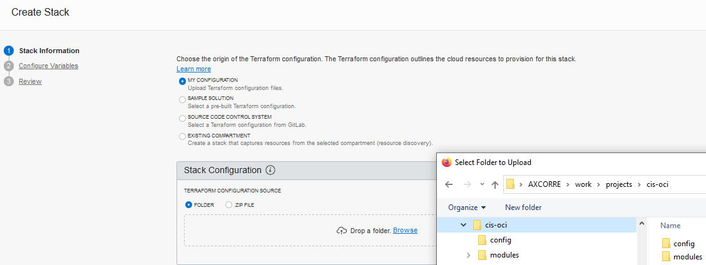
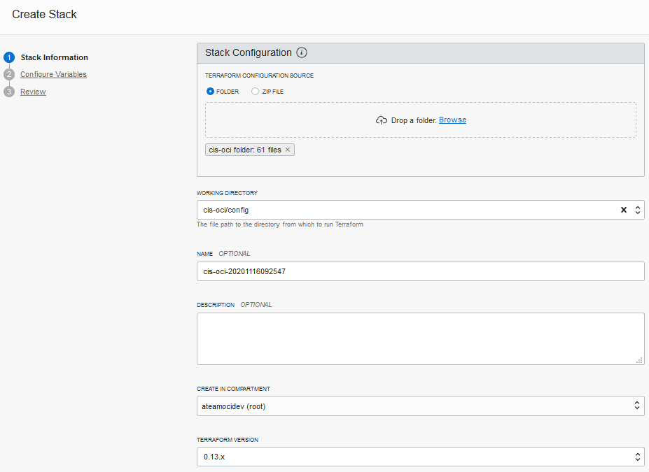
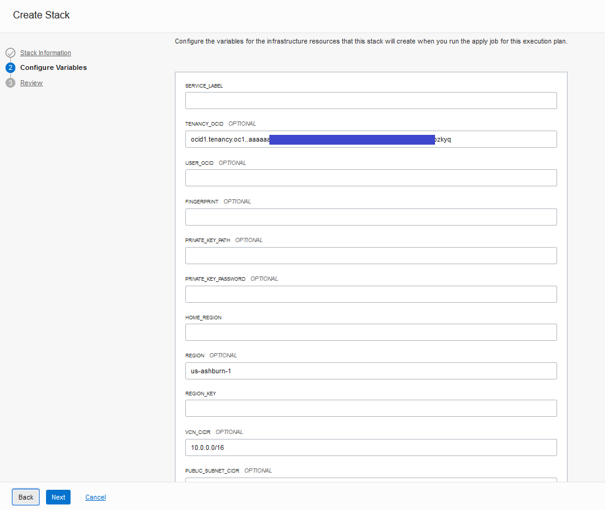

# CIS OCI Landing Zone Quick Start Template

[uri-oracle-terraform-modules]: https://github.com/oracle-terraform-modules
[uri-showoci]: https://github.com/adizohar/showoci

## Overview
This Landing Zone template deploys a standardized environment in an Oracle Cloud Infrastructure (OCI) tenancy that helps organizations to comply with the CIS OCI Foundations Benchmark v1.1.    

The template uses multiple compartments, groups, and IAM policies to segregate access to resources based on job function. The resources within the template are configured to meet the CIS OCI Foundations Benchmark settings related to:

- IAM (Identity & Access Management)
- Networking
- Keys
- Cloud Guard
- Logging
- Events
- Notifications
- Object Storage

 ## Deliverables
 This repository encloses two deliverables:

- A reference implementation written in Terraform HCL (Hashicorp Language) that provisions fully functional resources in an OCI tenancy.
- A Python script that performs compliance checks for most of the CIS OCI Foundations Benchmark recommendations.

 ## Architecture 
 The Terraform code deploys a standard three-tier network architecture within a single Virtual Cloud Network (VCN). The three tiers are divided into:
 
 - One public subnet for load balancers and bastion servers;
 - Two private subnets: one for the application tier and one for the database tier.
 
 The Landing Zone template also creates four compartments in the tenancy:
 
 - A network compartment: for all networking resources.
 - A security compartment: for all logging, key management, and notifications resources. 
 - An application development compartment: for application development related services, including compute, storage, functions, streams, Kubernetes, API Gateway, etc. 
 - A database compartment: for all database resources. 

The compartment design reflects a basic functional structure observed across different organizations, where IT responsibilities are typically split among networking, security, application development and database admin teams. Each compartment is assigned an admin group, with enough permissions to perform its duties. The provided permissions lists are not exhaustive and are expected to be appended with new statements as new resources are brought into the Terraform template.

The diagram below shows services and resources that are deployed:


The diagram does not show the database compartment, because no resources are initially provisioned into that compartment. The greyed out icons in the AppDev compartment indicate services not provisioned by the template.

The resources are provisioned using a single user account with broad tenancy administration privileges.

## How the Terraform Code is Organized 
The Terraform code consists of a single root module configuration defined within the *config* folder along with a few children modules within the *modules* folder.

Within the config folder, the Terraform files are named after the use cases they implement as described in CIS OCI Security Foundation Benchmark document. For instance, iam_1.1.tf implements use case 1.1 in the IAM sectiom, while mon_3.5.tf implements use case 3.5 in the Monitoring section. .tf files with no numbering scheme are either Terraform suggested names for Terraform constructs (provider.tf, variables.tf, locals.tf, outputs.tf) or use cases supporting files (iam_compartments.tf, net_vcn.tf).

**Note**: The code has been written and tested with Terraform version 0.13.5 and OCI provider version 4.2.0.

## Input Variables
Input variables used in the configuration are all defined (and defaulted) in config/variables.tf:

Variable Name | Description | Required | Default Value
--------------|-------------|----------|--------------
**tenancy_ocid** | the OCI tenancy id where this configuration will be executed. This information can be obtained in OCI Console | Yes | None
**user_ocid** | the OCI user id that will execute this configuration. This information can be obtained in OCI Console. The user must have the necessary privileges to provision the resources | Yes | ""
**fingerprint** | the user's public key fingerprint. This information can be obtained in OCI Console | Yes | ""
**private_key_path** | the local path to the user private key | Yes | ""
**private_key_password** | the private key password, if any | No | ""
**home_region** \* | the tenancy home region identifier where Terraform should provision IAM resources | Yes | None
**region** \* | the tenancy region identifier where the Terraform should provision the resources | Yes | None
**region_key** \* | the 3-letter region key | Yes | None
**service_label** | a label used as a prefix for naming resources | Yes | None
**vcn_cidr** | the VCN CIDR block | Yes | "10.0.0.0/16"
**public_subnet_cidr** | the public subnet CIDR block | Yes | "10.0.1.0/24"
**private_subnet_app_cidr** | the App private subnet CIDR block | Yes | "10.0.2.0/24"
**private_subnet_db_cidr** | the DB private subnet CIDR block | Yes | "10.0.3.0/24"
**public_src_bastion_cidr** | the external CIDR block that is allowed to ingress into the bastions servers in the public subnet | Yes | None
**public_src_lbr_cidr** | the external CIDR block that is allowed to ingress into the load balancer in the public subnet | Yes | "0.0.0.0/0"
**is_vcn_onprem_connected** | whether the VCN is connected to on-premises, in which case a DRG is created and attached to the VCN | Yes | false
**onprem_cidr** | the on-premises CIDR block. Only used if is_vcn_onprem_connected == true | No | "0.0.0.0/0"
**network_admin_email_endpoint** | an email to receive notifications for network related events | Yes | None
**security_admin_email_endpoint** | an email to receive notifications for security related events | Yes | None
**cloud_guard_configuration_status** | whether Cloud Guard is enabled or not | Yes | ENABLED
**cloud_guard_configuration_self_manage_resources** | whether Cloud Guard should seed Oracle-managed entities. Setting this variable to true lets the user seed the Oracle-managed entities with minimal changes to the original entities | Yes | false

\* For a list of available regions, please see https://docs.cloud.oracle.com/en-us/iaas/Content/General/Concepts/regions.htm	

## How to Execute the Code Using Terraform CLI
Within the config folder, provide variable values in the existing *quickstart-input.tfvars* file.

Next, within the config folder, execute:

	terraform init
	terraform plan -var-file="quickstart-input.tfvars" -out plan.out
	terraform apply plan.out

Alternatively, rename *quickstart-input.tfvars* file to *terraform.tfvars* and execute:	

	terraform init
	terraform plan -out plan.out
	terraform apply plan.out

## How to Execute the Code Using OCI Resource Manager
There are a few different ways of running Terraform code in OCI Resource Manager (ORM). Here we describe two of them: 
- creating an ORM stack by uploading a folder to ORM;
- creating an ORM stack by integrating with GitLab. 

A stack is the ORM term for a Terraform configuration. Regardless of the chosen method, **an ORM stack must not be contain any state file or *.terraform* folder in Terraform working folder (the *config* folder in this setup)**.

For more ORM information, please see https://docs.cloud.oracle.com/en-us/iaas/Content/ResourceManager/Concepts/resourcemanager.htm.

### Stack from Folder
Create a folder in your local computer (name it say 'cis-oci') and paste there the config and modules folders from this project. 

Using OCI Console, navigate to Resource Manager service page and create a stack based on a folder. In the **Create Stack** page:
1. Select **My Configuration** option as the origin of the Terraform configuration.
2. In the **Stack Configuration** area, select the **Folder** option and upload the folder containing both config and modules folder ('cis-oci' in this example).



3. In **Working Directory**, select the config folder ('cis-oci/config' in this example) .
4. In **Name**, give the stack a name or accept the default.
5. In **Create in Compartment** dropdown, select the compartment to store the Stack.
6. In **Terraform Version** dropdown, **make sure to select 0.13.x**.



Following the Stack creation wizard, the subsequent step prompts for variables values. Please see the **Input Variables** section above for the variables description. 

Notice that *TENANCY_OCID* and *REGION* have default values. They are automatically picked by ORM based on the executing context. The other values used by the OCI provider, *USER_OCID*, *FINGERPRINT*, *PRIVATE_KEY_PATH* and *PRIVATE_KEY_PASSWORD*, marked as optional, must be left blank, as ORM executes with the privileges of the connected user.

The other defaulted variables, like *VCN_CIDR*, for instance, have their values picked from the stack's variables.tf file and must be reviewed and assigned values as needed.



Once variable values are provided, click Next, review stack values and create the stack. 

Next, navigate to the stack page and use the **Terraform Actions** button to plan/apply/destroy your configuration.


### Stack from GitLab
**Note:** ORM requires the GitLab instance accessible over the Internet.

Using OCI Console, navigate to Resource Manager service page and create a connection to your GitLab instance.

In the **Configuration Source Providers** page, provide the required connection details to your GitLab, including the **GitLab URL** and your GitLab **Personal Access Token**. 


Next, create a stack based on a source code control system. Using OCI Console, in the **Create Stack** page:
1. Select **Source Code Control System** option as the origin of the Terraform configuration.
2. In the **Stack Configuration** area, select the configured GitLab repository details:
	- The configured GitLab provider
	- The repository name
	- The repository branch
	- For the **Working Directory**, select the 'config' folder.	 
3. In **Name**, give the stack a name or accept the default.
4. In **Create in Compartment** dropdown, select the compartment to store the stack.
5. In **Terraform Version** dropdown, **make sure to select 0.13.x**.


Once the stack is created, navigate to the stack page and use the **Terraform Actions** button to plan/apply/destroy your configuration.

## How to Customize the Terraform Configuration
The Terraform code has a single configuration root module and a few modules that actually perform the provisioning. We encourage any customization to follow this pattern as it enables consistent code reuse.

For bringing new resources into the Terraform configuration, like compartments or VCNs, you can simply reuse the existing modules and add extra module calls similar to the existing ones in the root module. Most modules accept a map of resource objects that are usually keyed by the resource name. 

For adding extra objects to an existing container object (like adding subnets to a VCN), simply add the extra objects to the existing map. For instance, looking at the net_vcn.tf file, we have:

```
  module "cis_vcn" {
  	source               = "../modules/network/vcn"
  	compartment_id       = module.cis_compartments.compartments[local.network_compartment_name].id
  	...
  	is_create_drg        = tobool(var.is_vcn_onprem_connected)

  	subnets = {
    (local.public_subnet_name) = {
      compartment_id    = null
      ...
      cidr              = var.public_subnet_cidr
      ...
      dns_label         = "public"
      private           = false
      ...
      route_table_id    = module.cis_vcn.route_tables[local.public_subnet_route_table_name].id
      security_list_ids = [module.cis_security_lists.security_lists[local.public_subnet_security_list_name].id]
    }, 
    (local.private_subnet_app_name) = {
      compartment_id    = null
      ...
      cidr              = var.private_subnet_app_cidr
      ...
      dns_label         = "appsubnet"
      private           = true
      ...
      route_table_id    = module.cis_vcn.route_tables[local.private_subnet_app_route_table_name].id
      security_list_ids = [module.cis_security_lists.security_lists[local.private_subnet_app_security_list_name].id]
	  ...
```
In this code excerpt, the *subnets* variable is a map of subnet objects. Adding a new subnet to the existing VCN is as easy as adding a new subnet object to the *subnets* map. Make sure to provide the new subnet a route table and security list. Use the available code as an example. For adding a new VCN altogether, simply provide a new tf file with contents similar to net_vcn.tf.

# Compliance Checking Script
## Overview
The CIS Reports Script checks a tenancy's configuration against the CIS Foundations Benchmark for Oracle Cloud. 

The script is located under the *reports* folder in this repository. It outputs a summmary report CSV as well individual CSV findings report for configuration issues that are discovered.

Using the --output-to-bucket ```<bucket-name>``` the reports will be copied to the Object Storage bucket in a folder with current day's date ex. ```2020-12-08```.

## Usage 

### Executing on local machine

1. [Setup and Prerequisites](https://docs.cloud.oracle.com/en-us/iaas/Content/API/Concepts/apisigningkey.htm#Required_Keys_and_OCIDs) 

1. Run
```
python3 cis_reports.py --output-to-bucket 'my-example-bucket-1' -t <Profile_Name>
```
where \<Profile_Name> is the profile name in OCI client config file (typically located under $HOME/.oci). A profile defines the connecting parameters to your tenancy, like tenancy id, region, user id, fingerprint and key file.

	[the_profile_name]
	tenancy=ocid1.tenancy.oc1..aaaaaaaagfqbe4notarealocidreallygzinrxt6h6hfshjokfgfi5nzquxmfpzkyq
	region=us-ashburn-1
	user=ocid1.user.oc1..aaaaaaaaltwx45wllv52qqxk7inotarealocidreallyo76gboofpbzlgmihq
	fingerprint=c8:91:41:8p:65:56:68:02:2e:54:80:kk:36:76:69:39
	key_file=/path_to_my_private_key_file.pem

### Executing using Cloud Shell:
1. install OCI sdk

```
pip3 install --user oci
```
1. Copy the cis_reports.py to the directory

1. Run
```
python3 cis_reports.py -dt --output-to-bucket 'my-example-bucket-1'
``` 
# Known Facts
## Destroying Resources
- By design, vaults and keys are not destroyed immediately. They have a delayed delete of 30 days.
- By design, compartments are not destroyed immediately. 
- Tag namespaces may fail to delete on the first destroy.  Run destroy again to remove.

# Acknowledgement
Parts of the Terraform code reuse and adapts from [Oracle Terraform Modules] [uri-oracle-terraform-modules].

The Compliance Check script uses [Adi Zohar's showoci OCI Reporting tool] [uri-showoci].

# Contributors
**Owners**: @andrecorreaneto, @halimer
**Contributors**: @herosjourney, @flynnkc 

# License
Copyright &copy; 2019 Oracle and/or its associates. All rights reserved.

Licensed under the [Universal Permissive License 1.0][uri-license] as shown at 
[https://oss.oracle.com/licenses/upl][uri-canonical-license].

# Feedback
We welcome your feedback. To post feedback, submit feature ideas or report bugs, please use the Issues section on this repository.	