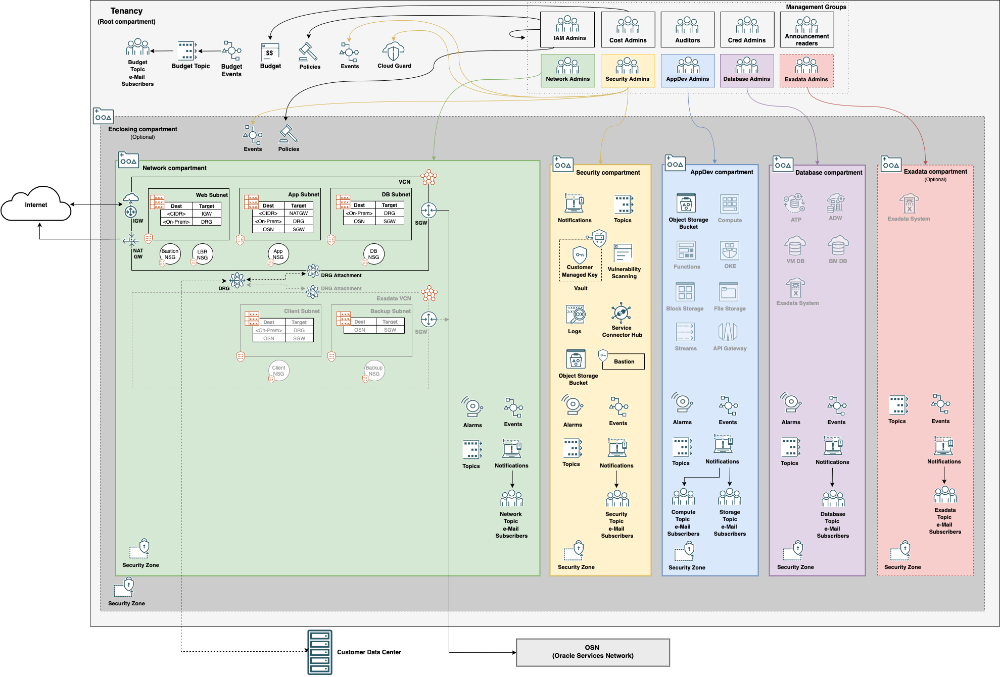
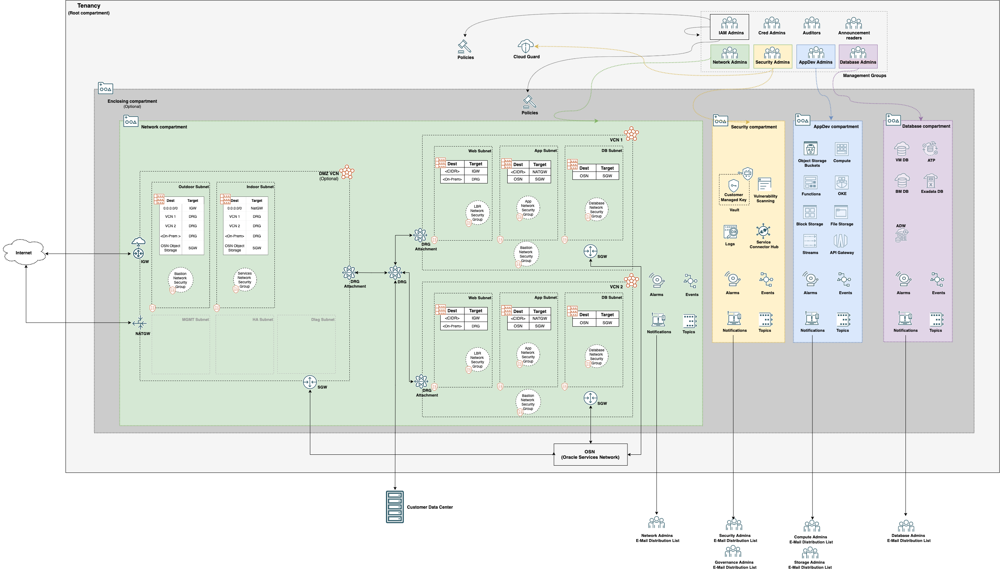
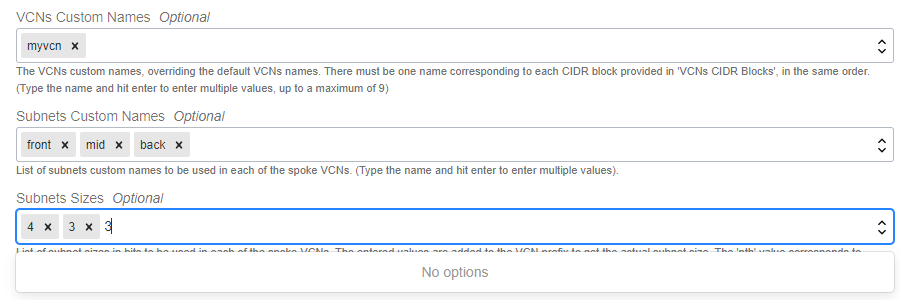

[](https://cloud.oracle.com/resourcemanager/stacks/create?zipUrl=https://github.com/oracle-quickstart/oci-cis-landingzone-quickstart/archive/refs/heads/main.zip)

*If you are logged into your OCI tenancy, the button will take you directly to OCI Resource Manager where you can proceed to deploy. If you are not logged, the button takes you to Oracle Cloud initial page where you must enter your tenancy name and login to OCI.*
<br>
<br>
&nbsp;&nbsp;Check our [Live Lab](https://apexapps.oracle.com/pls/apex/r/dbpm/livelabs/view-workshop?wid=3662) for key use cases and hands on deployment experience!
<br>
<br>
# CIS OCI Landing Zone Quick Start Template

## Table of Contents
1. [Overview](#overview)
1. [Deliverables](#deliverables)
1. [Architecture](#architecture)
    1. [IAM](#arch-iam)
    1. [Network](#arch-network)
    1. [Diagram](#arch-diagram)
1. [Deployment Guide](DEPLOYMENT-GUIDE.md)
1. [Executing Instructions](#instructions)
    1. [Terraform Configuration](terraform.md)
    1. [Compliance Checking](compliance-script.md)
1. [Blog Posts](#documentation)
1. [CIS OCI Foundations Benchmark Modules Collection](#modules)
1. [Feedback](#feedback)
1. [Known Issues](#known-issues)
1. [Contribute](CONTRIBUTING.md)
1. [Frequently Asked Questions](FAQ.md)

## <a name="overview"></a>Overview
This Landing Zone template deploys a standardized environment in an Oracle Cloud Infrastructure (OCI) tenancy that helps organizations to comply with the [CIS OCI Foundations Benchmark v1.2](https://www.cisecurity.org/benchmark/oracle_cloud/).    

The template uses multiple compartments, groups, and IAM policies to segregate access to resources based on job function. The resources within the template are configured to meet the CIS OCI Foundations Benchmark settings related to:

- IAM (Identity & Access Management)
- Networking
- Keys
- Cloud Guard
- Logging
- Vulnerability Scanning
- Bastion
- Events
- Alarms
- Notifications
- Object Storage
- Budgets
- Security Zone

 ## <a name="deliverables"></a>Deliverables
 This repository encloses two deliverables:

- A reference implementation written in Terraform HCL (Hashicorp Language) that provisions fully functional resources in an OCI tenancy.
- A Python script that performs compliance checks for most of the CIS OCI Foundations Benchmark recommendations. The script is completely independent of the Terraform code and can be used against any existing tenancy.

 ## <a name="architecture"></a>Architecture
 ### <a name="arch-iam"></a>IAM
The Landing Zone template creates a few compartments in the tenancy root compartment or under an enclosing compartment:
 - Network compartment: for all networking resources.
 - Security compartment: for all logging, key management, scanning, and notifications resources. 
 - Application Development compartment: for application development related services, including Compute, Storage, Functions, Streams, Kubernetes, API Gateway, etc. 
 - Database compartment: for all database resources. 
 - Exadata infrastructure compartment: this is an optional compartment. While preparing for deploying Exadata Cloud Service, customers can choose between creating a specific compartment or using the Database compartment.   
 - Enclosing compartment: a compartment at any level in the compartment hierarchy to hold the above compartments. 

The compartment design reflects a basic functional structure observed across different organizations, where IT responsibilities are typically split among networking, security, application development and database admin teams. Each compartment is assigned an admin group, with enough permissions to perform its duties. The provided permissions lists are not exhaustive and are expected to be appended with new statements as new resources are brought into the Terraform template.

 ### <a name="arch-networking"></a>Networking
 The Terraform code provisions a standard three-tier network architecture within one or more Virtual Cloud Network (VCN)s. The three tiers are divided into:
 
 - One public subnet for load balancers and bastion servers;
 - Two private subnets: one for the application tier and one for the database tier.

Optionally, the Terraform code can provision one or more VCNs configured for Exadata deployments. These VCNs are comprised of:

- One private client subnet;
- One private backup subnet.
 
The VCNs are either stand alone networks or in one of the below Hub and Spoke architectures:
- **Access to multiple VCNs in the same region:** This scenario enables communication between an on-premises network and multiple VCNs in the same region over a single FastConnect private virtual circuit or Site-to-Site VPN and uses a DRG as the hub.
- **Access between multiple networks through a single DRG with a firewall between networks:** This scenario connects several VCNs to a single DRG, with all routing configured to send packets through a firewall in a hub VCN before they can be sent to another network.

The above can be deployed without the creation of Internet Gateways and NAT Gateways to provide a more isolated network. 

### <a name="arch-diagram"></a>Diagram
The diagram below shows services and resources that are deployed in a single VCN deployment:



[Get the diagram in SVG format.](images/Architecture_Single_VCN.svg)

The diagram below shows services and resources that are deployed in a Hub & Spoke VCN deployment:



[Get the diagram in SVG format.](images/Architecture_HS_VCN.svg)

The greyed out icons in the AppDev and Database compartments indicate services not provisioned by the template.

## <a name="instructions"></a>Executing Instructions

- [Terraform Configuration](terraform.md)
- [Compliance Checking](compliance-script.md)

## <a name="documentation"></a>Documentation
- [Deploy a Secure Landing Zone that Meets the CIS Foundations Benchmark for Oracle Cloud](https://docs.oracle.com/en/solutions/cis-oci-benchmark/index.html#GUID-4572A461-E54D-41E8-89E8-9576B8EBA7D8)
- [CIS OCI Landing Zone Quick Start Template Version 2](https://www.ateam-oracle.com/cis-oci-landing-zone-quick-start-template-version-2)
- [Deployment Modes for CIS OCI Landing Zone](https://www.ateam-oracle.com/deployment-modes-for-cis-oci-landing-zone)
- [Tenancy Pre Configuration For Deploying CIS OCI Landing Zone as a non-Administrator](https://www.ateam-oracle.com/tenancy-pre-configuration-for-deploying-cis-oci-landing-zone-as-a-non-administrator)
- [Strong Security Posture Monitoring with Cloud Guard](https://www.ateam-oracle.com/cloud-guard-support-in-cis-oci-landing-zone)
- [Logging Consolidation with Service Connector Hub](https://www.ateam-oracle.com/security-log-consolidation-in-cis-oci-landing-zone)
- [Vulnerability Scanning in CIS OCI Landing Zone](https://www.ateam-oracle.com/vulnerability-scanning-in-cis-oci-landing-zone)
- [How to Deploy OCI Secure Landing Zone for Exadata Cloud Service](https://www.ateam-oracle.com/how-to-deploy-oci-secure-landing-zone-for-exadata-cloud-service)
- [Operational Monitoring and Alerting in the CIS Landing Zone](https://www.ateam-oracle.com/operational-monitoring-and-alerting-in-the-cis-landing-zone)
- [How to Deploy Landing Zone for a Security Partner Network Appliance](https://www.ateam-oracle.com/post/how-to-deploy-landing-zone-for-a-security-partner-network-appliance)
- [Adding Our Security Partners to a CIS OCI Landing Zone](https://blogs.oracle.com/cloud-infrastructure/post/adding-our-security-partners-to-a-cis-oci-landing-zone)
- [Advanced Configuration using Terraform Overrides](https://www.ateam-oracle.com/post/oci-cis-landing-zone-advanced-configuration-using-terraform-overrides)
- [Creating a Secure Multi-Region Landing Zone](https://www.ateam-oracle.com/post/creating-a-secure-multi-region-landing-zone)
- [The Center for Internet Security Oracle Cloud Infrastructure Foundations Benchmark 1.2 Release update](https://www.ateam-oracle.com/post/the-center-for-internet-security-oracle-cloud-infrastructure-foundations-benchmark-12-release-update)

## <a name="modules"></a>CIS OCI Foundations Benchmark Modules

This repository uses a broader collection of repositories containing modules that help customers align their OCI implementations with the CIS OCI Foundations Benchmark recommendations:
- [Identity & Access Management](https://github.com/oracle-quickstart/terraform-oci-cis-landing-zone-iam)
- [Networking](https://github.com/oracle-quickstart/terraform-oci-cis-landing-zone-networking)
- [Governance](https://github.com/oracle-quickstart/terraform-oci-cis-landing-zone-governance)
- [Security](https://github.com/oracle-quickstart/terraform-oci-cis-landing-zone-security)
- [Observability & Monitoring](https://github.com/oracle-quickstart/terraform-oci-cis-landing-zone-observability)
- [Secure Workloads](https://github.com/oracle-quickstart/terraform-oci-secure-workloads)

The modules in this collection are designed for flexibility, are straightforward to use, and enforce CIS OCI Foundations Benchmark recommendations when possible.

Using these modules does not require a user extensive knowledge of Terraform or OCI resource types usage. Users declare a JSON object describing the OCI resources according to each module’s specification and minimal Terraform code to invoke the modules. The modules generate outputs that can be consumed by other modules as inputs, allowing for the creation of independently managed operational stacks to automate your entire OCI infrastructure.


## <a name="feedback"></a>Feedback
We welcome your feedback. To post feedback, submit feature ideas or report bugs, please use the Issues section on this repository.	

## <a name="known-issues"></a>Known Issues
* **Terraform Apply Failure 404-NotAuthorizedorNotFound**    
    * Terraform CLI or Resource Manager fails to apply with a message similar as this:
    ```
        2021/07/01 23:53:25[TERRAFORM_CONSOLE] [INFO]
        2021/07/01 23:53:25[TERRAFORM_CONSOLE] [INFO] Error: 404-NotAuthorizedOrNotFound
        2021/07/01 23:53:25[TERRAFORM_CONSOLE] [INFO] Provider version: 4.33.0, released on 2021-06-30.  
        2021/07/01 23:53:25[TERRAFORM_CONSOLE] [INFO] Service: Identity Policy
        2021/07/01 23:53:25[TERRAFORM_CONSOLE] [INFO] Error Message: Authorization failed or requested resource not found
        2021/07/01 23:53:25[TERRAFORM_CONSOLE] [INFO] OPC request ID: f14a700dc5d00272933a327c8feb2871/5053FB2DA16689F6421821A1B178D450/D3F2FE52F3BF8FB2C769AEFF7754A9B0
        2021/07/01 23:53:25[TERRAFORM_CONSOLE] [INFO] Suggestion: Either the resource has been deleted or service Identity Policy need policy to access this resource. Policy reference: https://docs.oracle.com/en-us/iaas/Content/Identity/Reference/policyreference.htm
    ```

    This is due to eventual consistency, where resources need to be propagated to all regions before becoming fully available. We have dealt with these type of issues in code by introducing artificial delays. However, they may still arise as the consistency is eventual. If you face errors like this, simply re-plan and re-apply the Terraform configuration (you do not need to destroy and start all over). The errors should go away in the subsequent run. If they still persist, the problem is of a different nature.

    **If your plan continues to fail, please ensure the OCI service is available in your realm.  All the OCI services in the CIS OCI Landing Zone are available in the commercial (OC1) realm but may not be in others.**

* **OCI Tags**
    * By design, the CIS OCI Landing Zone Quick Start sets a freeform tag as an indicator for resources created by its Terraform scripts.
    * The OCI Tag Defaults may not be applied to OCI Keys during creation. This issue is currently under investigation.
    * Creating and using Defined Tags requires a two step process:
      1. Create the tag namespace and the tags.
      2. Assign the ```defined_tags```. 
    * Assigning an empty map (```{}```) to ```defined_tags``` or ```freeform_tags``` deletes all prevouisly set values and also prevents tag defaults to be applied.
    * Tag defaults are applied when providing a ```null``` value ```defined_tags = null```. 


* **OCI Compartment Deletion**
    * By design, OCI compartments are not deleted upon Terraform destroy by default. Deletion can be enabled in Landing Zone by setting *enable_cmp_delete* variable to true in locals.tf file. However, compartments may take a long time to delete. Not deleting compartments is ok if you plan on reusing them. For more information about deleting compartments in OCI via Terraform, check [OCI Terraform provider documentation](https://registry.terraform.io/providers/hashicorp/oci/latest/docs/resources/identity_compartment).


* **OCI Vault Deletion**
    * By design, OCI vaults and keys are not deleted immediately upon Terraform destroy, but scheduled for deletion. Both have a default 30 day grace period. For shortening that period, use OCI Console to first cancel the scheduled deletion and then set the earliest possible deletion date (7 days from current date) when deleting.


* **Enabling no internet access on an existing deployment**
    * Enabling *no_internet_access* on currently deployed stack fails to apply due to timeout.  This is due to OCI Terraform provider not being able remove Internet Gateway(s) and and NAT Gateway(s) when there are route table rules referencing them. For enabling *no_internet_access* on a deployed stack, you have to first manually remove the rules from the route tables that reference the gateways. 


* **Resource Manager does not allow elements with same value in array type** 
    * This impacts the ability to deploy custom subnets with the same size, as subnets_sizes is an array of strings. If you need custom subnets sizes, do not use Resource Manager UI. Deploy with either Terraform CLI or Resource Manager APIs.

    

* **Support for free tier tenancies***
    * Deploying in a free tier tenancy is not supported at this time as there are some services that are not available.  If you want to try the Landing Zone please upgrade your account to a pay-go. 