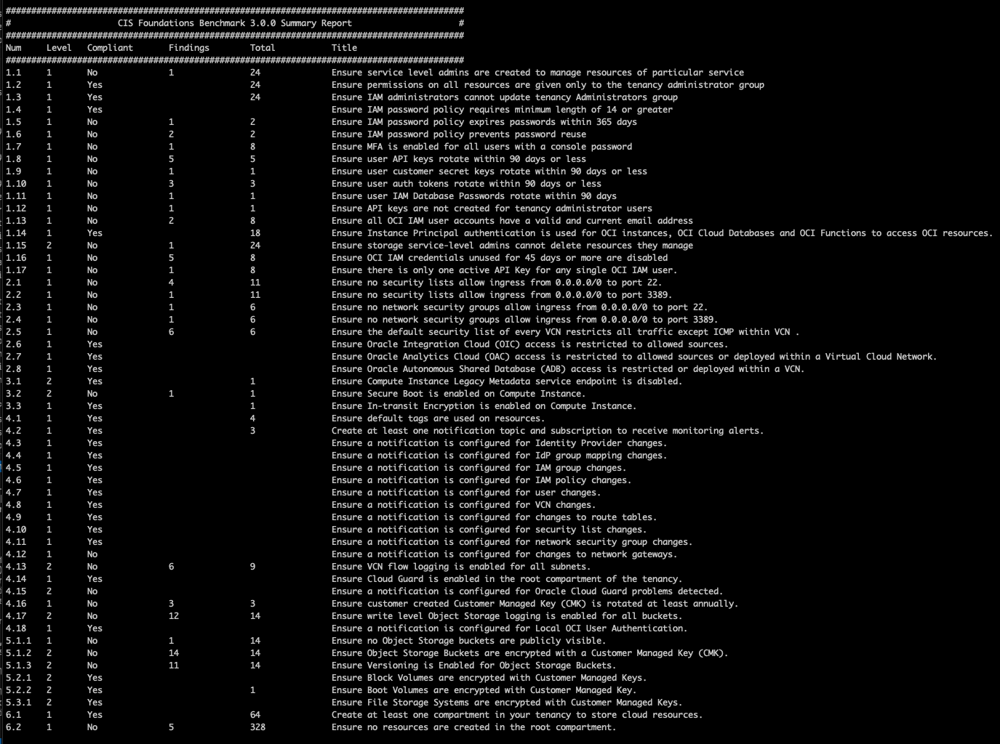

---

**NOTE**

### This repository is the official home of the CIS Compliance Script. The CIS Landing Zone **Terraform configuration**, is retired as of May 2025. The last release of CIS Landing Zone Terraform configuration is [Release 2.8.8](https://github.com/oci-landing-zones/oci-cis-landingzone-quickstart/releases/tag/v2.8.8).

- Users looking for a deployment experience similar to CIS Landing Zone should now use [OCI Core Landing Zone](https://github.com/oci-landing-zones/terraform-oci-core-landingzone). OCI Core Landing Zone evolves CIS Landing Zone and is compliant with CIS OCI Foundations Benchmark 2.0.0.
- Users looking for a deployment experience based on fully declarable and customizable templates should use the [Operating Entities Landing Zone](https://github.com/oci-landing-zones/oci-landing-zone-operating-entities) or the [OCI Landing Zones Modules](#modules) in the [OCI Landing Zones GitHub organization](https://github.com/oci-landing-zones).
---

# CIS Compliance Script

## Table of Contents
1. [Overview](#overview)
1. [Setup](#setup)
1. [Arguments](#arguments)
1. [Usage Examples](#usage)
1. [Output Examples](#output)
1. [Known Issues](ISSUES.md)
1. [Frequently Asked Questions](FAQ.md)
1. [Blogs](#blogs)
1. [Landing Zone Resources](#resources)
1. [Contribute](CONTRIBUTING.md)
1. [Feedback](#feedback)

## <a name="overview"></a>Overview

The CIS Compliance Script checks a tenancy's configuration against the CIS OCI Foundations Benchmark. The CIS Compliance Script has been awarded [CIS Security Software Certification](https://www.cisecurity.org/partner/oracle) for CIS Oracle Cloud Infrastructure Foundations Benchmark v3.0.0.

In addition to CIS checks it can be check for alignment to OCI Best Practices  by using the `--obp` flag.  These checks review the following OCI best practices in your tenancy:
- Aggregation of OCI Audit compartment logs, Network Flow logs, and Object Storage logs are sent to Service Connector Hub in all regions
- A Budget for cost track is created in your tenancy
- Network connectivity to on-premises is redundant 
- Cloud Guard is configured at the root compartment with detectors and responders 
- Certificates close to expiration

The script is located under the *scripts* folder in this repository. It outputs a summary report CSV as well individual CSV findings report for configuration issues that are discovered in a folder(default location) with the region, tenancy name, and current day's date ex. ```<tenancy_name>-2022-12-02_13-50-30/```. 

## <a name="setup"></a>Setup 

### Required Permissions
The **Auditors Group** that is created as part of the CIS Landing Zone Terraform has all the permissions required to run the compliance checking in the tenancy.  Below is the minimum OCI IAM Policy to grant a group the script in a tenancy.

**Access to audit retention requires the user to be part of the Administrator group* - the only recommendation affected is CIS recommendation 3.1.

```
allow group Auditor-Group to inspect all-resources in tenancy
allow group Auditor-Group to read instances in tenancy
allow group Auditor-Group to read load-balancers in tenancy
allow group Auditor-Group to read buckets in tenancy
allow group Auditor-Group to read nat-gateways in tenancy
allow group Auditor-Group to read public-ips in tenancy
allow group Auditor-Group to read file-family in tenancy
allow group Auditor-Group to read instance-configurations in tenancy
allow group Auditor-Group to read network-security-groups in tenancy
allow group Auditor-Group to read capture-filters in tenancy
allow group Auditor-Group to read resource-availability in tenancy
allow group Auditor-Group to read audit-events in tenancy
allow group Auditor-Group to read users in tenancy	
allow group Auditor-Group to use cloud-shell in tenancy
allow group Auditor-Group to read vss-family in tenancy
allow group Auditor-Group to read usage-budgets in tenancy
allow group Auditor-Group to read usage-reports in tenancy
allow group Auditor-Group to read data-safe-family in tenancy
allow group Auditor-Group to read vaults in tenancy
allow group Auditor-Group to read keys in tenancy
allow group Auditor-Group to read tag-namespaces in tenancy
allow group Auditor-Group to read cloud-guard-targets in tenancy
allow group Auditor-Group to read serviceconnectors in tenancy
allow group Auditor-Group to use ons-family in tenancy where any {request.operation!=/Create*/, request.operation!=/Update*/, request.operation!=/Delete*/, request.operation!=/Change*/}
```

### Setup the script to run on a local machine
1. [Setup and Prerequisites](https://docs.oracle.com/en-us/iaas/Content/API/Concepts/sdkconfig.htm)
1. Ensure your OCI `config` file is in the `~/.oci/` directory
1. Download cis_reports.py: [https://raw.githubusercontent.com/oci-landing-zones/oci-cis-landingzone-quickstart/main/scripts/cis_reports.py](https://raw.githubusercontent.com/oci-landing-zones/oci-cis-landingzone-quickstart/main/scripts/cis_reports.py)
```
wget https://raw.githubusercontent.com/oci-landing-zones/oci-cis-landingzone-quickstart/main/scripts/cis_reports.py
```
1. Create a Python Virtual Environment with required modules
```
python3 -m venv python-venv
source python-venv/bin/activate
pip3 install oci
pip3 install pytz
pip3 install requests
```
1. Libraries for Dashboard Graphics (optional)
```
pip3 install numpy
pip3 install matplotlib
```

1. Libraries for XLSX Output (optional) 
```
pip3 install xlsxwriter
```

### Setup the script to run in a Cloud Shell Environment without a Python virtual environment
1. Download cis_reports.py: [https://raw.githubusercontent.com/oci-landing-zones/oci-cis-landingzone-quickstart/main/scripts/cis_reports.py](https://raw.githubusercontent.com/oci-landing-zones/oci-cis-landingzone-quickstart/main/scripts/cis_reports.py)
```
wget https://raw.githubusercontent.com/oci-landing-zones/oci-cis-landingzone-quickstart/main/scripts/cis_reports.py
```

### Setup the script to run in a Cloud Shell Environment with a Python virtual environment
1. Download cis_reports.py: [https://raw.githubusercontent.com/oci-landing-zones/oci-cis-landingzone-quickstart/main/scripts/cis_reports.py](https://raw.githubusercontent.com/oci-landing-zones/oci-cis-landingzone-quickstart/main/scripts/cis_reports.py)
```
wget https://raw.githubusercontent.com/oci-landing-zones/oci-cis-landingzone-quickstart/main/scripts/cis_reports.py
```
1. Create a Python Virtual Environment with required modules
```
python3 -m venv python-venv
source python-venv/bin/activate
pip3 install oci
pip3 install pytz
pip3 install requests
```
1. Libraries for Dashboard Graphics (optional)
```
pip3 install numpy
pip3 install matplotlib
```

1. Libraries for XLSX Output (optional) 
```
pip3 install xlsxwriter
```


## <a name="arguments"></a>Arguments
```
  -h, --help                           show this help message and exit
  -c FILE_LOCATION                     OCI config file location.
  -t CONFIG_PROFILE                    Config file section to use (tenancy profile).
  -p PROXY                             Set Proxy (i.e. www-proxy-server.com:80).
  --output-to-bucket OUTPUT_BUCKET     Set Output bucket name (i.e. my-reporting-bucket).
  --report-directory REPORT_DIRECTORY  Set Output report directory by default it is the current date (i.e. reports-date).
  --report-prefix REPORT_PREFIX        Set Output report prefix to allow unique files for better baseline comparison.
  --report-summary-json                Write summary report as JSON file, too.
  --print-to-screen PRINT_TO_SCREEN    Set to False if you want to see only non-compliant findings (i.e. False).
  --level LEVEL                        CIS Recommendation Level options are: 1 or 2. Set to 2 by default.
  --regions REGIONS                    Regions to run the compliance checks on, by default it will run in all regions. Sample input: us-ashburn-1,ca-toronto-1,eu-frankfurt-1.
  --raw                                Outputs all resource data into CSV files.
  --obp                                Checks for OCI best practices.
  --all-resources                      Uses Advanced Search Service to query all resources in the tenancy and outputs to a JSON. It also enables OCI Best Practice Checks with
                                       Service Limits checking (--obp) and enables the (--raw) flags. All of these checks increase runtime.
  --disable-api-usage-check            Disables the checking of OCI API unused for 45 days or more.
  --redact-output                      Redacts OCIDs in output CSV and JSON files.
  --deeplink-url-override OCI_URL      Replaces the base OCI URL (https://cloud.oracle.com) for deeplinks (i.e. https://oc10.cloud.oracle.com).
  -ip                                  Use Instance Principals for Authentication.
  -dt                                  Use Delegation Token for Authentication in Cloud Shell.
  -st                                  Authenticate using Security Token.
  -v                                   Show the version of the script and exit.
  --debug                              Enables debugging messages printed to screen.
```

## <a name="usage"></a>Usage Examples

### Executing on a local machine to check CIS and OCI Best Practices with raw data
To run using python running a local machine in all regions and check for OCI Best Practices with raw data of all resources output to CSV files and network topology.
```
% python3 cis_reports.py --obp --raw
```

### Executing in Cloud Shell to check CIS and OCI Best Practices with raw data
To run using Cloud Shell in all regions and check for OCI Best Practices with raw data of all resources output to CSV files and network topology.
```
% python3 cis_reports.py -dt --obp --raw
```

### Executing in Cloud Shell to check CIS, OCI Best Practices with raw data, and get all resource via the Advanced Search Query service
To run using Cloud Shell in all regions and check for OCI Best Practices with raw data, network topology and get all resource via the Advanced Search Query service
```
% python3 cis_reports.py -dt --all-resources
``` 

### Executing on local machine with a specific OCI Config file
To run on a local machine using a specific OCI Config file.
```
% python3 cis_reports.py -c <file_location>
```
where ```<file_location>``` is the fully qualified path to an OCI client config file (default location is `~/.oci/config`). An OCI config file contains profiles that define the connecting parameters to your tenancy, like tenancy id, region, user id, fingerprint and key file. For more information: [https://docs.oracle.com/en-us/iaas/Content/API/Concepts/sdkconfig.htm#SDK_and_CLI_Configuration_File](https://docs.oracle.com/en-us/iaas/Content/API/Concepts/sdkconfig.htm#SDK_and_CLI_Configuration_File).

```
  [<Profile_Name>]
	tenancy=<tenancy_ocid>
	region=us-ashburn-1
	user=<user_ocid>
	fingerprint=<api_key_finger_print>
	key_file=/path_to_my_private_key_file.pem
```

### Executing on local machine with a specific profile
To run on a local machine using a specific profile in the an OCI Config file.
```
% python3 cis_reports.py -t <Profile_Name>
```
where ```<Profile_Name>``` is the profile name in OCI client config file (typically located under $HOME/.oci). A profile defines the connecting parameters to your tenancy, like tenancy id, region, user id, fingerprint and key file.
```
  [<Profile_Name>]
  tenancy=<tenancy_ocid>
  region=us-ashburn-1
  user=<user_ocid>
  fingerprint=<api_key_finger_print>
  key_file=/path_to_my_private_key_file.pem
```

### Executing on a local machine via Security Token (oci session authenticate)
To run on a local machine using a Security Token without OCI Config file. For more information: [https://docs.oracle.com/en-us/iaas/Content/API/SDKDocs/clitoken.htm](https://docs.oracle.com/en-us/iaas/Content/API/SDKDocs/clitoken.htm).

Execute the oci command.
```
% oci session authenticate
```
This command will prompt for Region details, provide region name ex: us-ashburn-1.
Browser will open the OCI console window and asks for user credentials. Once after providing the credentials get back to the command prompt. This will create config file using the provided credentials in the "/Users/***/.oci/sessions/config.
Execute the python script.
```
% python3 cis_reports.py -st
```
#### Executing using Cloud Shell
To run in Cloud Shell with delegated token authentication.
```
% python3 cis_reports.py -dt
``` 

#### Executing in Australia Government and Defense realm
To run in Cloud Shell with delegated token authentication.
```
% python3 cis_reports.py --deeplink-url-override  https://oc10.cloud.oracle.com'
``` 

#### Executing on local machine with using Instance Principal
To run on an OCI instance that associated with Instance Principal. 
```
% python3 cis_reports.py -ip
``` 

#### Executing using Cloud Shell in only two regions
To run on using Cloud Shell in on us-ashburn-1 and us-phoenix-1. IAM checks will performed in the tenancy's Home Region.
```
% python3 cis_reports.py -dt --region us-ashburn-1,us-phoenix-1'
``` 

#### Executing using output to an bucket
To write the output files to an Object Storage bucket.
 ```
% python3 cis_reports.py --output-to-bucket 'my-example-bucket-1'
``` 
Using --output-to-bucket ```<bucket-name>``` the reports will be copied to the Object Storage bucket in a folder(default location) with the region, tenancy name, and current day's date ex. ```us-ashburn-1-<tenancy_name>-2020-12-08```.  The bucket must already exist and the user executing the script must have permissions to use the bucket. If using the --report-directory flag as well the folder must already exist in the bucket.

#### Executing using report directory
To write the output files to an specified directory.
 ```
% python3 cis_reports.py --report-directory 'my-directory'
``` 
Using ```--report-directory <directory-name>``` the reports will be copied to the specified directory. The directory must already exist.

#### Executing using report directory and output to a bucket
To write the output files to an specified directory in an object storage bucket.
 ```
% python3 cis_reports.py --report-directory 'bucket-directory' --output-to-bucket 'my-example-bucket-1'
``` 
Using ```--report-directory <directory-name>``` and ```--output-to-bucket <bucket-name>``` together the reports will be copied to the specified directory in the specified bucket. The bucket must already exist in the **Tenancy's Home Region** and user must have permissions to write to that bucket.

#### Executing using report directory and output to a bucket
To write the output files to an specified directory in an object storage bucket.
 ```
% python3 cis_reports.py --report-directory 'bucket-directory' --output-to-bucket 'my-example-bucket-1'
``` 
Using ```--report-directory <directory-name>``` and ```--output-to-bucket <bucket-name>``` together the reports will be copied to the specified directory in the specified bucket. The bucket must already exist in the **Tenancy's Home Region** and user must have permissions to write to that bucket.

#### Executing on local machine and output raw data
To run on a local machine with the default profile and output raw data as well as the reports.
```
% python3 cis_reports.py --raw
``` 


## <a name="output"></a>Output Examples

The CIS Compliance Script loops through all regions used by the tenancy and all resource types referenced in the CIS OCI Foundations Benchmark and outputs a summary compliance report. Each report row corresponds to a recommendation in the OCI Foundations Benchmark and identifies if the tenancy is in compliance as well as the number of offending findings. The report summary columns read as:

- **Num**: the recommendation number in the CIS Benchmark document.
- **Level**: the recommendation level. Level 1 recommendations are less restrictive than Level 2.
- **Compliant**: whether the tenancy is in compliance with the recommendation.
- **Findings**: the number of offending findings for the recommendation.
- **Total**: Total number of that resources
- **Title**: the recommendation description.

In the sample output below, we see the tenancy is not compliant with several recommendations. Among those is item 1.7 where the output shows 33 users do not have MFA enabled for accessing OCI Console.



For each non-compliant report item, a file with findings details is generated, as shown in the last part of the output:
```
##########################################################################################
#                               Writing CIS reports to CSV                               #
##########################################################################################
CSV: summary_report         --> tenancy1-2026-03-17_18-30-55/cis_summary_report.csv
HTML: summary_report         --> tenancy1-2026-03-17_18-30-55/cis_summary_report.html
CSV: Identity and Access Management_1.1 --> tenancy1-2026-03-17_18-30-55/cis_Identity_and_Access_Management_1-1.csv
CSV: Identity and Access Management_1.2 --> tenancy1-2026-03-17_18-30-55/cis_Identity_and_Access_Management_1-2.csv
CSV: Identity and Access Management_1.3 --> tenancy1-2026-03-17_18-30-55/cis_Identity_and_Access_Management_1-3.csv
CSV: Identity and Access Management_1.4 --> tenancy1-2026-03-17_18-30-55/cis_Identity_and_Access_Management_1-4.csv
CSV: Identity and Access Management_1.5 --> tenancy1-2026-03-17_18-30-55/cis_Identity_and_Access_Management_1-5.csv
CSV: Identity and Access Management_1.6 --> tenancy1-2026-03-17_18-30-55/cis_Identity_and_Access_Management_1-6.csv
CSV: Identity and Access Management_1.7 --> tenancy1-2026-03-17_18-30-55/cis_Identity_and_Access_Management_1-7.csv
CSV: Identity and Access Management_1.8 --> tenancy1-2026-03-17_18-30-55/cis_Identity_and_Access_Management_1-8.csv
CSV: Identity and Access Management_1.9 --> tenancy1-2026-03-17_18-30-55/cis_Identity_and_Access_Management_1-9.csv
CSV: Identity and Access Management_1.10 --> tenancy1-2026-03-17_18-30-55/cis_Identity_and_Access_Management_1-10.csv
CSV: Identity and Access Management_1.11 --> tenancy1-2026-03-17_18-30-55/cis_Identity_and_Access_Management_1-11.csv
CSV: Identity and Access Management_1.12 --> tenancy1-2026-03-17_18-30-55/cis_Identity_and_Access_Management_1-12.csv
CSV: Identity and Access Management_1.13 --> tenancy1-2026-03-17_18-30-55/cis_Identity_and_Access_Management_1-13.csv
CSV: Identity and Access Management_1.15 --> tenancy1-2026-03-17_18-30-55/cis_Identity_and_Access_Management_1-15.csv
CSV: Identity and Access Management_1.16 --> tenancy1-2026-03-17_18-30-55/cis_Identity_and_Access_Management_1-16.csv
CSV: Identity and Access Management_1.17 --> tenancy1-2026-03-17_18-30-55/cis_Identity_and_Access_Management_1-17.csv
CSV: Networking_2.1         --> tenancy1-2026-03-17_18-30-55/cis_Networking_2-1.csv
CSV: Networking_2.2         --> tenancy1-2026-03-17_18-30-55/cis_Networking_2-2.csv
CSV: Networking_2.3         --> tenancy1-2026-03-17_18-30-55/cis_Networking_2-3.csv
CSV: Networking_2.4         --> tenancy1-2026-03-17_18-30-55/cis_Networking_2-4.csv
CSV: Networking_2.5         --> tenancy1-2026-03-17_18-30-55/cis_Networking_2-5.csv
CSV: Networking_2.6         --> tenancy1-2026-03-17_18-30-55/cis_Networking_2-6.csv
CSV: Networking_2.7         --> tenancy1-2026-03-17_18-30-55/cis_Networking_2-7.csv
CSV: Networking_2.8         --> tenancy1-2026-03-17_18-30-55/cis_Networking_2-8.csv
CSV: Compute_3.1            --> tenancy1-2026-03-17_18-30-55/cis_Compute_3-1.csv
CSV: Compute_3.2            --> tenancy1-2026-03-17_18-30-55/cis_Compute_3-2.csv
CSV: Compute_3.3            --> tenancy1-2026-03-17_18-30-55/cis_Compute_3-3.csv
CSV: Logging and Monitoring_4.2 --> tenancy1-2026-03-17_18-30-55/cis_Logging_and_Monitoring_4-2.csv
CSV: Logging and Monitoring_4.4 --> tenancy1-2026-03-17_18-30-55/cis_Logging_and_Monitoring_4-4.csv
CSV: Logging and Monitoring_4.13 --> tenancy1-2026-03-17_18-30-55/cis_Logging_and_Monitoring_4-13.csv
CSV: Logging and Monitoring_4.16 --> tenancy1-2026-03-17_18-30-55/cis_Logging_and_Monitoring_4-16.csv
CSV: Logging and Monitoring_4.17 --> tenancy1-2026-03-17_18-30-55/cis_Logging_and_Monitoring_4-17.csv
CSV: Logging and Monitoring_4.18 --> tenancy1-2026-03-17_18-30-55/cis_Logging_and_Monitoring_4-18.csv
CSV: Storage - Object Storage_5.1.1 --> tenancy1-2026-03-17_18-30-55/cis_Storage_Object_Storage_5-1-1.csv
CSV: Storage - Object Storage_5.1.2 --> tenancy1-2026-03-17_18-30-55/cis_Storage_Object_Storage_5-1-2.csv
CSV: Storage - Object Storage_5.1.3 --> tenancy1-2026-03-17_18-30-55/cis_Storage_Object_Storage_5-1-3.csv
CSV: Storage - Block Volumes_5.2.2 --> tenancy1-2026-03-17_18-30-55/cis_Storage_Block_Volumes_5-2-2.csv
CSV: Storage - File Storage Service_5.3.1 --> tenancy1-2026-03-17_18-30-55/cis_Storage_File_Storage_Service_5-3-1.csv
CSV: Asset Management_6.2   --> tenancy1-2026-03-17_18-30-55/cis_Asset_Management_6-2.csv
```
Back to our example, by looking at *cis_Identity and Access Management_1.7.csv* file, the output shows the 33 users who do not have MFA enabled for accessing OCI Console. The script only identifies compliance gaps. It does not remediate the findings. Administrator action is required to address this compliance gap.

#### **Output Non-compliant Findings Only**

Using `--print-to-screen False` will only print non-compliant findings to the screen. 

In the sample output below:


#### **Output Level 1 Findings Only**

Using `--level 1` will only print Level 1 findings. 

In the sample output below:


#### **Output OCI Best Practice Summary Report**
Using `--obp` will check for a tenancy's alignment to the available OCI Best Practices. 

```
#########################################################################################
#                              OCI Best Practices Findings                               #
##########################################################################################
Category                                Compliant       Findings        Best Practices
##########################################################################################
SIEM_Audit_Log_All_Comps                Yes             0               2
SIEM_Audit_Incl_Sub_Comp                Yes             0               1
SIEM_VCN_Flow_Logging                   No              48              4
SIEM_Write_Bucket_Logs                  No              49              2
SIEM_Read_Bucket_Logs                   No              50              1
Log_Retention                           No              58              2
Networking_Redudancy                    No              4               0
Networking_DRG_Upgraded                 Yes             0               4
Networking_Hub_Spoke                    No              2               2
Networking_IPSec_connections            No              4               0
Networking_IPSec_bgp                    No              4               0
Cloud_Guard_Config                      No              1               0
Cloud_Guard_Problems                    No              234             329
Certificates_Near_Expiry                No              1               0
Service_Limits                          No              1               1555
Cost_Tracking_Budgets                   No              2               0
Quotas                                  Yes             0               1
ADB_MTLS                                No              1               3
ADB_DataSafe                            No              1               3
ADB_CMK                                 No              1               3
ADB_Contacts                            No              2               2
ADB_Private_IP                          No              1               3
IAM_Stmt_Root_Count                     Yes             0               1
IAM_Stmt_Comp_Hierarchy_Count           No              4               44
```
For each non-compliant report item, a file with findings details is generated, as shown in the last part of the output:

```
##########################################################################################
#                      Writing Oracle Best Practices reports to CSV                      #
##########################################################################################
CSV: OBP_Summary            --> tenancy1-2026-03-17_18-30-55/obp_OBP_Summary.csv
CSV: SIEM_VCN_Flow_Logging_Findings --> tenancy1-2026-03-17_18-30-55/obp_SIEM_VCN_Flow_Logging_Findings.csv
CSV: SIEM_Write_Bucket_Logs_Findings --> tenancy1-2026-03-17_18-30-55/obp_SIEM_Write_Bucket_Logs_Findings.csv
CSV: SIEM_Read_Bucket_Logs_Findings --> tenancy1-2026-03-17_18-30-55/obp_SIEM_Read_Bucket_Logs_Findings.csv
CSV: Log_Retention_Findings --> tenancy1-2026-03-17_18-30-55/obp_Log_Retention_Findings.csv
CSV: Networking_Redudancy_Findings --> tenancy1-2026-03-17_18-30-55/obp_Networking_Redudancy_Findings.csv
CSV: Networking_Hub_Spoke_Findings --> tenancy1-2026-03-17_18-30-55/obp_Networking_Hub_Spoke_Findings.csv
CSV: Networking_IPSec_connections_Findings --> tenancy1-2026-03-17_18-30-55/obp_Networking_IPSec_connections_Findings.csv
CSV: Networking_IPSec_bgp_Findings --> tenancy1-2026-03-17_18-30-55/obp_Networking_IPSec_bgp_Findings.csv
CSV: Cloud_Guard_Config_Findings --> tenancy1-2026-03-17_18-30-55/obp_Cloud_Guard_Config_Findings.csv
CSV: Cloud_Guard_Problems_Findings --> tenancy1-2026-03-17_18-30-55/obp_Cloud_Guard_Problems_Findings.csv
CSV: Certificates_Near_Expiry_Findings --> tenancy1-2026-03-17_18-30-55/obp_Certificates_Near_Expiry_Findings.csv
CSV: Service_Limits_Findings --> tenancy1-2026-03-17_18-30-55/obp_Service_Limits_Findings.csv
CSV: Cost_Tracking_Budgets_Findings --> tenancy1-2026-03-17_18-30-55/obp_Cost_Tracking_Budgets_Findings.csv
CSV: ADB_MTLS_Findings      --> tenancy1-2026-03-17_18-30-55/obp_ADB_MTLS_Findings.csv
CSV: ADB_DataSafe_Findings  --> tenancy1-2026-03-17_18-30-55/obp_ADB_DataSafe_Findings.csv
CSV: ADB_CMK_Findings       --> tenancy1-2026-03-17_18-30-55/obp_ADB_CMK_Findings.csv
CSV: ADB_Contacts_Findings  --> tenancy1-2026-03-17_18-30-55/obp_ADB_Contacts_Findings.csv
CSV: ADB_Private_IP_Findings --> tenancy1-2026-03-17_18-30-55/obp_ADB_Private_IP_Findings.csv
CSV: IAM_Stmt_Comp_Hierarchy_Count_Findings --> tenancy1-2026-03-17_18-30-55/obp_IAM_Stmt_Comp_Hierarchy_Count_Findings.csv
CSV: SIEM_Audit_Log_All_Comps_Best_Practices --> tenancy1-2026-03-17_18-30-55/obp_SIEM_Audit_Log_All_Comps_Best_Practices.csv
CSV: SIEM_Audit_Incl_Sub_Comp_Best_Practices --> tenancy1-2026-03-17_18-30-55/obp_SIEM_Audit_Incl_Sub_Comp_Best_Practices.csv
CSV: SIEM_VCN_Flow_Logging_Best_Practices --> tenancy1-2026-03-17_18-30-55/obp_SIEM_VCN_Flow_Logging_Best_Practices.csv
CSV: SIEM_Write_Bucket_Logs_Best_Practices --> tenancy1-2026-03-17_18-30-55/obp_SIEM_Write_Bucket_Logs_Best_Practices.csv
CSV: SIEM_Read_Bucket_Logs_Best_Practices --> tenancy1-2026-03-17_18-30-55/obp_SIEM_Read_Bucket_Logs_Best_Practices.csv
CSV: Log_Retention_Best_Practices --> tenancy1-2026-03-17_18-30-55/obp_Log_Retention_Best_Practices.csv
CSV: Networking_DRG_Upgraded_Best_Practices --> tenancy1-2026-03-17_18-30-55/obp_Networking_DRG_Upgraded_Best_Practices.csv
CSV: Networking_Hub_Spoke_Best_Practices --> tenancy1-2026-03-17_18-30-55/obp_Networking_Hub_Spoke_Best_Practices.csv
CSV: Cloud_Guard_Problems_Best_Practices --> tenancy1-2026-03-17_18-30-55/obp_Cloud_Guard_Problems_Best_Practices.csv
CSV: Service_Limits_Best_Practices --> tenancy1-2026-03-17_18-30-55/obp_Service_Limits_Best_Practices.csv
CSV: Quotas_Best_Practices  --> tenancy1-2026-03-17_18-30-55/obp_Quotas_Best_Practices.csv
CSV: ADB_MTLS_Best_Practices --> tenancy1-2026-03-17_18-30-55/obp_ADB_MTLS_Best_Practices.csv
CSV: ADB_DataSafe_Best_Practices --> tenancy1-2026-03-17_18-30-55/obp_ADB_DataSafe_Best_Practices.csv
CSV: ADB_CMK_Best_Practices --> tenancy1-2026-03-17_18-30-55/obp_ADB_CMK_Best_Practices.csv
CSV: ADB_Contacts_Best_Practices --> tenancy1-2026-03-17_18-30-55/obp_ADB_Contacts_Best_Practices.csv
CSV: ADB_Private_IP_Best_Practices --> tenancy1-2026-03-17_18-30-55/obp_ADB_Private_IP_Best_Practices.csv
CSV: IAM_Stmt_Root_Count_Best_Practices --> tenancy1-2026-03-17_18-30-55/obp_IAM_Stmt_Root_Count_Best_Practices.csv
CSV: IAM_Stmt_Comp_Hierarchy_Count_Best_Practices --> tenancy1-2026-03-17_18-30-55/obp_IAM_Stmt_Comp_Hierarchy_Count_Best_Practices.csv
CSV: identity_groups_and_membership --> tenancy1-2026-03-17_18-30-55/raw_data_identity_groups_and_membership.csv
CSV: identity_domains       --> tenancy1-2026-03-17_18-30-55/raw_data_identity_domains.csv
CSV: identity_users         --> tenancy1-2026-03-17_18-30-55/raw_data_identity_users.csv
CSV: identity_policies      --> tenancy1-2026-03-17_18-30-55/raw_data_identity_policies.csv
CSV: identity_dynamic_groups --> tenancy1-2026-03-17_18-30-55/raw_data_identity_dynamic_groups.csv
CSV: identity_tags          --> tenancy1-2026-03-17_18-30-55/raw_data_identity_tags.csv
CSV: identity_compartments  --> tenancy1-2026-03-17_18-30-55/raw_data_identity_compartments.csv
CSV: network_security_groups --> tenancy1-2026-03-17_18-30-55/raw_data_network_security_groups.csv
CSV: network_security_lists --> tenancy1-2026-03-17_18-30-55/raw_data_network_security_lists.csv
CSV: network_subnets        --> tenancy1-2026-03-17_18-30-55/raw_data_network_subnets.csv
CSV: network_vcns           --> tenancy1-2026-03-17_18-30-55/raw_data_network_vcns.csv
CSV: network_capture_filters --> tenancy1-2026-03-17_18-30-55/raw_data_network_capture_filters.csv
CSV: autonomous_databases   --> tenancy1-2026-03-17_18-30-55/raw_data_autonomous_databases.csv
CSV: analytics_instances    --> tenancy1-2026-03-17_18-30-55/raw_data_analytics_instances.csv
CSV: integration_instances  --> tenancy1-2026-03-17_18-30-55/raw_data_integration_instances.csv
CSV: event_rules            --> tenancy1-2026-03-17_18-30-55/raw_data_event_rules.csv
CSV: log_groups_and_logs    --> tenancy1-2026-03-17_18-30-55/raw_data_log_groups_and_logs.csv
CSV: object_storage_buckets --> tenancy1-2026-03-17_18-30-55/raw_data_object_storage_buckets.csv
CSV: boot_volumes           --> tenancy1-2026-03-17_18-30-55/raw_data_boot_volumes.csv
CSV: file_storage_system    --> tenancy1-2026-03-17_18-30-55/raw_data_file_storage_system.csv
CSV: kms_keys               --> tenancy1-2026-03-17_18-30-55/raw_data_kms_keys.csv
CSV: kms_vaults             --> tenancy1-2026-03-17_18-30-55/raw_data_kms_vaults.csv
CSV: ons_subscriptions      --> tenancy1-2026-03-17_18-30-55/raw_data_ons_subscriptions.csv
CSV: budgets                --> tenancy1-2026-03-17_18-30-55/raw_data_budgets.csv
CSV: quotas                 --> tenancy1-2026-03-17_18-30-55/raw_data_quotas.csv
CSV: service_connectors     --> tenancy1-2026-03-17_18-30-55/raw_data_service_connectors.csv
CSV: network_drgs           --> tenancy1-2026-03-17_18-30-55/raw_data_network_drgs.csv
CSV: cloud_guard_target     --> tenancy1-2026-03-17_18-30-55/raw_data_cloud_guard_target.csv
CSV: cloud_guard_problems   --> tenancy1-2026-03-17_18-30-55/raw_data_cloud_guard_problems.csv
CSV: regions                --> tenancy1-2026-03-17_18-30-55/raw_data_regions.csv
CSV: network_drg_attachments --> tenancy1-2026-03-17_18-30-55/raw_data_network_drg_attachments.csv
CSV: instances              --> tenancy1-2026-03-17_18-30-55/raw_data_instances.csv
CSV: certificates           --> tenancy1-2026-03-17_18-30-55/raw_data_certificates.csv
CSV: service_limits         --> tenancy1-2026-03-17_18-30-55/raw_data_service_limits.csv
CSV: compartment_hierarchy_policy_count --> tenancy1-2026-03-17_18-30-55/raw_data_compartment_hierarchy_policy_count.csv
JSON: all_resources          --> tenancy1-2026-03-17_18-30-55/raw_data_all_resources.json
```

## <a name="blogs"></a>Blogs
- [Automate CIS Compliance Checking with OCI Functions and OCI Resource Scheduler](https://www.ateam-oracle.com/post/automate-cis-compliance-checking)

## <a name="resources"></a>OCI Landing Zones Resources
- [OCI Landing Zone Organization](https://github.com/oci-landing-zones)
- [Core Landing Zone](https://github.com/oci-landing-zones/terraform-oci-core-landingzone)
- [Operating Entities Landing Zone](https://github.com/oci-landing-zones/terraform-oci-open-lz)
- [OCI Landing Zones IAM Modules](https://github.com/oracle-quickstart/terraform-oci-cis-landing-zone-iam)
- [OCI Landing Zones Networking Module](https://github.com/oracle-quickstart/terraform-oci-cis-landing-zone-networking)
- [OCI Landing Zones Governance Modules](https://github.com/oracle-quickstart/terraform-oci-cis-landing-zone-governance)
- [OCI Landing Zone Security Modules](https://github.com/oracle-quickstart/terraform-oci-cis-landing-zone-security)
- [OCI Landing Zone Observability Modules](https://github.com/oracle-quickstart/terraform-oci-cis-landing-zone-observability)
- [OCI Landing Zones Secure Workload Modules](https://github.com/oracle-quickstart/terraform-oci-secure-workloads)


## Help

Open an issue in this repository.

## Contributing

This project welcomes contributions from the community. Before submitting a pull request, please [review our contribution guide](./CONTRIBUTING.md).

## Security

Please consult the [security guide](./SECURITY.md) for our responsible security vulnerability disclosure process.

## License

Copyright (c) 2020,2025 Oracle and/or its affiliates.

Released under the Universal Permissive License v1.0 as shown at
<https://oss.oracle.com/licenses/upl/>.
