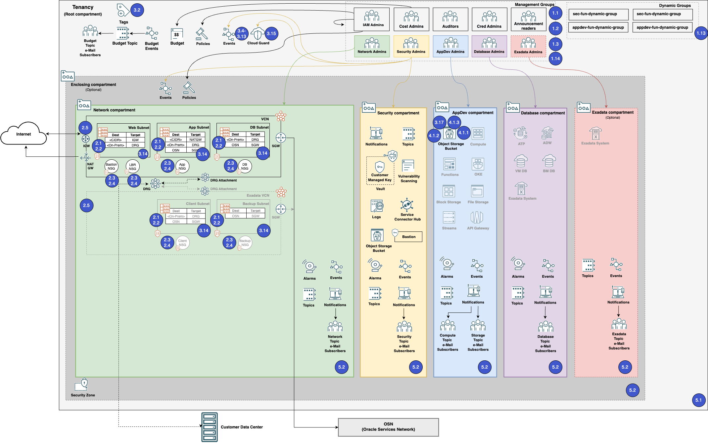

# CIS OCI Benchmark to CIS Landing Zone Architecture Mapping
## Overview
The OCI CIS Landing Zone Quick Start Terraform configures services and resources in an OCI tenancy to comply with the [CIS OCI Foundations Benchmark v2.0.0](https://www.cisecurity.org/benchmark/oracle_cloud/).  This document details how the OCI CIS Landing Zone configuration aligns with the CIS Benchmark v2.0.0.

## Architecture to CIS OCI Benchmark
The diagram below shows how the services and resources deployed in a single VCN deployment map to the CIS OCI Benchmark v2.0.0.

## Mapping to CIS OCI Benchmark
The table below documents how the services and resources are configured to meet the CIS OCI Benchmark.

|CIS v8        |Benchmark Recommendation #|Section                       |Level|Title                                                                                                                             |Configured By Quick Start           |Quick Start Terraform                                                                                                                                                                                                                                                                                                                                                                                                                                                                                                                                                                                                                                                                                                                                                                                                                                                                                                                                                                                                                                                                                                                                                                                                                                                                                                                                                                                                                                                                                                                                                                                                                                                                                                                                                                                                                                                                                                                                  |Code Source                                                                                                                                                                                                                                                                                                                                                                                                                                                          |Cloud Guard Detector                                                                                                                                         |Cloud Guard Detector Coverage|Security Zone Rule                 |
|--------------|--------------------------|------------------------------|-----|----------------------------------------------------------------------------------------------------------------------------------|------------------------------------|-------------------------------------------------------------------------------------------------------------------------------------------------------------------------------------------------------------------------------------------------------------------------------------------------------------------------------------------------------------------------------------------------------------------------------------------------------------------------------------------------------------------------------------------------------------------------------------------------------------------------------------------------------------------------------------------------------------------------------------------------------------------------------------------------------------------------------------------------------------------------------------------------------------------------------------------------------------------------------------------------------------------------------------------------------------------------------------------------------------------------------------------------------------------------------------------------------------------------------------------------------------------------------------------------------------------------------------------------------------------------------------------------------------------------------------------------------------------------------------------------------------------------------------------------------------------------------------------------------------------------------------------------------------------------------------------------------------------------------------------------------------------------------------------------------------------------------------------------------------------------------------------------------------------------------------------------------|---------------------------------------------------------------------------------------------------------------------------------------------------------------------------------------------------------------------------------------------------------------------------------------------------------------------------------------------------------------------------------------------------------------------------------------------------------------------|-------------------------------------------------------------------------------------------------------------------------------------------------------------|-----------------------------|-----------------------------------|
|              |1                         |Identity and Access Management|     |                                                                                                                                  |                                    |                                                                                                                                                                                                                                                                                                                                                                                                                                                                                                                                                                                                                                                                                                                                                                                                                                                                                                                                                                                                                                                                                                                                                                                                                                                                                                                                                                                                                                                                                                                                                                                                                                                                                                                                                                                                                                                                                                                                                       |                                                                                                                                                                                                                                                                                                                                                                                                                                                                     |                                                                                                                                                             |                             |                                   |
|5.4, 6.7      |1.1                       |Identity and Access Management|1    |Ensure service level admins are created to manage resources of particular service                                                 |Yes                                 |The CIS Landing Zone defines the following personas that account for most organization needs: • IAM Administrators: manage IAM services and resources including compartments, groups, dynamic groups, policies, identity providers, authentication policies, network sources, tag defaults. However, this group is not allowed to manage the out-of-box Administrators and Credential Administrators groups. It's also not allowed to touch the out-of-box Tenancy Admin Policy policy. • Credential Administrators: manage users capabilities and users credentials in general, including API keys, authentication tokens and secret keys. • Cost Administrators: manage budgets and usage reports. • Auditors: entitled with read-only access across the tenancy and the ability to use cloud-shell to run the cis_reports.py script. • Announcement Readers: for reading announcements displayed in OCI Console. • Security Administrators: manage security services and resources including Vaults, Keys, Logging, Vulnerability Scanning, Web Application Firewall, Bastion, Service Connector Hub. • Network Administrators: manage OCI network family, including VCNs, Load Balancers, DRGs, VNICs, IP addresses. • Application Administrators: manage application related resources including Compute images, OCI Functions, Kubernetes clusters, Streams, Object Storage, Block Storage, File Storage. • Database Administrators: manage database services, including Oracle VMDB (Virtual Machine), BMDB (Bare Metal), ADB (Autonomous databases), Exadata databases, MySQL, NoSQL, etc. • ExaCS Administrators (only created when ExaCS compartment is created): manage Exadata infrastructure and VM clusters in the ExaCS compartment. • Storage Administrators: the only group allowed to delete storage resources, including buckets, volumes and files. Used as a protection measure against inadvertent deletion of storage resources.|https://github.com/oracle-quickstart/oci-cis-landingzone-quickstart/blob/main/config/iam_groups.tf Deployment dependent: - https://github.com/oracle-quickstart/oci-cis-landingzone-quickstart/blob/main/config/iam_service_policies.tf - https://github.com/oracle-quickstart/oci-cis-landingzone-quickstart/blob/main/config/iam_template_policies.tf                                                                                                              |POLICY_GIVES_MANY_PRIVILEGES                                                                                                                                 |Partial Coverage             |                                   |
|3.3           |1.2                       |Identity and Access Management|1    |Ensure permissions on all resources are given only to the tenancy administrator group                                             |Yes                                 |The CIS Landing Zone defines the following personas that account for most organization needs: • IAM Administrators: manage IAM services and resources including compartments, groups, dynamic groups, policies, identity providers, authentication policies, network sources, tag defaults. However, this group is not allowed to manage the out-of-box Administrators and Credential Administrators groups. It's also not allowed to touch the out-of-box Tenancy Admin Policy policy. • Credential Administrators: manage users capabilities and users credentials in general, including API keys, authentication tokens and secret keys. • Cost Administrators: manage budgets and usage reports. • Auditors: entitled with read-only access across the tenancy and the ability to use cloud-shell to run the cis_reports.py script. • Announcement Readers: for reading announcements displayed in OCI Console. • Security Administrators: manage security services and resources including Vaults, Keys, Logging, Vulnerability Scanning, Web Application Firewall, Bastion, Service Connector Hub. • Network Administrators: manage OCI network family, including VCNs, Load Balancers, DRGs, VNICs, IP addresses. • Application Administrators: manage application related resources including Compute images, OCI Functions, Kubernetes clusters, Streams, Object Storage, Block Storage, File Storage. • Database Administrators: manage database services, including Oracle VMDB (Virtual Machine), BMDB (Bare Metal), ADB (Autonomous databases), Exadata databases, MySQL, NoSQL, etc. • ExaCS Administrators (only created when ExaCS compartment is created): manage Exadata infrastructure and VM clusters in the ExaCS compartment. • Storage Administrators: the only group allowed to delete storage resources, including buckets, volumes and files. Used as a protection measure against inadvertent deletion of storage resources.|https://github.com/oracle-quickstart/oci-cis-landingzone-quickstart/blob/main/config/iam_groups.tf Deployment dependent: - https://github.com/oracle-quickstart/oci-cis-landingzone-quickstart/blob/main/config/iam_service_policies.tf - https://github.com/oracle-quickstart/oci-cis-landingzone-quickstart/blob/main/config/iam_template_policies.tf                                                                                                              |POLICY_GIVES_MANY_PRIVILEGES                                                                                                                                 |Partial Coverage             |                                   |
|3.3, 5.4      |1.3                       |Identity and Access Management|1    |Ensure IAM administrators cannot update tenancy Administrators group                                                              |Yes                                 |The CIS Landing Zone defines the following personas that account for most organization needs: • IAM Administrators: manage IAM services and resources including compartments, groups, dynamic groups, policies, identity providers, authentication policies, network sources, tag defaults. However, this group is not allowed to manage the out-of-box Administrators and Credential Administrators groups. It's also not allowed to touch the out-of-box Tenancy Admin Policy policy. • Credential Administrators: manage users capabilities and users credentials in general, including API keys, authentication tokens and secret keys.                                                                                                                                                                                                                                                                                                                                                                                                                                                                                                                                                                                                                                                                                                                                                                                                                                                                                                                                                                                                                                                                                                                                                                                                                                                                                                            |https://github.com/oracle-quickstart/oci-cis-landingzone-quickstart/blob/main/config/iam_groups.tf Deployment dependent: - https://github.com/oracle-quickstart/oci-cis-landingzone-quickstart/blob/main/config/iam_service_policies.tf - https://github.com/oracle-quickstart/oci-cis-landingzone-quickstart/blob/main/config/iam_template_policies.tf                                                                                                              |POLICY_TENANCY_ADMIN_GROUP_PRIVILEGES                                                                                                                        |Partial Coverage             |                                   |
|4.1, 5.2      |1.4                       |Identity and Access Management|1    |Ensure IAM password policy requires minimum length of 14 or greater                                                               |No                                  |The CIS Landing Zone does change authentication settings.                                                                                                                                                                                                                                                                                                                                                                                                                                                                                                                                                                                                                                                                                                                                                                                                                                                                                                                                                                                                                                                                                                                                                                                                                                                                                                                                                                                                                                                                                                                                                                                                                                                                                                                                                                                                                                                                                              |                                                                                                                                                                                                                                                                                                                                                                                                                                                                     |PASSWORD_POLICY_NOT_COMPLEX                                                                                                                                  |                             |                                   |
|4.1, 5.2      |1.5                       |Identity and Access Management|1    |Ensure IAM password policy expires passwords within 365 days                                                                      |No                                  |The CIS Landing Zone does change authentication settings.                                                                                                                                                                                                                                                                                                                                                                                                                                                                                                                                                                                                                                                                                                                                                                                                                                                                                                                                                                                                                                                                                                                                                                                                                                                                                                                                                                                                                                                                                                                                                                                                                                                                                                                                                                                                                                                                                              |                                                                                                                                                                                                                                                                                                                                                                                                                                                                     |PASSWORD_TOO_OLD                                                                                                                                             |                             |                                   |
|5.2           |1.6                       |Identity and Access Management|1    |Ensure IAM password policy prevents password reuse                                                                                |No                                  |The CIS Landing Zone does change authentication settings.                                                                                                                                                                                                                                                                                                                                                                                                                                                                                                                                                                                                                                                                                                                                                                                                                                                                                                                                                                                                                                                                                                                                                                                                                                                                                                                                                                                                                                                                                                                                                                                                                                                                                                                                                                                                                                                                                              |                                                                                                                                                                                                                                                                                                                                                                                                                                                                     |None                                                                                                                                                         |                             |                                   |
|6.3, 6.5      |1.7                       |Identity and Access Management|1    |Ensure MFA is enabled for all users with a console password                                                                       |No                                  |The CIS Landing Zone does not create of modify OCI IAM users.                                                                                                                                                                                                                                                                                                                                                                                                                                                                                                                                                                                                                                                                                                                                                                                                                                                                                                                                                                                                                                                                                                                                                                                                                                                                                                                                                                                                                                                                                                                                                                                                                                                                                                                                                                                                                                                                                          |                                                                                                                                                                                                                                                                                                                                                                                                                                                                     |NO_MFA_ENABLED_FOR_USER                                                                                                                                      |                             |                                   |
|4.1, 4.4      |1.8                       |Identity and Access Management|1    |Ensure user API keys rotate within 90 days or less                                                                                |No                                  |The CIS Landing Zone does not create OCI IAM users or API Keys of users.                                                                                                                                                                                                                                                                                                                                                                                                                                                                                                                                                                                                                                                                                                                                                                                                                                                                                                                                                                                                                                                                                                                                                                                                                                                                                                                                                                                                                                                                                                                                                                                                                                                                                                                                                                                                                                                                               |                                                                                                                                                                                                                                                                                                                                                                                                                                                                     |API_KEY_TOO_OLD                                                                                                                                              |                             |                                   |
|4.1, 5.2      |1.9                       |Identity and Access Management|1    |Ensure user customer secret keys rotate within 90 days or less                                                                    |No                                  |The CIS Landing Zone does not create OCI IAM users or customer secrets of users.                                                                                                                                                                                                                                                                                                                                                                                                                                                                                                                                                                                                                                                                                                                                                                                                                                                                                                                                                                                                                                                                                                                                                                                                                                                                                                                                                                                                                                                                                                                                                                                                                                                                                                                                                                                                                                                                       |                                                                                                                                                                                                                                                                                                                                                                                                                                                                     |SECRET_KEY_TOO_OLD                                                                                                                                           |                             |                                   |
|4.1, 5.2      |1.10                      |Identity and Access Management|1    |Ensure user auth tokens rotate within 90 days or less                                                                             |No                                  |The CIS Landing Zone does not create OCI IAM users or Auth Tokens of users.                                                                                                                                                                                                                                                                                                                                                                                                                                                                                                                                                                                                                                                                                                                                                                                                                                                                                                                                                                                                                                                                                                                                                                                                                                                                                                                                                                                                                                                                                                                                                                                                                                                                                                                                                                                                                                                                            |                                                                                                                                                                                                                                                                                                                                                                                                                                                                     |AUTH_TOKEN_TOO_OLD                                                                                                                                           |                             |                                   |
|4.1, 5.2      |1.11                      |Identity and Access Management|1    |Ensure user IAM Database Passwords rotate within 90 days                                                                          |No                                  |The CIS Landing Zone does not create OCI IAM users or Databse Passwords of users.                                                                                                                                                                                                                                                                                                                                                                                                                                                                                                                                                                                                                                                                                                                                                                                                                                                                                                                                                                                                                                                                                                                                                                                                                                                                                                                                                                                                                                                                                                                                                                                                                                                                                                                                                                                                                                                                      |                                                                                                                                                                                                                                                                                                                                                                                                                                                                     |None                                                                                                                                                         |                             |                                   |
|5.4           |1.12                      |Identity and Access Management|1    |Ensure API keys are not created for tenancy administrator users                                                                   |No                                  |The CIS Landing Zone does modify existing users.                                                                                                                                                                                                                                                                                                                                                                                                                                                                                                                                                                                                                                                                                                                                                                                                                                                                                                                                                                                                                                                                                                                                                                                                                                                                                                                                                                                                                                                                                                                                                                                                                                                                                                                                                                                                                                                                                                       |                                                                                                                                                                                                                                                                                                                                                                                                                                                                     |USER_HAS_API_KEYS                                                                                                                                            |                             |                                   |
|5.1           |1.13                      |Identity and Access Management|1    |Ensure all OCI IAM user accounts have a valid and current email address                                                           |Yes                                 |The Landing Zone defines four dynamic groups to satisfy common needs of workloads that are eventually deployed: • Security Functions: to be used by functions defined in the Security compartment. The matching rule includes all functions in the Security compartment. An example is a function for rotating secrets kept in a Vault. • AppDev Functions: to be used by functions defined in the AppDev compartment. The matching rule includes all functions in the AppDev compartment. An example is a function for processing of application data and writing it to an Object Storage bucket. • Compute Agent: to be used by Compute's management agent in the AppDev compartment. • Database KMS: to be used by databases in the Database compartment to access keys in the Vault service.                                                                                                                                                                                                                                                                                                                                                                                                                                                                                                                                                                                                                                                                                                                                                                                                                                                                                                                                                                                                                                                                                                                                                       |                                                                                                                                                                                                                                                                                                                                                                                                                                                                     |None                                                                                                                                                         |                             |                                   |
|6.8           |1.14                      |Identity and Access Management|1    |Ensure Instance Principal authentication is used for OCI instances, OCI Cloud Databases and OCI Functions to access OCI resources.|Yes                                 |The CIS Landing Zone restricts adds where conditions to the OCI IAM policies for the Network Admins , Security Admins, App Admin, and Database Admins groups which allows them to create storage services but prevents them from deleting storage services. The CIS Landing Zone also create a Storage Admin policy and group which allows the deletion of storage resources but not their creation.                                                                                                                                                                                                                                                                                                                                                                                                                                                                                                                                                                                                                                                                                                                                                                                                                                                                                                                                                                                                                                                                                                                                                                                                                                                                                                                                                                                                                                                                                                                                                   |Deployment dependent: - https://github.com/oracle-quickstart/oci-cis-landingzone-quickstart/blob/main/config/iam_service_policies.tf - https://github.com/oracle-quickstart/oci-cis-landingzone-quickstart/blob/main/config/iam_template_policies.tf                                                                                                                                                                                                                 |KEY_NOT_ROTATED                                                                                                                                              |                             |                                   |
|5.4, 6.8      |1.15                      |Identity and Access Management|2    |Ensure storage service-level admins cannot delete resources they manage                                                           |                                    |                                                                                                                                                                                                                                                                                                                                                                                                                                                                                                                                                                                                                                                                                                                                                                                                                                                                                                                                                                                                                                                                                                                                                                                                                                                                                                                                                                                                                                                                                                                                                                                                                                                                                                                                                                                                                                                                                                                                                       |                                                                                                                                                                                                                                                                                                                                                                                                                                                                     |None                                                                                                                                                         |                             |                                   |
|              |2                         |Networking                    |     |                                                                                                                                  |                                    |                                                                                                                                                                                                                                                                                                                                                                                                                                                                                                                                                                                                                                                                                                                                                                                                                                                                                                                                                                                                                                                                                                                                                                                                                                                                                                                                                                                                                                                                                                                                                                                                                                                                                                                                                                                                                                                                                                                                                       |                                                                                                                                                                                                                                                                                                                                                                                                                                                                     |                                                                                                                                                             |                             |                                   |
|4.4, 12.3     |2.1                       |Networking                    |1    |Ensure no security lists allow ingress from 0.0.0.0/0 to port 22.                                                                 |Yes                                 |The CIS Landing Zone creates a secruity list for each VCN it creates. The security only allows port 22 connections from on-premises CIDRs or the hub network. The on-premises CIDRs variable does not allow 0.0.0.0/0.                                                                                                                                                                                                                                                                                                                                                                                                                                                                                                                                                                                                                                                                                                                                                                                                                                                                                                                                                                                                                                                                                                                                                                                                                                                                                                                                                                                                                                                                                                                                                                                                                                                                                                                                 |https://github.com/oracle-quickstart/oci-cis-landingzone-quickstart/blob/main/config/net_vcn.tf https://github.com/oracle-quickstart/oci-cis-landingzone-quickstart/blob/main/config/variables.tf                                                                                                                                                                                                                                                                    |SECURITY_LISTS_OPEN_SOURCE                                                                                                                                   |                             |                                   |
|4.4, 12.3     |2.2                       |Networking                    |1    |Ensure no security lists allow ingress from 0.0.0.0/0 to port 3389.                                                               |Yes                                 |The CIS Landing Zone creates a secruity list for each VCN it creates. The security only allows port 22 connections from on-premises CIDRs or the hub network. The on-premises CIDRs variable does not allow 0.0.0.0/0.                                                                                                                                                                                                                                                                                                                                                                                                                                                                                                                                                                                                                                                                                                                                                                                                                                                                                                                                                                                                                                                                                                                                                                                                                                                                                                                                                                                                                                                                                                                                                                                                                                                                                                                                 |https://github.com/oracle-quickstart/oci-cis-landingzone-quickstart/blob/main/config/net_vcn.tf https://github.com/oracle-quickstart/oci-cis-landingzone-quickstart/blob/main/config/variables.tf                                                                                                                                                                                                                                                                    |SECURITY_LISTS_OPEN_SOURCE                                                                                                                                   |                             |                                   |
|4.4, 12.3     |2.3                       |Networking                    |1    |Ensure no network security groups allow ingress from 0.0.0.0/0 to port 22.                                                        |Yes                                 |The CIS Landing Zone deploys a bastion network security groups (NSG) for each VCN it creates. That NSG allows 22 however the variable for ingress CIDRs does not allow 0.0.0.0/0.                                                                                                                                                                                                                                                                                                                                                                                                                                                                                                                                                                                                                                                                                                                                                                                                                                                                                                                                                                                                                                                                                                                                                                                                                                                                                                                                                                                                                                                                                                                                                                                                                                                                                                                                                                      |https://github.com/oracle-quickstart/oci-cis-landingzone-quickstart/blob/main/config/variables.tf                                                                                                                                                                                                                                                                                                                                                                    |VCN_NSG_EGRESS_RULE_PORTS_CHECK                                                                                                                              |                             |                                   |
|4.4, 12.3     |2.4                       |Networking                    |1    |Ensure no network security groups allow ingress from 0.0.0.0/0 to port 3389.                                                      |Yes                                 |The CIS Landing Zone deploys a bastion network security groups (NSG) for each VCN it creates. That NSG allows 3389 however the variable for ingress CIDRs does not allow 0.0.0.0/0.                                                                                                                                                                                                                                                                                                                                                                                                                                                                                                                                                                                                                                                                                                                                                                                                                                                                                                                                                                                                                                                                                                                                                                                                                                                                                                                                                                                                                                                                                                                                                                                                                                                                                                                                                                    |https://github.com/oracle-quickstart/oci-cis-landingzone-quickstart/blob/main/config/variables.tf                                                                                                                                                                                                                                                                                                                                                                    |VCN_NSG_EGRESS_RULE_PORTS_CHECK                                                                                                                              |                             |                                   |
|12.3          |2.5                       |Networking                    |1    |Ensure the default security list of every VCN restricts all traffic except ICMP.                                                  |Yes                                 |The CIS Landing Zone modifies the default security list for every VCN it creates to restrict all traffic except for ICMP.                                                                                                                                                                                                                                                                                                                                                                                                                                                                                                                                                                                                                                                                                                                                                                                                                                                                                                                                                                                                                                                                                                                                                                                                                                                                                                                                                                                                                                                                                                                                                                                                                                                                                                                                                                                                                              |https://github.com/oracle-quickstart/oci-cis-landingzone-quickstart/blob/main/config/variables.tf                                                                                                                                                                                                                                                                                                                                                                    |SECURITY_LISTS_OPEN_PORTS                                                                                                                                    |Partial Coverage             |                                   |
|4.4, 12.3     |2.6                       |Networking                    |1    |Ensure Oracle Integration Cloud (OIC) access is restricted to allowed sources.                                                    |No                                  |The CIS Landing Zone doesn't deploy any Oracle Integration Cloud instances.                                                                                                                                                                                                                                                                                                                                                                                                                                                                                                                                                                                                                                                                                                                                                                                                                                                                                                                                                                                                                                                                                                                                                                                                                                                                                                                                                                                                                                                                                                                                                                                                                                                                                                                                                                                                                                                                            |                                                                                                                                                                                                                                                                                                                                                                                                                                                                     |None                                                                                                                                                         |                             |                                   |
|4.4, 12.3     |2.7                       |Networking                    |1    |Ensure Oracle Analytics Cloud (OAC) access is restricted to allowed sources or deployed within a Virtual Cloud Network.           |Enables                             |The CIS Landing Zone doesn't deploy any Oracle Analytics Cloud (OAC) instances. The CIS Landing Zone does deploy VCNs with app subnets which are private that can be used for deploying a OAC instances.                                                                                                                                                                                                                                                                                                                                                                                                                                                                                                                                                                                                                                                                                                                                                                                                                                                                                                                                                                                                                                                                                                                                                                                                                                                                                                                                                                                                                                                                                                                                                                                                                                                                                                                                               |https://github.com/oracle-quickstart/oci-cis-landingzone-quickstart/blob/main/config/net_vcn.tf                                                                                                                                                                                                                                                                                                                                                                      |None                                                                                                                                                         |                             |                                   |
|4.4, 12.3     |2.8                       |Networking                    |1    |Ensure Oracle Autonomous Shared Database (ADB) access is restricted or deployed within a VCN.                                     |Enables                             |The CIS Landing Zone doesn't deploy any Autonomous Shared Databases (ADB-S). The CIS Landing Zone does deploy VCNs with database subnets which are private that can be used for deploying a ADB-S                                                                                                                                                                                                                                                                                                                                                                                                                                                                                                                                                                                                                                                                                                                                                                                                                                                                                                                                                                                                                                                                                                                                                                                                                                                                                                                                                                                                                                                                                                                                                                                                                                                                                                                                                      |https://github.com/oracle-quickstart/oci-cis-landingzone-quickstart/blob/main/config/net_vcn.tf                                                                                                                                                                                                                                                                                                                                                                      |None                                                                                                                                                         |                             |                                   |
|              |3                         |Compute                       |     |                                                                                                                                  |                                    |                                                                                                                                                                                                                                                                                                                                                                                                                                                                                                                                                                                                                                                                                                                                                                                                                                                                                                                                                                                                                                                                                                                                                                                                                                                                                                                                                                                                                                                                                                                                                                                                                                                                                                                                                                                                                                                                                                                                                       |                                                                                                                                                                                                                                                                                                                                                                                                                                                                     |                                                                                                                                                             |                             |                                   |
|4.8           |3.1                       |Compute                       |2    |Ensure Compute Instance Legacy Metadata service endpoint is disabled                                                              |Enables - via Secure Workload Module|The CIS Landing Zone doesn't deploy any Compute Instance. The CIS Landing Zone does deploy VCNs which can be used for deploying compute Instances and the Secure Workload Module deploys compute instances with the Legacy Metadata service endpoint disabled.                                                                                                                                                                                                                                                                                                                                                                                                                                                                                                                                                                                                                                                                                                                                                                                                                                                                                                                                                                                                                                                                                                                                                                                                                                                                                                                                                                                                                                                                                                                                                                                                                                                                                         |https://github.com/oracle-quickstart/terraform-oci-secure-workloads/blob/main/cis-compute-storage/compute.tf                                                                                                                                                                                                                                                                                                                                                         |                                                                                                                                                             |                             |                                   |
|4.1           |3.2                       |Compute                       |2    |Ensure Secure Boot is enabled on Compute Instance                                                                                 |Enables - via Secure Workload Module|The CIS Landing Zone doesn't deploy any Compute Instance. The CIS Landing Zone does deploy VCNs which can be used for deploying compute Instances and the Secure Workload Module deploys compute instances with Secure Boot Enabled.                                                                                                                                                                                                                                                                                                                                                                                                                                                                                                                                                                                                                                                                                                                                                                                                                                                                                                                                                                                                                                                                                                                                                                                                                                                                                                                                                                                                                                                                                                                                                                                                                                                                                                                   |https://github.com/oracle-quickstart/terraform-oci-secure-workloads/blob/main/cis-compute-storage/compute.tf                                                                                                                                                                                                                                                                                                                                                         |                                                                                                                                                             |                             |                                   |
|3.10,4.1      |3.3                       |Compute                       |1    |Ensure In-transit Encryption is enabled on Compute Instance                                                                       |Enables - via Secure Workload Module|The CIS Landing Zone doesn't deploy any Compute Instance. The CIS Landing Zone does deploy VCNs which can be used for deploying compute Instances and the Secure Workload Module deploys compute instances with In-Transit Encryption Enabled.                                                                                                                                                                                                                                                                                                                                                                                                                                                                                                                                                                                                                                                                                                                                                                                                                                                                                                                                                                                                                                                                                                                                                                                                                                                                                                                                                                                                                                                                                                                                                                                                                                                                                                         |https://github.com/oracle-quickstart/terraform-oci-secure-workloads/blob/main/cis-compute-storage/compute.tf                                                                                                                                                                                                                                                                                                                                                         |                                                                                                                                                             |                             |                                   |
|              |4                         |Logging and Monitoring        |     |                                                                                                                                  |                                    |                                                                                                                                                                                                                                                                                                                                                                                                                                                                                                                                                                                                                                                                                                                                                                                                                                                                                                                                                                                                                                                                                                                                                                                                                                                                                                                                                                                                                                                                                                                                                                                                                                                                                                                                                                                                                                                                                                                                                       |                                                                                                                                                                                                                                                                                                                                                                                                                                                                     |                                                                                                                                                             |                             |                                   |
|1.1           |4.1                       |Logging and Monitoring        |1    |Ensure default tags are used on resources.                                                                                        |Yes                                 |The CIS Landing zone deploys two default tags. The two tags are: • Created By tag which identifies who create the resource. • Created On tag which identifies when the resource was created.                                                                                                                                                                                                                                                                                                                                                                                                                                                                                                                                                                                                                                                                                                                                                                                                                                                                                                                                                                                                                                                                                                                                                                                                                                                                                                                                                                                                                                                                                                                                                                                                                                                                                                                                                           |https://github.com/oracle-quickstart/oci-cis-landingzone-quickstart/blob/main/config/mon_tags.tf                                                                                                                                                                                                                                                                                                                                                                     |RESOURCE_NOT_TAGGED                                                                                                                                          |                             |                                   |
|8.2, 8.11     |4.2                       |Logging and Monitoring        |1    |Create at least one notification topic and subscription to receive monitoring alerts.                                             |Yes                                 |The CIS Landing Zone creates at least two topics each with a subscription. The two default topics are: • Security Topic and subscription which is where all IAM related events are sent. • Network Topic and subscription which is where all network related events are sent.                                                                                                                                                                                                                                                                                                                                                                                                                                                                                                                                                                                                                                                                                                                                                                                                                                                                                                                                                                                                                                                                                                                                                                                                                                                                                                                                                                                                                                                                                                                                                                                                                                                                          |https://github.com/oracle-quickstart/oci-cis-landingzone-quickstart/blob/main/config/mon_topics.tf                                                                                                                                                                                                                                                                                                                                                                   |None                                                                                                                                                         |                             |                                   |
|4.2           |4.3                       |Logging and Monitoring        |1    |Ensure a notification is configured for Identity Provider changes.                                                                |Yes                                 |The CIS Landing Zone creates an OCI event rule for Identity Provider changes.                                                                                                                                                                                                                                                                                                                                                                                                                                                                                                                                                                                                                                                                                                                                                                                                                                                                                                                                                                                                                                                                                                                                                                                                                                                                                                                                                                                                                                                                                                                                                                                                                                                                                                                                                                                                                                                                          |https://github.com/oracle-quickstart/oci-cis-landingzone-quickstart/blob/main/config/mon_notifications.tf                                                                                                                                                                                                                                                                                                                                                            |None                                                                                                                                                         |                             |                                   |
|4.2           |4.4                       |Logging and Monitoring        |1    |Ensure a notification is configured for IdP group mapping changes.                                                                |Yes                                 |The CIS Landing Zone creates an OCI event rule for IDP mapping changes.                                                                                                                                                                                                                                                                                                                                                                                                                                                                                                                                                                                                                                                                                                                                                                                                                                                                                                                                                                                                                                                                                                                                                                                                                                                                                                                                                                                                                                                                                                                                                                                                                                                                                                                                                                                                                                                                                |https://github.com/oracle-quickstart/oci-cis-landingzone-quickstart/blob/main/config/mon_notifications.tf                                                                                                                                                                                                                                                                                                                                                            |None                                                                                                                                                         |                             |                                   |
|4.2           |4.5                       |Logging and Monitoring        |1    |Ensure a notification is configured for IAM group changes.                                                                        |Yes                                 |The CIS Landing Zone creates an OCI event rule for IAM group changes.                                                                                                                                                                                                                                                                                                                                                                                                                                                                                                                                                                                                                                                                                                                                                                                                                                                                                                                                                                                                                                                                                                                                                                                                                                                                                                                                                                                                                                                                                                                                                                                                                                                                                                                                                                                                                                                                                  |https://github.com/oracle-quickstart/oci-cis-landingzone-quickstart/blob/main/config/mon_notifications.tf                                                                                                                                                                                                                                                                                                                                                            |IAM_GROUP_DELETED, USER_ADDED_TO_GROUP, IAM_GROUP_CREATED, USER_REMOVED_FROM_GROUP                                                                           |                             |                                   |
|4.2           |4.6                       |Logging and Monitoring        |1    |Ensure a notification is configured for IAM policy changes.                                                                       |Yes                                 |The CIS Landing Zone creates an OCI event rule for IAM policy changes.                                                                                                                                                                                                                                                                                                                                                                                                                                                                                                                                                                                                                                                                                                                                                                                                                                                                                                                                                                                                                                                                                                                                                                                                                                                                                                                                                                                                                                                                                                                                                                                                                                                                                                                                                                                                                                                                                 |https://github.com/oracle-quickstart/oci-cis-landingzone-quickstart/blob/main/config/mon_notifications.tf                                                                                                                                                                                                                                                                                                                                                            |SECURITY_POLICY_MODIFIED                                                                                                                                     |Partial Coverage             |                                   |
|4.2           |4.7                       |Logging and Monitoring        |1    |Ensure a notification is configured for user changes.                                                                             |Yes                                 |The CIS Landing Zone creates an OCI event rule for IAM User changes.                                                                                                                                                                                                                                                                                                                                                                                                                                                                                                                                                                                                                                                                                                                                                                                                                                                                                                                                                                                                                                                                                                                                                                                                                                                                                                                                                                                                                                                                                                                                                                                                                                                                                                                                                                                                                                                                                   |https://github.com/oracle-quickstart/oci-cis-landingzone-quickstart/blob/main/config/mon_notifications.tf                                                                                                                                                                                                                                                                                                                                                            |USER_ADDED_TO_GROUP                                                                                                                                          |Partial Coverage             |                                   |
|4.2           |4.8                       |Logging and Monitoring        |1    |Ensure a notification is configured for VCN changes.                                                                              |Yes                                 |The CIS Landing Zone creates an OCI event rule for Virtual Cloud Network (VCN) changes.                                                                                                                                                                                                                                                                                                                                                                                                                                                                                                                                                                                                                                                                                                                                                                                                                                                                                                                                                                                                                                                                                                                                                                                                                                                                                                                                                                                                                                                                                                                                                                                                                                                                                                                                                                                                                                                                |https://github.com/oracle-quickstart/oci-cis-landingzone-quickstart/blob/main/config/mon_notifications.tf                                                                                                                                                                                                                                                                                                                                                            |VCN_CREATE, VCN_DELETED                                                                                                                                      |Partial Coverage             |                                   |
|4.2           |4.9                       |Logging and Monitoring        |1    |Ensure a notification is configured for changes to route tables.                                                                  |Yes                                 |The CIS Landing Zone creates an OCI event rule for network route table changes.                                                                                                                                                                                                                                                                                                                                                                                                                                                                                                                                                                                                                                                                                                                                                                                                                                                                                                                                                                                                                                                                                                                                                                                                                                                                                                                                                                                                                                                                                                                                                                                                                                                                                                                                                                                                                                                                        |https://github.com/oracle-quickstart/oci-cis-landingzone-quickstart/blob/main/config/mon_notifications.tf                                                                                                                                                                                                                                                                                                                                                            |ROUTE_TABLE_CHANGED                                                                                                                                          |Partial Coverage             |                                   |
|4.2           |4.10                      |Logging and Monitoring        |1    |Ensure a notification is configured for security list changes.                                                                    |Yes                                 |The CIS Landing Zone creates an OCI event rule for network Security List changes.                                                                                                                                                                                                                                                                                                                                                                                                                                                                                                                                                                                                                                                                                                                                                                                                                                                                                                                                                                                                                                                                                                                                                                                                                                                                                                                                                                                                                                                                                                                                                                                                                                                                                                                                                                                                                                                                      |https://github.com/oracle-quickstart/oci-cis-landingzone-quickstart/blob/main/config/mon_notifications.tf                                                                                                                                                                                                                                                                                                                                                            |VCN_SECURITY_LIST_DELETED, VCN_SECURITY_LIST_CREATED, VCN_SECURITY_LIST_EGRESS_RULES_CHANGED, VCN_SECURITY_LIST_INGRESS_RULES_CHANGED                        |Partial Coverage             |                                   |
|4.2           |4.11                      |Logging and Monitoring        |1    |Ensure a notification is configured for network security group changes.                                                           |Yes                                 |The CIS Landing Zone creates an OCI event rule for network security group changes.                                                                                                                                                                                                                                                                                                                                                                                                                                                                                                                                                                                                                                                                                                                                                                                                                                                                                                                                                                                                                                                                                                                                                                                                                                                                                                                                                                                                                                                                                                                                                                                                                                                                                                                                                                                                                                                                     |https://github.com/oracle-quickstart/oci-cis-landingzone-quickstart/blob/main/config/mon_notifications.tf                                                                                                                                                                                                                                                                                                                                                            |NSG_DELETE, NSG_EGRESS_RULE_CHANGED, NSG_INGRESS_RULE_CHANGED, VCN_NSG_INGRESS_RULE_PORTS_CHECK, VCN_NSG_EGRESS_RULE_PORTS_CHECK                             |Partial Coverage             |                                   |
|4.2           |4.12                      |Logging and Monitoring        |1    |Ensure a notification is configured for changes to network gateways.                                                              |Yes                                 |The CIS Landing Zone creates an OCI event rules for network gateway changes.                                                                                                                                                                                                                                                                                                                                                                                                                                                                                                                                                                                                                                                                                                                                                                                                                                                                                                                                                                                                                                                                                                                                                                                                                                                                                                                                                                                                                                                                                                                                                                                                                                                                                                                                                                                                                                                                           |https://github.com/oracle-quickstart/oci-cis-landingzone-quickstart/blob/main/config/mon_notifications.tf                                                                                                                                                                                                                                                                                                                                                            |DRG_DELETED, VCN_LOCAL_PEERING_GATEWAY_CHANGED, DRG_ATTACHED_TO_VCN, INTERNET_GATEWAY_TERMINATED, INTERNET_GATEWAY_CREATED, DRG_DETACHED_FROM_VCN DRG_CREATED|Partial Coverage             |                                   |
|8.2, 8.5, 13.6|4.13                      |Logging and Monitoring        |2    |Ensure VCN flow logging is enabled for all subnets.                                                                               |Yes                                 |The CIS Landing Zone enables VCN flow logs for all subnets it deploys                                                                                                                                                                                                                                                                                                                                                                                                                                                                                                                                                                                                                                                                                                                                                                                                                                                                                                                                                                                                                                                                                                                                                                                                                                                                                                                                                                                                                                                                                                                                                                                                                                                                                                                                                                                                                                                                                  |https://github.com/oracle-quickstart/oci-cis-landingzone-quickstart/blob/main/config/mon_flow_logs.tf                                                                                                                                                                                                                                                                                                                                                                |None                                                                                                                                                         |                             |                                   |
|8.2, 8.5, 8.11|4.14                      |Logging and Monitoring        |1    |Ensure Cloud Guard is enabled in the root compartment of the tenancy.                                                             |Yes                                 |The CIS Landing Zone enables OCI Cloud Guard with all the detectors and responders at the root compartment.                                                                                                                                                                                                                                                                                                                                                                                                                                                                                                                                                                                                                                                                                                                                                                                                                                                                                                                                                                                                                                                                                                                                                                                                                                                                                                                                                                                                                                                                                                                                                                                                                                                                                                                                                                                                                                            |https://github.com/oracle-quickstart/oci-cis-landingzone-quickstart/blob/main/config/mon_cloud_guard.tf                                                                                                                                                                                                                                                                                                                                                              |None                                                                                                                                                         |                             |                                   |
|8.2, 8.11     |4.15                      |Logging and Monitoring        |1    |Ensure a notification is configured for Oracle Cloud Guard problems detected                                                      |Yes                                 |The CIS Landing Zone creates an OCI event rules for Cloud Guard Events.                                                                                                                                                                                                                                                                                                                                                                                                                                                                                                                                                                                                                                                                                                                                                                                                                                                                                                                                                                                                                                                                                                                                                                                                                                                                                                                                                                                                                                                                                                                                                                                                                                                                                                                                                                                                                                                                                |https://github.com/oracle-quickstart/oci-cis-landingzone-quickstart/blob/main/config/mon_notifications.tf                                                                                                                                                                                                                                                                                                                                                            |None                                                                                                                                                         |                             |                                   |
|8.0           |4.16                      |Logging and Monitoring        |1    |Ensure customer created Customer Managed Key (CMK) is rotated at least annually.                                                  |No                                  |No configuration available at this time                                                                                                                                                                                                                                                                                                                                                                                                                                                                                                                                                                                                                                                                                                                                                                                                                                                                                                                                                                                                                                                                                                                                                                                                                                                                                                                                                                                                                                                                                                                                                                                                                                                                                                                                                                                                                                                                                                                |                                                                                                                                                                                                                                                                                                                                                                                                                                                                     |KEY_NOT_ROTATED                                                                                                                                              |                             |                                   |
|8.2           |4.17                      |Logging and Monitoring        |2    |Ensure write level Object Storage logging is enabled for all buckets.                                                             |Yes                                 |The CIS Landing Zone deploy an optional Object Storage bucket(s) in the AppDev Compartment. Those bucket(s) are deployed and write logging is enabled.                                                                                                                                                                                                                                                                                                                                                                                                                                                                                                                                                                                                                                                                                                                                                                                                                                                                                                                                                                                                                                                                                                                                                                                                                                                                                                                                                                                                                                                                                                                                                                                                                                                                                                                                                                                                 |https://github.com/oracle-quickstart/oci-cis-landingzone-quickstart/blob/main/config/mon_oss_logs.tf                                                                                                                                                                                                                                                                                                                                                                 |BUCKET_WRITE_LOG_ACCESS_DISABLED                                                                                                                             |                             |                                   |
|              |5                         |Storage - Object Storage      |     |                                                                                                                                  |                                    |                                                                                                                                                                                                                                                                                                                                                                                                                                                                                                                                                                                                                                                                                                                                                                                                                                                                                                                                                                                                                                                                                                                                                                                                                                                                                                                                                                                                                                                                                                                                                                                                                                                                                                                                                                                                                                                                                                                                                       |                                                                                                                                                                                                                                                                                                                                                                                                                                                                     |                                                                                                                                                             |                             |                                   |
|3.3           |5.1.1                     |Storage - Object Storage      |1    |Ensure no Object Storage buckets are publicly visible.                                                                            |Yes                                 |The CIS Landing Zone deploy an optional Object Storage bucket(s) in the AppDev Compartment. Those bucket(s) are deployed as a private bucket.                                                                                                                                                                                                                                                                                                                                                                                                                                                                                                                                                                                                                                                                                                                                                                                                                                                                                                                                                                                                                                                                                                                                                                                                                                                                                                                                                                                                                                                                                                                                                                                                                                                                                                                                                                                                          |https://github.com/oracle-quickstart/oci-cis-landingzone-quickstart/blob/main/modules/object-storage/bucket/main.tf                                                                                                                                                                                                                                                                                                                                                  |BUCKET_IS_PUBLIC                                                                                                                                             |                             |deny public_buckets                |
|3.11          |5.1.2                     |Storage - Object Storage      |2    |Ensure Object Storage Buckets are encrypted with a Customer-Managed Key (CMK).                                                    |Yes                                 |The CIS Landing Zone deploys an optional (Level 2 selected) OCI Vault in the Security Compartment and generates an optional Customer Managed Key (CMK). It also deploys required OCI IAM policies for the Object Storage service and OCI IAM groups to use CMKs in the Security Compartment.                                                                                                                                                                                                                                                                                                                                                                                                                                                                                                                                                                                                                                                                                                                                                                                                                                                                                                                                                                                                                                                                                                                                                                                                                                                                                                                                                                                                                                                                                                                                                                                                                                                           |https://github.com/oracle-quickstart/oci-cis-landingzone-quickstart/blob/main/modules/object-storage/bucket/main.tf https://github.com/oracle-quickstart/oci-cis-landingzone-quickstart/blob/main/config/keys.tf Deployment dependent: - https://github.com/oracle-quickstart/oci-cis-landingzone-quickstart/blob/main/config/iam_service_policies.tf - https://github.com/oracle-quickstart/oci-cis-landingzone-quickstart/blob/main/config/iam_template_policies.tf|BUCKET_ENCRYPTED_WITH_ORACLE_MANAGED_KEY                                                                                                                     |                             |deny buckets_without_vault_key     |
|3.11          |5.1.3                     |Storage - Object Storage      |2    |Ensure Versioning is Enabled for Object Storage Buckets.                                                                          |Yes                                 |The CIS Landing Zone deploy an optional Object Storage bucket in the AppDev Compartment. That bucket is deployed is deployed with versioning Enabled.                                                                                                                                                                                                                                                                                                                                                                                                                                                                                                                                                                                                                                                                                                                                                                                                                                                                                                                                                                                                                                                                                                                                                                                                                                                                                                                                                                                                                                                                                                                                                                                                                                                                                                                                                                                                  |https://github.com/oracle-quickstart/oci-cis-landingzone-quickstart/blob/main/modules/object-storage/bucket/main.tf                                                                                                                                                                                                                                                                                                                                                  |None                                                                                                                                                         |                             |                                   |
|3.11          |5.2.1                     |Storage - Block Volumes       |2    |Ensure Block Volumes are encrypted with Customer-Managed Keys.                                                                    |Enables                             |The CIS Landing Zone deploys an optional (Level 2 selected) OCI Vault in the Security Compartment and generates an optional Customer Managed Key (CMK). It also deploys required OCI IAM policies for the Block Volume service and OCI IAM groups to use CMKs in the Security Compartment.                                                                                                                                                                                                                                                                                                                                                                                                                                                                                                                                                                                                                                                                                                                                                                                                                                                                                                                                                                                                                                                                                                                                                                                                                                                                                                                                                                                                                                                                                                                                                                                                                                                             |https://github.com/oracle-quickstart/oci-cis-landingzone-quickstart/blob/main/config/keys.tf Deployment dependent: - https://github.com/oracle-quickstart/oci-cis-landingzone-quickstart/blob/main/config/iam_service_policies.tf - https://github.com/oracle-quickstart/oci-cis-landingzone-quickstart/blob/main/config/iam_template_policies.tf                                                                                                                    |BLOCK_VOLUME_ENCRYPTED_WITH_ORACLE_MANAGED_KEY                                                                                                               |                             |deny block_volume_without_vault_key|
|3.11          |5.2.2                     |Storage - Block Volumes       |2    |Ensure Boot Volumes are encrypted with Customer-Managed Key.                                                                      |Enables                             |The CIS Landing Zone deploys an optional (Level 2 selected) OCI Vault in the Security Compartment and generates an optional Customer Managed Key (CMK). It also deploys required OCI IAM policies for the Block Volume service and OCI IAM groups to use CMKs in the Security Compartment.                                                                                                                                                                                                                                                                                                                                                                                                                                                                                                                                                                                                                                                                                                                                                                                                                                                                                                                                                                                                                                                                                                                                                                                                                                                                                                                                                                                                                                                                                                                                                                                                                                                             |https://github.com/oracle-quickstart/oci-cis-landingzone-quickstart/blob/main/config/keys.tf Deployment dependent: - https://github.com/oracle-quickstart/oci-cis-landingzone-quickstart/blob/main/config/iam_service_policies.tf - https://github.com/oracle-quickstart/oci-cis-landingzone-quickstart/blob/main/config/iam_template_policies.tf                                                                                                                    |None                                                                                                                                                         |                             |deny boot_volume_without_vault_key |
|3.11          |5.3.1                     |Storage - File Storage Service|2    |Ensure File Storage Systems are encrypted with Customer-Managed Keys.                                                             |Enables                             |The CIS Landing Zone deploys an optional (Level 2 selected) OCI Vault in the Security Compartment and generates an optional Customer Managed Key (CMK). It also deploys required OCI IAM policies for the File Storage Service (FSS) service and OCI IAM groups to use keys in the Security Compartment.                                                                                                                                                                                                                                                                                                                                                                                                                                                                                                                                                                                                                                                                                                                                                                                                                                                                                                                                                                                                                                                                                                                                                                                                                                                                                                                                                                                                                                                                                                                                                                                                                                               |https://github.com/oracle-quickstart/oci-cis-landingzone-quickstart/blob/main/config/keys.tf Deployment dependent: - https://github.com/oracle-quickstart/oci-cis-landingzone-quickstart/blob/main/config/iam_service_policies.tf - https://github.com/oracle-quickstart/oci-cis-landingzone-quickstart/blob/main/config/iam_template_policies.tf                                                                                                                    |None                                                                                                                                                         |                             |deny file_system_without_vault_key |
|              |6                         |Asset Management              |     |                                                                                                                                  |                                    |                                                                                                                                                                                                                                                                                                                                                                                                                                                                                                                                                                                                                                                                                                                                                                                                                                                                                                                                                                                                                                                                                                                                                                                                                                                                                                                                                                                                                                                                                                                                                                                                                                                                                                                                                                                                                                                                                                                                                       |                                                                                                                                                                                                                                                                                                                                                                                                                                                                     |                                                                                                                                                             |                             |                                   |
|3.1           |6.1                       |Asset Management              |1    |Create at least one compartment in your tenancy to store cloud resources.                                                         |Yes                                 |The CIS Landing Zone provisions the following compartments: • A recommended enclosing compartment containing all compartments above. • A Network compartment for all the networking resources, including the required network gateways. • A Security compartment for the logging, key management, and notifications resources. • An App compartment for the application-related services, including compute, storage, functions, streams, Kubernetes nodes, API gateway, and so on. • A Database compartment for all database resources. • An optional compartment for Oracle Exadata Database Service infrastructure.                                                                                                                                                                                                                                                                                                                                                                                                                                                                                                                                                                                                                                                                                                                                                                                                                                                                                                                                                                                                                                                                                                                                                                                                                                                                                                                                 |https://github.com/oracle-quickstart/oci-cis-landingzone-quickstart/blob/main/config/iam_compartments.tf                                                                                                                                                                                                                                                                                                                                                             |None                                                                                                                                                         |                             |                                   |
|3.12          |6.2                       |Asset Management              |1    |Ensure no resources are created in the root compartment.                                                                          |Yes                                 |The CIS Landing Zone creates a • A recommended enclosing compartment is created to contain all of the compartments below. • A Network compartment is used for network and network-related resources. The CIS Landing Zone Quick Start deploys the network-related resources, including VCN, Subnets, gateways, NSG, and Security Lists in the Network Compartment • A Security compartment is used for security and logging related resources. The CIS Landing Zone deploys the logging, key management, and notification resources into the Security Compartment. • An App compartment is used for the application-related services. The CIS Landing Zone deploys an optional Object Storage bucket in this compartment. • A Database compartment for is used for database related resources. • An optional compartment for Oracle Exadata Database Service is used for Exadata infrastructure.                                                                                                                                                                                                                                                                                                                                                                                                                                                                                                                                                                                                                                                                                                                                                                                                                                                                                                                                                                                                                                                       |https://github.com/oracle-quickstart/oci-cis-landingzone-quickstart/blob/main/config/iam_compartments.tf Deployment dependent: - https://github.com/oracle-quickstart/oci-cis-landingzone-quickstart/blob/main/config/iam_service_policies.tf - https://github.com/oracle-quickstart/oci-cis-landingzone-quickstart/blob/main/config/iam_template_policies.tf                                                                                                        |None                                                                                                                                                         |                             |                                   |
