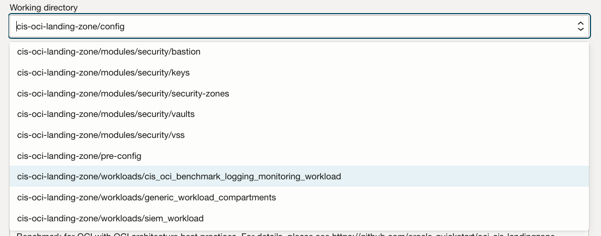
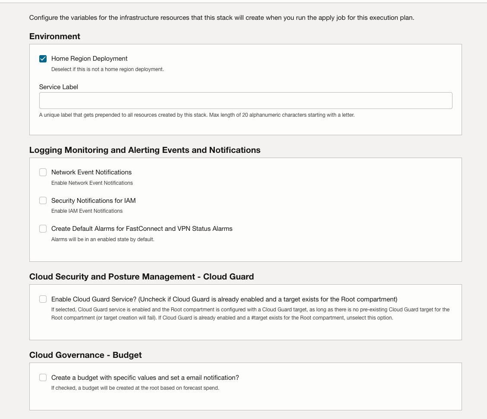

# CIS OCI Benchmark Logging and Monitoring Remediation Workload

## Introduction

The terraform code in this folder adds to an existing OCI tenancy to deploy the following:

**Logging Monitoring and Alerting Events and Notifications:**

- Notifications enabled - IAM/Network
- Notification sent to correct people
- Connectivity alerting & monitoring enabled
- Alerts sent to correct people

**Cloud Security and Posture Management (CSPM)- Cloud Guard:**

- CSPM integrated with tenancy
- Cloud Guard enabled and configured
- Responder - Cloud Events enabled
- Critical/High Alerts are sent to correct people

**Cloud Governance - Budget:**

- Root Level budget has been defined
- Budget is forecast based

## Variables
### Terraform Provider Variables
Variable Name | Description | Required | Default Value
--------------|-------------|----------|--------------
**tenancy_ocid** | The OCI tenancy id where this configuration will be executed. This information can be obtained in OCI Console. | Yes | None
**user_ocid** | The OCI user id that will execute this configuration. This information can be obtained in OCI Console. The user must have the necessary privileges to provision the resources. | Yes | ""
**fingerprint** | The user's public key fingerprint. This information can be obtained in OCI Console. | Yes | ""
**private_key_path** | The local path to the user private key. | Yes | ""
**private_key_password** | The private key password, if any. | No | ""

### Environment Variables
Variable Name | Description | Required | Default Value
--------------|-------------|----------|--------------
**homeregion** | The tenancy's home region identifier where the Terraform should provision the resources. | Yes | None
**service_label** | A label used as a prefix for naming resources. | Yes | None

### Budget Variables
Variable Name | Description | Required | Default Value
--------------|-------------|----------|--------------
**create_budget** | Determines whether or not a budget will be created. | Yes | false
**budget_alert_threshold** | The threshold for triggering the alert expressed as a percentage. 100% is the default. | No | 100
**budget_amount** | The amount of the budget expressed as a whole number in the currency of the customer's rate card. | No | 1000
**budget_alert_email_endpoints** | List of email addresses for all cost related notifications. | No | []

### Security and Network Events Variables
Variable Name | Description | Required | Default Value
--------------|-------------|----------|--------------
**enable_net_events** |  Determines whether or not a network events aligned with the CIS OCI Foundations Benchmark will be created.  | No | false
**network_admin_email_endpoints** | List of email addresses for all network notifications. | No | []
**compartment_id_for_net_events** | The compartment where network events should reside will default to root. | No | (root)
**enable_iam_events** |  Determines whether or not a IAM events aligned with the CIS OCI Foundations Benchmark will be created.  | No | false
**security_admin_email_endpoints** | List of email addresses for all security notifications. | No | []
**compartment_id_for_iam_events** | The compartment where iam events should reside will default to root. | No | (root)

### Alarms Variables
Variable Name | Description | Required | Default Value
--------------|-------------|----------|--------------
**create_alarms_as_enabled** | Creates alarm artifacts in disabled state when set to false. | No | false
**alarms_admin_email_endpoints** | List of email addresses for all alarms related notifications. | No | []
**compartment_id_for_iam_events** | The compartment where alarm events should reside will default to root. | No | (root)
**create_alarms_as_enabled** | Creates alarm artifacts in disabled state when set to false. | No | false

### Cloud Guard Variables
Variable Name | Description | Required | Default Value
--------------|-------------|----------|--------------
**configure_cloud_guard** | Determines whether the Cloud Guard service should be enabled. If true, Cloud Guard is enabled and the Root compartment is configured with a Cloud Guard target, as long as there is no pre-existing Cloud Guard target for the Root compartment (or target creation will fail). | No | false
**cloud_guard_reporting_region** | Cloud Guard reporting region, where Cloud Guard reporting resources are kept. If not set, it defaults to home region. | No | null
**compartment_id_for_cg_events** | The compartment where Cloud Guard events should reside will default to root. | No | null
**cloudguard_email_endpoints** | List of email addresses for Cloud Guard related events. | No | []

## Prerequisites

The following permissions are needed to run the stack using the resource manager.

Note: Some policies(Cloudevents-rule, Alarms, ons-family) can be further restricted and refined if required.

Please replace "`<Remediation Group>`" with an appropriate group in your tenancy.

The reference to "`<Stack Compartment>`" should be replaced within an existing compartment used for housing Security or Shared resources. The stack can also be created at the tenancy level but it is not recommended.

**Resource Manager Permissions:**

`Allow group <Remediation Group> to manage orm-stacks in compartment <Stack Compartment>`  
`Allow group <Remediation Group> to manage orm-jobs in compartment <Stack Compartment>`

**Remediation Permissions:**

`Allow group <Remediation Group> to inspect all-resources in tenancy`  
`Allow group <Remediation Group> to read all-resources in tenancy`  
`Allow group <Remediation Group> to manage cloud-guard-family in tenancy`  
`Allow group <Remediation Group> to manage cloudevents-rules in tenancy`  
`Allow group <Remediation Group> to manage usage-budgets in tenancy`  
`Allow group <Remediation Group> to manage alarms in tenancy`  
`Allow group <Remediation Group> to manage ons-family in tenancy`  
`Allow group <Remediation Group> to manage policies in tenancy`

## Considerations before running the Terraform script

**Stack placement:**

We recommend creating the stack in a Security or Shared compartment and not in the Root compartment. The location of the stack doesn't have any effect on the resources created by the stack.

**Service Label:**

Consider what service label to use and if you have any existing naming convention to follow. A Service Label is a unique label that gets prepended to all resources created by this stack. Max length of 8 alphanumeric characters starting with a letter.

**Multi Region deployment:**

If you are subscribed to multiple regions, you will need to create a stack per region as the terraform provider works on a regional basis.

**Compartment for Network Events and Alarms:**

Consider what compartment should be used for Network Event Notifications and Alarms. Typically, an existing Security or Shared Services compartment is used.

**Compartment for Security Events:**

Consider what compartment should be used for Security Event Notifications. We recommend placing Security Event Rules at the Root compartment level.

**Email recipients for Security Events, Network Events and Alarms:**

Consider what Distribution Lists or individuals should receive  emails related to :

- Security Events

- Network Events

- Connectivity Alarms

**Review Cloud Guard configuration:**

Review the current Cloud Guard configuration. If a target already exists at the root level, this wil cause an issue when running the Cloud Guard remediation. Evaluate if the current target can be removed and be created by the MAP Remediation.

- **Budget information:**

The budget creation requires a Monthly spending threshold. For tenancies that have existing and stable workload, the Cost Analysis tooling in OCI can show how the current monthly spending looks.

Consider, who should receive a Budget Alert when it is forecasted that the monthly threshold will be exceeded.

- **Enforced tagging strategy:**

The provisioning of resources will fail, If you have setup tags to be required at resource creations, since the stack cannot provide these tags.

## How to execute
### Via Resource Manager
1. 
*If you are logged into your OCI tenancy, the button will take you directly to OCI Resource Manager where you can proceed to deploy. If you are not logged, the button takes you to Oracle Cloud initial page where you must enter your tenancy name and login to OCI.*
1. Under **Working directory select the directory ending with *cis_oci_benchmark_logging_monitoring_workload*

1. Click Next
1. Enter the required variables

1. Click Next
1. Click Next
1. Click Apply

### Via Terraform CLI
1. Enter required variables from input.auto.tfvars
1. terraform init
1. terraform plan
1. terraforom apply

## Expected outcome and known issues

When deploy in your home region, you should expect Terraform to create 21 resources if all remediations have been selected. This can be validated by reviewing the Terraform Log after a successful Apply Job

**Cloud Guard Errors when running the Apply Job:**

You will see an API - "CreateTarget" error when running an Apply job, if you have selected the Cloud Guard remediation and Cloud Guard has already been partially configured., i.e. has a target defined at the root level.  If Cloud Guard is not yet operationalized in your tenancy, evaluate if deleting any existing target is feasible and then rerunning the Apply Job. This will enable and configure Cloud Guard as recommended by Oracle.

**Destroying Notification resources is slow:**

This delay is due to the way the Notification API works when destroying topics. Typically, a 10 minutes delay is to be expected.

**TF requires network connectivity to github.com**

The remediation code references modules hosted publicly on Github - Oracle Quickstart. When Terraform initializes it will need network access to download the referenced modules. This may be relevant when using 3rd party tooling.

**Detailed Log Levels are set to None:**

When troubleshooting any issues when running the remediation TF in Resource Manager, we recommend enabling detailed logging in the advanced section of the Plan or Apply popup window and rerunning the job.

**Terraform version errors due to version mismatch:**

The TF code requires terraform 1.2.x. When using 3rd party tooling you need to ensure the matching terraform binaries are used.
