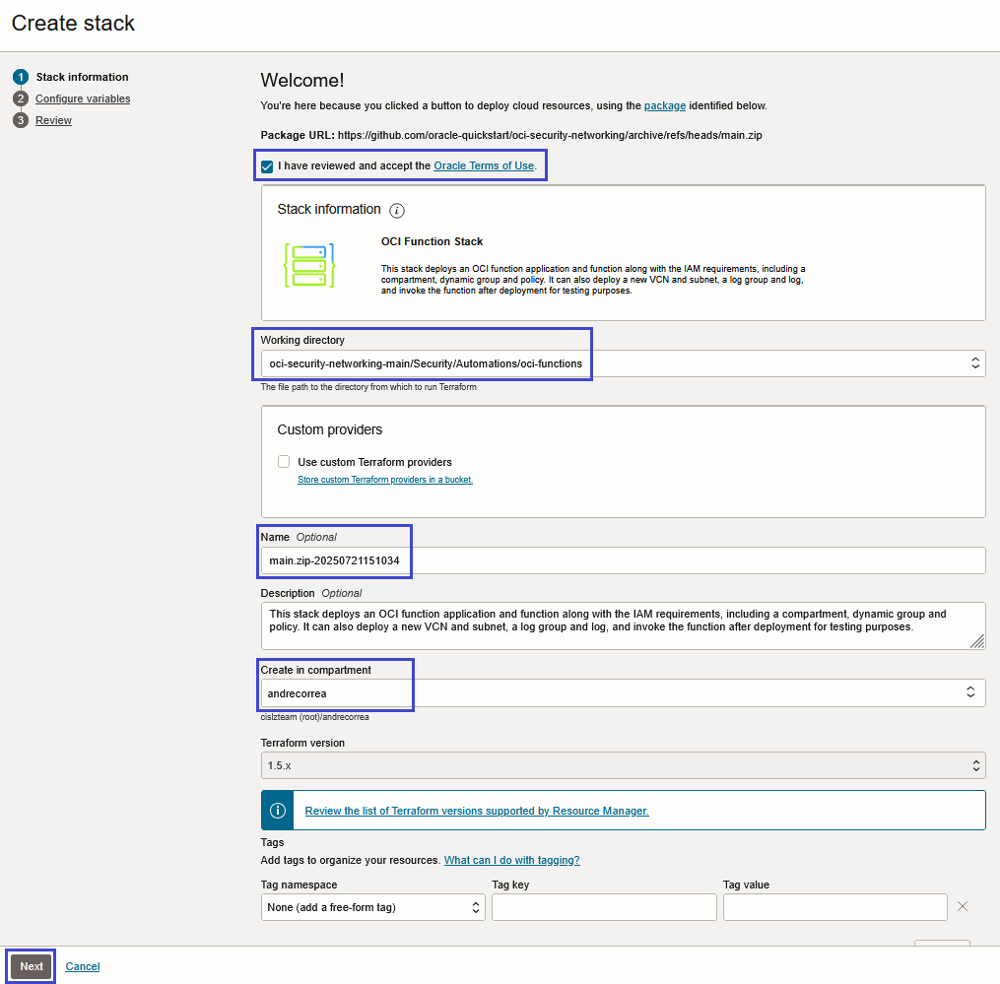

# Introduction

This Terraform configuration deploys an [OCI Function](https://docs.oracle.com/en-us/iaas/Content/Functions/Concepts/functionsoverview.htm) that runs the OCI CIS report script with resource-principal authentication and writes report output to Object Storage, covering the following aspects:

1. **IAM compartment, dynamic group and policy**: the configuration supports deploying a new compartment, dynamic group and policy, as well as deploying the function in an existing compartment with no dynamic group and policy. This enables the configuration to be executed for deploying functions in different regions leveraging the same IAM definitions. 
2. **Networking**: the configuration supports deploying the required network infrastructure for the function, including a VCN, a private subnet, routing to Service Gateway and NAT Gateway and the corresponding security rules in a security list. Alternatively, it supports using an existing subnet for the Function. In this case, the subnet must be already satisfy the function connectivity requirements.
3. **Function image build and upload to OCI Registry**: the configuration creates the OCIR repository, builds the function image using the *fn* CLI, tags and pushes it to OCI Registry using the configured container CLI.
4. **Function Application and Function resources**: the configuration deploys the function application and the function resources, linking the function resource to the function image in OCI Registry.
5. **Report output**: the configuration can create a private Object Storage bucket and grants the function scoped object-write access.
6. **Logging**: the configuration optionally deploys a log group and a log for the Function. This is essential for debugging purposes.
7. **Resource Scheduler automation**: the configuration can create an OCI Resource Scheduler schedule that runs the Function automatically on an ICAL or CRON cadence using the existing function dynamic group and policy.
8. **HTML report email notification**: the configuration can create a Notifications topic and email subscription; after each CIS run creates `cis_summary_report.html`, the function emails a 4-hour `ObjectRead` pre-authenticated request link for that exact object.
9. **Function testing**: the configuration optionally invokes the function for testing. Because a CIS scan can run for a while, post-deploy invocation is disabled by default.

# Requirements

## IAM Permissions

The following permissions are required for the executing user (the user that deploys the Terraform configuration):

1. For deploying the configuration with the IAM resources:

    - Allow group \<group\> to read tenancies in tenancy
    - Allow group \<group\> to manage dynamic-groups in tenancy
    - Allow group \<group\> to manage policies in tenancy
    - Allow group \<group\> to manage compartments in compartment \<function-parent-compartment\>

2. For deploying the configuration with the networking infrastructure:

    - Allow group \<group\> to manage virtual-network-family in \<function-compartment\>

3. For deploying the configuration with logging:

    - Allow group \<group\> to manage logging-family in \<function-compartment\>

4. For deploying the function application and the function:

    - Allow group \<group\> to manage functions-family in \<function-compartment\>
    - Allow group \<group\> to manage repos in tenancy
    - Allow group \<group\> to manage buckets in \<output-bucket-compartment\>
    - Allow group \<group\> to manage ons-family in \<function-compartment\>
    - Allow group \<group\> to manage cloudevents-rules in \<output-bucket-compartment\>
    - Allow group \<group\> to manage resource-schedule-family in tenancy

5. When `use_ocir_vault_credentials` is true, the principal that runs Terraform and the OCI CLI secret lookup needs read access to the two OCI Registry credential secret bundles before the image login step runs. The minimal policy is:

    ```text
    Allow group <deployment-group> to read secret-bundles in compartment id <secret-compartment-ocid> where any {target.secret.id = '<username-secret-ocid>', target.secret.id = '<auth-token-secret-ocid>'}
    ```

    If the deployment runner uses a resource principal, use a dynamic group instead:

    ```text
    Allow dynamic-group <deployment-dynamic-group> to read secret-bundles in compartment id <secret-compartment-ocid> where any {target.secret.id = '<username-secret-ocid>', target.secret.id = '<auth-token-secret-ocid>'}
    ```

    The stack can optionally create this policy with `create_ocir_vault_deployment_policy`, but the applying principal must already be able to manage policies in the chosen policy compartment. Otherwise, create this prerequisite policy before the first apply.

6. For deploying from OCI Cloud Shell:

    - Allow group \<group\> to use cloud-shell in tenancy
    - Allow group \<group\> to use cloud-shell-public-network in tenancy

Or deploy, if you can, as an almighty administrator user.

## OCI Registry Service Account

Before executing this stack, identify or create the OCI user that will own the OCI Registry image push credentials for the function. This is commonly a service account user used for this scheduled automation.

### Vault-backed credential prerequisites

The recommended deployment path stores the OCI Registry username and auth token in OCI Vault/Secret Management before the first Terraform apply.

- Create two secrets in OCI Vault/Secret Management: one for the OCI Registry username and one for the OCI Registry auth token.
- Copy the OCID from each Secret resource's details page. Both values must be different and begin with `ocid1.vaultsecret.`. An OCID beginning with `ocid1.vault.` identifies the Vault, while `ocid1.key.` identifies the encryption key; neither can be used with `oci secrets secret-bundle get`.
- The username secret value must contain the same value you would otherwise enter as `ocir_username`. Do not include the tenancy namespace; the stack prefixes the Object Storage namespace when it logs in to OCI Registry.
- The auth token secret value must be an OCI auth token generated for that same OCI user. Do not use the user's Console password.
- Set `use_ocir_vault_credentials` to true, provide `ocir_username_secret_ocid` and `ocir_auth_token_secret_ocid`, and set `ocir_vault_secret_compartment_ocid` if the secrets are not in the function compartment.
- The deployment environment must have `oci`, `python3`, and the configured OCI CLI authentication needed to call `oci secrets secret-bundle get` for both secret OCIDs.
- The deployment principal must have the minimal `read secret-bundles` policy shown in the IAM Permissions section. This is separate from the function runtime dynamic group policy because the secret lookup happens during the image build and push step.
- The secret OCIDs and the secret compartment OCID can appear in Terraform state. The secret payload values are fetched by `local-exec` and are not read through Terraform data sources or stored as Terraform output.

The OCI policy reference lists `secret-bundles` as the resource type used for `GetSecretBundle`, and the OCI CLI `secret-bundle get` command reads a secret bundle by secret OCID. See Oracle's [Vault, Key Management, and Secret Management policy reference](https://docs.oracle.com/en-us/iaas/Content/Identity/Reference/keypolicyreference.htm) and [OCI CLI secret-bundle get documentation](https://docs.oracle.com/en-us/iaas/tools/oci-cli/latest/oci_cli_docs/cmdref/secrets/secret-bundle/get.html).

Before applying the stack, verify each OCID without printing the secret contents:

```bash
oci secrets secret-bundle get --secret-id "<username-secret-ocid>" --query 'data."secret-id"' --raw-output
oci secrets secret-bundle get --secret-id "<auth-token-secret-ocid>" --query 'data."secret-id"' --raw-output
```

Each command should return the same `ocid1.vaultsecret...` value that was supplied. A `secretId has an invalid type` error means a Vault or encryption key OCID was entered instead of a Secret resource OCID.

### OCI Registry push permissions

The OCI Registry user whose username and auth token are stored in Vault must have permission to push the function image to OCI Registry. At minimum, grant repository permissions for the target repository compartment, for example:

```text
Allow group <ocir-service-account-group> to manage repos in compartment id <repository-compartment-ocid>
```

Use `manage repos in tenancy` only when a broader tenancy-wide repository grant is acceptable.

Direct input with `ocir_username` and `ocir_password` is still supported by setting `use_ocir_vault_credentials` to false, but Vault-backed credentials are preferred when avoiding credential exposure in Terraform variables and state is required.

## Function Source Code

The function source code must be available for the configuration, properly structured according to *fn* requirements. For instance, a Python *fn* function would be comprised of the following files:

- **func.py**: the function source code in Python. It wraps the CIS report script for OCI Functions, parses function config safely, and returns JSON invocation status.
- **func.yaml**: minimum amount of information required to build and run the function, including the function name, version and entrypoint. The name and version attributes are used by the Terraform automation. In fact, the version attribute is the only value you change to trigger the function code (re)deployment into OCI Registry.
- **requirements.txt**: defines the external packages and dependencies required by the function.
- **cis_reports.py**: optional vendored OCI CIS report script used only when `script_version` is set to `bundled`. Otherwise the function downloads the selected script version at runtime.

## Environment

The machine where Terraform runs must have *docker* or a compatible container CLI, such as *podman*, available. The container CLI builds the linux/arm64 image, tags it, and pushes it to OCI Registry.

**Tip:** use [OCI Cloud Shell](https://docs.oracle.com/en-us/iaas/Content/API/Concepts/cloudshellintro.htm) as the deployment platform. It has *terraform* and *podman* already available.

# Deployment

## With OCI Resource Manager Service

This Terraform package can be fully executed from OCI Resource Manager. Upload this directory as a stack zip, configure the variables in the Resource Manager UI, then run the apply job from Resource Manager. Terraform CLI is only needed if you prefer to deploy outside Resource Manager.

In the **Create stack/Stack information** page:

1. Check the box "I have reviewed and accept the Oracle Terms of Use".
2. Make sure to select **oci-security-networking-main/Security/Automations/oci-functions** option in **Working directory** field.
3. Give the stack a name in **Name** field.
4. Select a compartment where to save the stack in **Create in compartment** field.
5. Click **Next** button at the bottom of the page.



Configure the variables per your requirements in the **Create stack/Configure variables** page. Refer to *Configuration Variables* section below for guidance.

## With Terraform CLI

For deploying with Terraform CLI, use the [provided template](./template/). Rename *main.tf.template* to *main.tf*, provide your input parameters in it and run *terraform plan/apply*. Make sure *docker/podman* is available. As mentioned, you can use OCI Cloud Shell to deploy.

**Note:** Cloud Shell terminal runs terraform as the Console connected user. Therefore, input variables *user_ocid*, *fingerprint*, *private_key_path* and *private_key_password* are ignored by Cloud Shell.

# Configuration Variables

Following sections describe the available variables in the configuration: 

## General

- **tenancy_ocid**: the tenancy OCID.
- **user_ocid**: the user OCID that deploys the configuration. This is ignored in OCI Cloud Shell.
- **fingerprint**: the user API key fingerprint. This is ignored in OCI Cloud Shell.
- **private_key_path**: the path to the user API private key. This is ignored in OCI Cloud Shell.
- **private_key_password** the user API private key password, if any. This is ignored in OCI Cloud Shell.
- **region**: the region name where the function, network and logging are deployed. The IAM resources, when requested, are always transparently deployed in the home region. 
    - **Tip**: When deploying the function into multiple regions, set *deploy_compartment* and *deploy_dyn_group_and_policy* variables to false in all deployments, except the first.

## IAM Compartment

- **deploy_compartment**: if true, a compartment is deployed for the function. If false, a compartment must be provided in the variable *existing_compartment_ocid*. 
    - **Tip**: Set to false when using the configuration to deploy the function only. 
- **existing_compartment_ocid**: the existing compartment OCID where the function is deployed.
- **new_compartment_parent_ocid**: the existing compartment OCID chosen as the parent of the new function compartment. Only applicable when *deploy_compartment* is true.
- **new_compartment_name** the new compartment name. Only applicable when *deploy_compartment* is true.

## IAM Dynamic Group and Policy

- **deploy_dyn_group_and_policy**: if true, a dynamic group and a policy are deployed for the function. Otherwise, it is assumed the required dynamic group and policy have already been created. 
    - **Tip**: Set to false when using the configuration to deploy the function only.
- **dynamic_group_name**: the dynamic group name used to execute the function. The function executes under the identity of this dynamic group based on the permissions assigned to it.
- **policy_name**: the policy name.
- **provide_short_policy_statements**: if true and *policy_statements_short* is not empty, short statements are expanded in the function compartment. If short statements are empty, the stack falls back to the full CIS policy statements.
- **policy_statements_short**: policy statements in "short" form, provided as a comma-separated list of *\<verb\> \<resource\>* pairs. The CIS report function uses tenancy-scoped full statements by default, so short statements are best reserved for custom, compartment-scoped deployments.
- **policy_statements_full** policy statements in full format. Defaults to the tenancy read permissions needed by the CIS report script. Use the literal placeholder `${dynamic_group_name}` when you want Terraform to substitute the dynamic group created by this stack. Example:
```
allow dynamic-group <dynamic-group-name-either-created-or-being-created-in-stack> to inspect all-resources in tenancy
allow dynamic-group <dynamic-group-name-either-created-or-being-created-in-stack> to read instances in tenancy
allow dynamic-group <dynamic-group-name-either-created-or-being-created-in-stack> to read load-balancers in tenancy
allow dynamic-group <dynamic-group-name-either-created-or-being-created-in-stack> to read buckets in tenancy
allow dynamic-group <dynamic-group-name-either-created-or-being-created-in-stack> to read nat-gateways in tenancy
allow dynamic-group <dynamic-group-name-either-created-or-being-created-in-stack> to read public-ips in tenancy
allow dynamic-group <dynamic-group-name-either-created-or-being-created-in-stack> to read file-family in tenancy
allow dynamic-group <dynamic-group-name-either-created-or-being-created-in-stack> to read instance-configurations in tenancy
allow dynamic-group <dynamic-group-name-either-created-or-being-created-in-stack> to read network-security-groups in tenancy
allow dynamic-group <dynamic-group-name-either-created-or-being-created-in-stack> to read resource-availability in tenancy
```
- **policy_compartment_ocid** the compartment OCID where the policy is attached. If not provided and full policy statements are used, the policy is created in the tenancy.
    - **Tip**: use this to define the policy compartment when the policy statements refer to different compartments.


## Function Networking

- **deploy_infra_for_subnet**: if true, deploys required infrastructure for the function subnet, including a VCN, the Subnet itself (**subnet is private**), a Security List, a Route Table, a Service Gateway and a NAT Gateway. When false, it is assumed that the existing subnet is already properly configured for connecting to Oracle Services Network or to the Internet (if required by the function).
- **new_vcn_compartment_ocid**: the compartment OCID for the new VCN. Only applicable when *deploy_infra_for_subnet* is true.
- **new_vcn_name**: the new VCN name. Only applicable when *deploy_infra_for_subnet* is true.
- **new_vcn_cidr**: the new VCN CIDR block. 
- **new_subnet_name**: the new subnet name. Only applicable when *deploy_infra_for_subnet* is true.
- **new_subnet_cidr**: the new Subnet CIDR. Only applicable when *deploy_infra_for_subnet* is true.
- **existing_vcn_compartment_ocid**: the compartment OCID for the existing VCN. Only applicable when *deploy_infra_for_subnet* is false.
- **existing_vcn_ocid**: the existing VCN OCID. Only applicable when *deploy_infra_for_subnet* is false.
- **existing_subnet_ocid**: the existing subnet OCID. Only applicable when *deploy_infra_for_subnet* is false.

## Function Image, Function Application and Function Resources

- **use_ocir_vault_credentials**: when true, the image login step reads the OCI Registry username and auth token from OCI Vault secrets at apply time. This avoids reading secret payloads through Terraform data sources and avoids storing the credential values in Terraform state.
- **ocir_username_secret_ocid** and **ocir_auth_token_secret_ocid**: Vault secret OCIDs for the OCI Registry username and auth token. The deployment principal must be able to read the secret bundle values.
- **ocir_vault_secret_compartment_ocid**: compartment OCID that contains both OCI Registry credential secrets. Leave blank when the secrets are in the function compartment. This value is used for the minimal Vault read policy output and optional managed policy.
- **create_ocir_vault_deployment_policy**: advanced option to create the narrow deployment-time `read secret-bundles` policy from this stack. Use only when the applying principal can manage policies in the chosen policy compartment.
- **ocir_vault_deployment_principal_type** and **ocir_vault_deployment_principal_name**: group or dynamic group that runs Terraform and the OCI CLI secret lookup when the optional Vault deployment policy is created.
- **ocir_vault_deployment_policy_name** and **ocir_vault_deployment_policy_compartment_ocid**: optional policy name and placement for the stack-created Vault deployment policy. Leave the compartment blank to create the policy in the Vault secret compartment.
- **ocir_username** and **ocir_password**: direct fallback values used only when *use_ocir_vault_credentials* is false. Direct input is convenient for local testing but is not recommended when avoiding credential exposure in state is required.
- **repository_name**: the repository prefix in OCI Registry. The final image repository is `<repository_name>/<func.yaml name>`.
- **repository_compartment_ocid**: compartment OCID for the OCIR repository. Defaults to the function compartment.
- **create_repository**: if true, Terraform creates the OCIR repository before pushing the image.
- **create_faas_ocir_pull_policy**: if true, creates the policy statement that lets OCI Functions read images from the OCI Registry repository compartment.
- **application_shape**: OCI Functions application shape, either `GENERIC_ARM` or `GENERIC_X86`. This stack builds linux/arm64 images, so `GENERIC_ARM` is the default.
- **container_platform**: container build platform. Defaults to `linux/arm64` for `GENERIC_ARM`.
- **force_arm_application_shape**: when true, the stack uses `GENERIC_ARM` even if an older Resource Manager run retained `GENERIC_X86`.
- **force_x86_application_shape**: deprecated compatibility variable; it is no longer used.
- **function_working_dir**: the function working directory, where the function artifacts are available. Defaults to `./src/cis-reports`.

**Tip 1**: The function application and function resources are named after the *name* attribute within *func.yaml*, available in *function_working_dir*.

**Tip 2**: The image build is triggered by both the *version* attribute within *func.yaml* and a hash of all files in *function_working_dir*.

## CIS Report Runtime

These values appear in the Resource Manager **Function Runtime** section. They control what the CIS report function does each time it runs, either from a manual invocation or from Resource Scheduler.

- **deploy_output_bucket**: if true, creates a private Object Storage bucket for report output.
- **output_bucket_name**: existing or new bucket name. If not provided, Terraform derives one from the function name and region key.
- **output_bucket_compartment_ocid**: compartment for the output bucket. Defaults to the function compartment.
- **deploy_output_bucket_policy**: if true, grants the function dynamic group scoped access to read the output bucket and manage objects in it.
- **regions_to_run_in**: comma-separated OCI region names to scan, such as `us-ashburn-1,us-phoenix-1`. Leave empty to scan all subscribed regions.
    - **Tip**: In tenancies subscribed to many regions, specify only the regions you need. This reduces total scan time and can help the function complete without timeout or resource issues.
- **report_level**: CIS recommendation level, either `1` or `2`.
- **report_raw_data**, **report_summary_json**, **redact_output**: runtime switches passed into the function config.
- **script_version**: CIS report script version to run.
    - Default is `latest`, which runs the current upstream script from the main branch.
    - Use `bundled` only if you add `cis_reports.py` to the function source before building the image. If no bundled script is present, the function falls back to `latest`.
    - Use a release tag, such as `v3.0.1`, to run a specific published version. These tags come from the [oci-cis-landingzone-quickstart](https://github.com/oci-landing-zones/oci-cis-landingzone-quickstart/tree/v3.2.0/scripts) repository, where the CIS report script is maintained under the `scripts` directory.
- **experimental_options_note**: visible Resource Manager note that warns about the experimental runtime options.
- **report_obp** and **report_all_resources**: experimental switches shown inside the Resource Manager **Function Runtime** section as **Generate OCI Best Practice Checks** and **Query All Resources**. Depending on tenancy size, these options can significantly increase runtime and may cause the function to timeout or fail because OCI Functions have a short execution life. You can try these options, but if the function fails or times out, rerun with one or both options unchecked.
- **function_parameters_json_string**: optional JSON object for advanced overrides.
- **function_timeout_in_seconds**: function execution timeout. OCI Functions rejects normal invocation timeout values above `300` seconds, so this defaults to `300`.
- **detached_mode_timeout_in_seconds**: timeout used for detached, long-running function invocations.

## HTML Report Notification

- **enable_html_report_notifications**: if true, creates a Notifications topic and email subscription. After the CIS function creates `cis_summary_report.html`, it confirms the object exists and publishes the report-ready email.
- **notification_email**: email address that receives the report details. The recipient must confirm the OCI Notifications subscription before emails are delivered.
- **html_notification_topic_name**: advanced topic name override.

When this is enabled, the function first confirms the generated `cis_summary_report.html` exists in Object Storage, then creates an `ObjectRead` pre-authenticated request for that exact object. The PAR expires after 4 hours. The email contains the bucket name, object name, event time, compartment, namespace, region, the PAR link, the expiration time, and a note that the report must be manually retrieved from Object Storage if the link is not used within 4 hours of the email being sent. If PAR creation fails, the function still publishes the notification with the PAR error so delivery problems are visible in email and function logs.

Terraform creates the Notifications topic and email subscription before creating the function resource. This means the first function execution after initial deployment can publish the report-ready email. OCI Notifications still requires the recipient to confirm the subscription email before messages are delivered to that inbox.

## Resource Scheduler

- **enable_resource_scheduler**: if true, creates an OCI Resource Scheduler schedule that runs the CIS report function automatically.
- **resource_scheduler_display_name** and **resource_scheduler_description**: schedule display metadata.
- **resource_scheduler_recurrence_type**: `ICAL` or `CRON`. `ICAL` uses the guided schedule fields by default.
- **resource_scheduler_frequency**: guided ICAL `FREQ` dropdown. Supported values are `SECONDLY`, `MINUTELY`, `HOURLY`, `DAILY`, `WEEKLY`, `MONTHLY`, and `YEARLY`.
- **resource_scheduler_interval**: guided ICAL `INTERVAL` value. For example, `WEEKLY` with interval `2` runs every two weeks.
- **resource_scheduler_recurrence_details**: advanced override. Leave empty to build ICAL from frequency and interval. For CRON, enter a cron expression or use the default daily midnight fallback.
- **resource_scheduler_state**: `ACTIVE` starts the schedule, `INACTIVE` creates it paused.
- **resource_scheduler_start_time_mode**: choose whether to omit an explicit schedule start time or build one from selected UTC date/time dropdowns.
- **resource_scheduler_start_year**, **resource_scheduler_start_month**, **resource_scheduler_start_day**, **resource_scheduler_start_hour**, **resource_scheduler_start_minute**: UTC date/time dropdown values used when *resource_scheduler_start_time_mode* is `SELECTED_DATE_TIME`.
- **resource_scheduler_end_time_mode**: choose whether the schedule keeps running or stops at a selected UTC date/time.
- **resource_scheduler_end_year**, **resource_scheduler_end_month**, **resource_scheduler_end_day**, **resource_scheduler_end_hour**, **resource_scheduler_end_minute**: UTC date/time dropdown values used when *resource_scheduler_end_time_mode* is `SELECTED_DATE_TIME`.

When scheduling is enabled, this stack updates the existing function dynamic group to match both the function and `resourceschedule` resources, then adds `manage resource-schedule-family in tenancy` and `manage functions-family in tenancy` to the same dynamic group policy. This keeps scheduling inside the current IAM code path instead of creating a second dynamic group.

## Logging

- **enable_function_logging**: if true, a log group and a log resource are created for the function in the same compartment as the function. Use it for debugging the function.

## Testing the Function

- **invoke_function**: if true, the function is invoked after deployment only when **enable_post_deploy_invoke** is also true. This two-switch guard prevents retained Resource Manager values from invoking the long-running CIS report during apply.
- **enable_post_deploy_invoke**: hidden safety switch that defaults to false.
- **invoke_function_fn_invoke_type**: defaults to `detached`.
- **invoke_function_body**: optional JSON payload for test invocation.

## Outputs

After apply, Resource Manager groups the stack outputs by area:

- **IAM**: `functions_compartment_name`, `functions_compartment_id`, `functions_dyn_group_name`, `functions_dyn_group_id`, `functions_policy_name`, and `functions_policy_id`.
- **Networking**: `vcn_name`, `vcn_id`, `private_subnet_name`, and `private_subnet_id`.
- **Function Configuration**: `function_application_name`, `function_application_id`, `function_name`, `function_id`, `function_invoke_endpoint`, `function_image`, `function_repository_name`, `output_bucket_name`, `output_bucket_compartment_id`, `function_log_group_name`, `function_log_group_id`, `function_log_name`, and `function_log_id`.
- **Function Runtime**: `function_invocation_test_output`, when test invocation is enabled.
- **Resource Scheduler**: `resource_scheduler_schedule_name`, `resource_scheduler_schedule_id`, and `resource_scheduler_schedule_next_run`.
- **HTML Report Notification**: `html_notification_topic_name`, `html_notification_topic_id`, and `html_notification_subscription_id`.


# Known Issues

1. For pushing the function image as a user not in the Default Identity Domain, include the identity domain in the OCI Registry username value, for example `<identity-domain>/<user-name>`. Use that same value in the username Vault secret when `use_ocir_vault_credentials` is true. Do not include the tenancy namespace in the secret value because this stack prefixes the namespace during `docker login`.

2. if you receive the following error when deploying from Mac OS, ensure you have *docker-credential-helper* installed.
```
exit status 1. Output: Error │ saving credentials: error storing credentials - err: exec: "docker-credential-osxkeychain": executable file not found in │ $PATH, out: 
```

# About the Authors

Marcus D'Andrea and Josh Hammer are members of the Field CISO team and are the authors and maintainers of this stack.

# Related OCI Security Resources

The following public repositories contain Terraform modules and supporting resources that help customers align OCI implementations with the CIS (Center for Internet Security) OCI Foundations Benchmark:
- [OCI Core Landing Zone](https://github.com/oci-landing-zones/terraform-oci-core-landingzone/)
- [OCI Landing Zone for Service Providers](https://github.com/oci-landing-zones/oci-landing-zone-operating-entities/tree/master/blueprints/multi-oe/saas/design)
- [Identity & Access Management](https://github.com/oci-landing-zones/terraform-oci-modules-iam)
- [Networking](https://github.com/oci-landing-zones/terraform-oci-modules-networking)
- [Governance](https://github.com/oci-landing-zones/terraform-oci-modules-governance)
- [Security](https://github.com/oci-landing-zones/terraform-oci-modules-security)
- [Observability & Monitoring](https://github.com/oci-landing-zones/terraform-oci-modules-observability)
- [Secure Workloads](https://github.com/oci-landing-zones/terraform-oci-modules-workloads)
