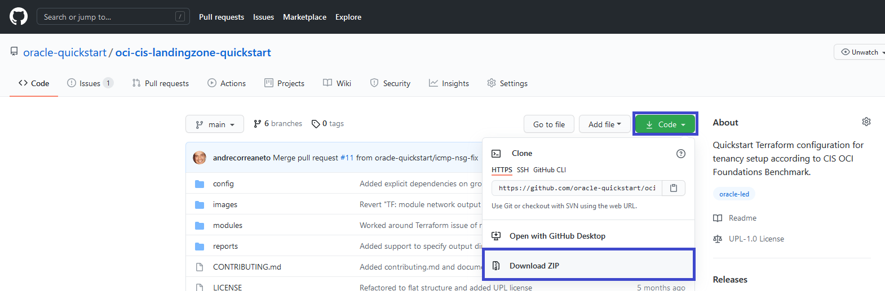
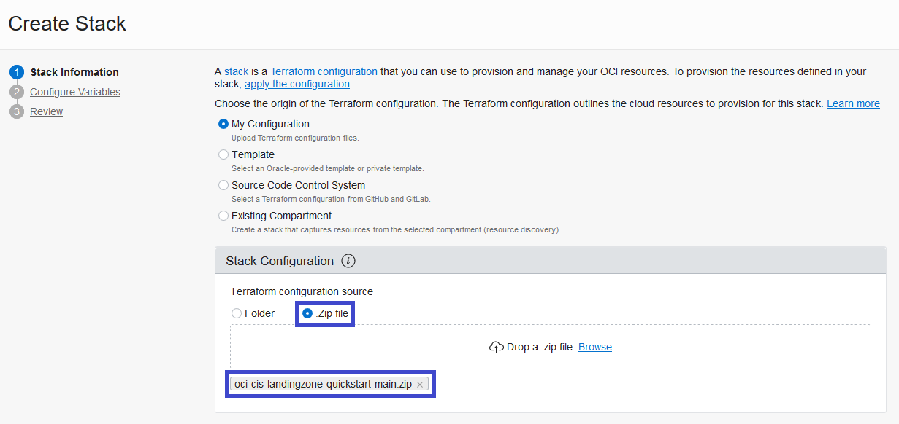
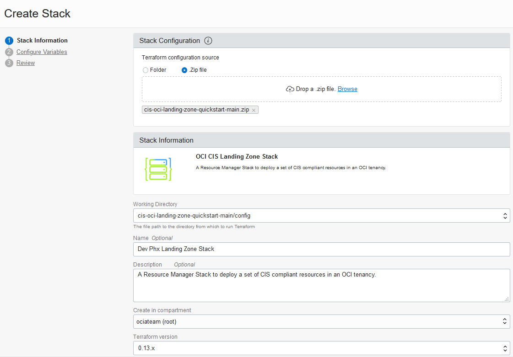
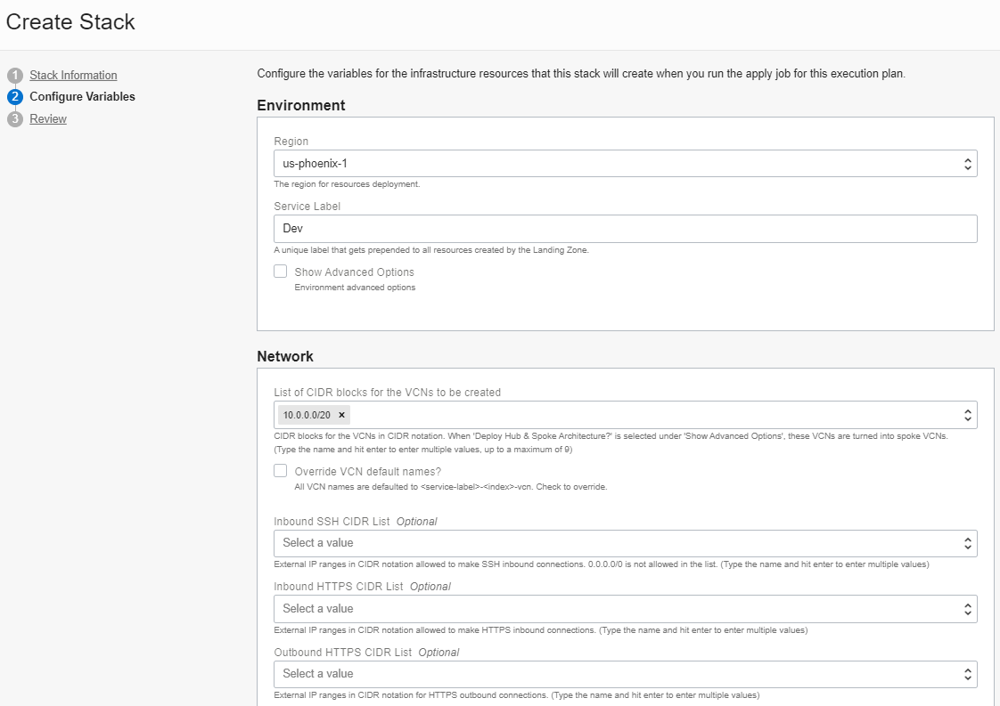
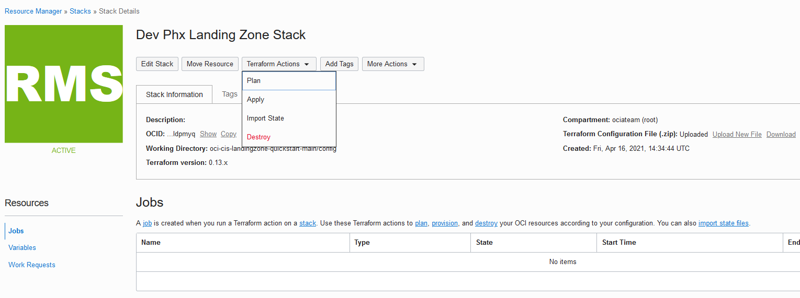
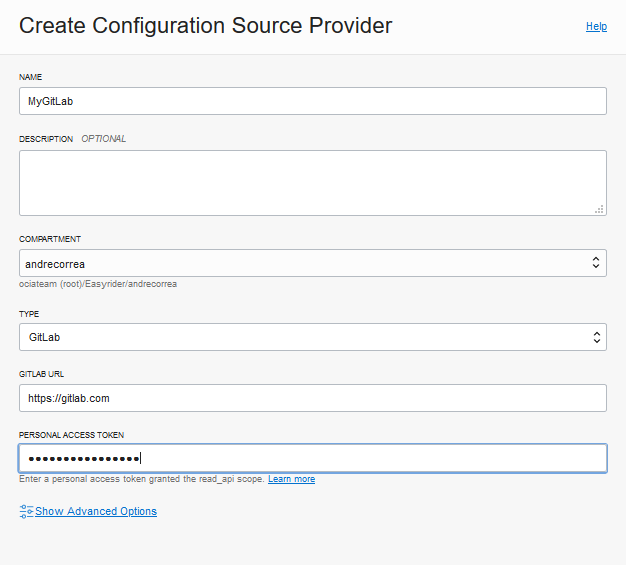
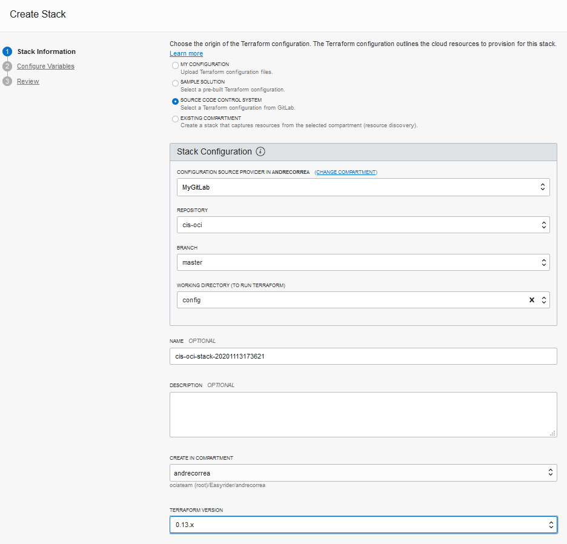

## Landing Zone Modules
The Landing Zone terraform is made of two root modules and some children modules. The root modules are under the *config* and *pre-config* folders, while the children modules are under the *modules* folder. Both *config* and *pre-config* use the children modules for resource creation.

The *config* module is responsible for provisioning the Landing Zone resources. It can be executed by a tenancy administrator or a non tenancy administrator. When executed by a non tenancy administrator, the *pre-config* module must be previously executed by a tenancy administrator to create Landing Zone required resources in the root compartment, like compartments, policies and groups. If the *config* module is being executed by a tenancy administrator, the *pre-config* module does not need to be executed, as the *config* module will be able to create all required resources in the root compartment.

Within the config folder, the Terraform files are named after the use cases they implement as described in CIS OCI Security Foundation Benchmark document. Each file prefix implements/supports use cases in the corresponding section in that document.

The variables in each root module are described in [Config Module Input Variables](VARIABLES.md#config_input_variables) and [Pre-Config Module Input Variables](VARIABLES.md#pre_config_input_variables).

## How to Execute the Code Using Terraform CLI
Within the root module folder (*config* or *pre-config*), provide variable values in the existing *quickstart-input.tfvars* file.

Next, execute:

	terraform init
	terraform plan -var-file="quickstart-input.tfvars" -out plan.out
	terraform apply plan.out

Alternatively, after providing the variable values in *quickstart-input.tfvars*, rename it to *terraform.tfvars* and execute:	

	terraform init
	terraform plan -out plan.out
	terraform apply plan.out

## How to Execute the Code Using OCI Resource Manager
There are a few different ways of running Terraform code in OCI Resource Manager (ORM). Here we describe two of them: 
- creating an ORM stack by uploading a zip file to ORM;
- creating an ORM stack by integrating with GitLab. 

A stack is the ORM term for a Terraform configuration. Regardless of the chosen method, **an ORM stack must not contain any state file or *.terraform* folder in Terraform working folder (the *config* folder in this setup)**.

For more ORM information, please see https://docs.cloud.oracle.com/en-us/iaas/Content/ResourceManager/Concepts/resourcemanager.htm.

### Stack from Zip File
Download this repository as a .zip file, by expanding the Code button in the repository home page and choosing the "Download ZIP" option.

Using OCI Console, navigate to Resource Manager service page and create a stack based on a .zip file. In the **Create Stack** page:
1. Select **My Configuration** option as the origin of the Terraform configuration.
2. In the **Stack Configuration** area, select the **.Zip file** option and upload the .zip file downloaded in the previous step.

Alternatively, you can simply click the button below to supply the zip file directly from GitHub without downloading it:

*If you are logged in your OCI tenancy, the button will take you directly to OCI Resource Manager where you can proceed to deploy. If you are not logged, the button takes you to Oracle Cloud initial page where you must enter your tenancy name and log in to OCI.*

3. In **Working Directory**, make sure the config folder is selected.
4. In **Name**, give the stack a name or accept the default.
5. In **Create in Compartment** dropdown, select the compartment to store the Stack.
6. In **Terraform Version** dropdown, **make sure to select 0.13.x at least. Lower Terraform versions are not supported**.

Following the Stack creation wizard, the subsequent step prompts for variables values. Please see the [Config Module Input Variables](VARIABLES.md#config_input_variables) for the variables description. 

Some variables, as the one highlighted in the screen capture below, are defaulted in the configuration's variables.tf file and should be reviewed and reassigned values as needed.

Once variable values are provided, click Next, review stack values and create the stack. 

In the Stack page use the appropriate buttons to plan/apply/destroy your stack.

### Stack from GitLab
**Note:** ORM requires the GitLab instance accessible over the Internet.

Using OCI Console, navigate to Resource Manager service page and create a connection to your GitLab instance.

In the **Configuration Source Providers** page, provide the required connection details to your GitLab, including the **GitLab URL** and your GitLab **Personal Access Token**.

Next, create a stack based on a source code control system. Using OCI Console, in the **Create Stack** page:
1. Select **Source Code Control System** option as the origin of the Terraform configuration.
2. In the **Stack Configuration** area, select the configured GitLab repository details:
	- The configured GitLab provider
	- The repository name
	- The repository branch
	- For the **Working Directory**, select the 'config' folder.	 
3. In **Name**, give the stack a name or accept the default.
4. In **Create in Compartment** dropdown, select the compartment to store the stack.
5. In **Terraform Version** dropdown, **make sure to select 0.13.x at least. Lower Terraform versions are not supported**.

Once the stack is created, navigate to the stack page and use the **Terraform Actions** button to plan/apply/destroy your configuration.

## How to Customize the Terraform Configuration
The Terraform code has two root modules and various children modules. The root modules are *pre-config* and *config* folders. They make calls to the children modules for resource creation. The children modules are defined under the *modules* folder. As a rule of thumb, the children modules iterate through maps of objects created by the root modules. We encourage customizations to follow this pattern as it enables consistent code reuse.

The file names in the root modules are self-explanatory. They are prefixed with a reference to the corresponding section name in CIS Benchmark document, followed by the OCI service or resource that they implement. For instance, iam_compartments.tf references the IAM section and implements compartments, net_vcn.tf references to the Networking section and implements VCN. mon_notifications.tf references the Monitoring section and implements notifications.

The root modules also have a locals.tf, where most of local variables are defined (note that some are defined directly in the files that use them). Local variables are used for processing input variables and creating the required inputs for the children modules. For example, many resource names and object maps are created as local variables. 

Small customizations, like changing resource names, changing a network security group or even adding a new subnet to a VCN can be achieved by changing the local variables.

Large customizations, like changing the compartments structure, are more involved and will likely require new logic in the root module. In these cases, one suggestion is creating a brand new root module while reusing the existing children modules.
