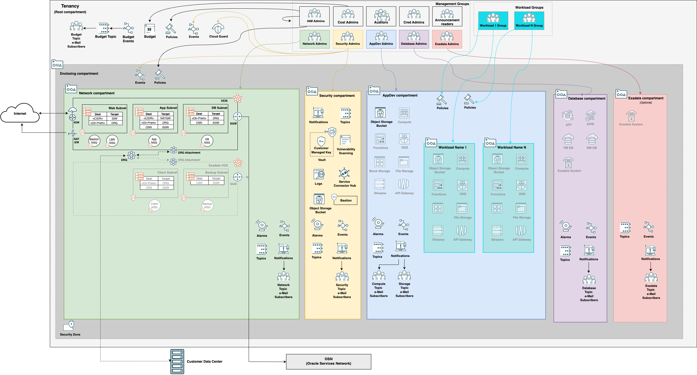
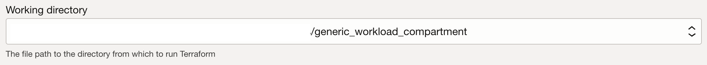
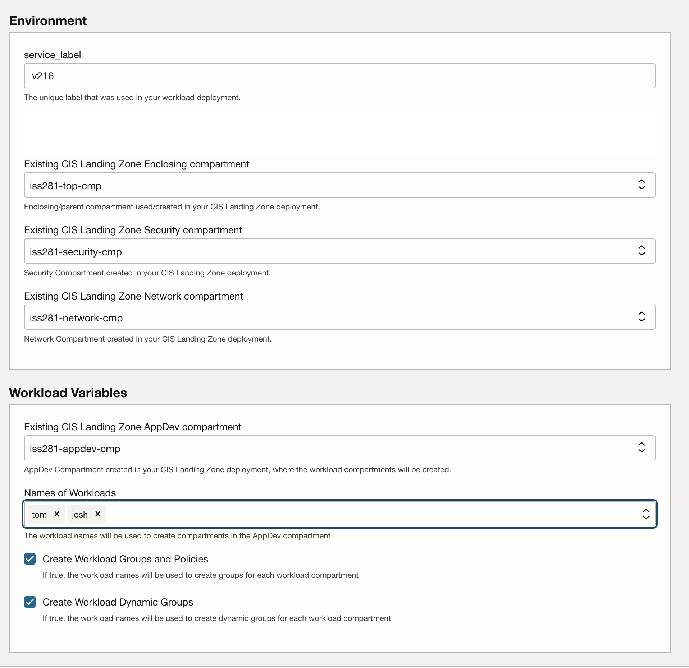

# CIS OCI Landing Zone Generic Workload

## Overview

The terraform code in this folder expands an existing CIS Landing Zone deployment.  It does this by adding one or more workload compartment(s) in the AppDev compartment and, optionally, the associated OCI IAM groups, dynamic groups, and OCI IAM policies to manage OCI resources in the workload compartment.

## Architecture 

## Variables
Variable Name | Description | Required | Default Value
--------------|-------------|----------|--------------
**region** | The tenancy region identifier where the Terraform should provision the resources. | Yes | None
**service_label** | A label used as a prefix for naming resources. | Yes | None
**enable_compartments_delete** | Determines whether compartments are physically deleted upon destroy. | No | false
**existing_lz_enclosing_compartment_ocid** | The enclosing/parent compartment utilized in the CIS Landing Zone deployment you want to add workload(s) to. | Yes | None
**existing_lz_security_compartment_ocid** | The existing Security compartment created by your CIS Landing Zone deployment you want to add workload(s) to. | Yes | None
**existing_lz_network_compartment_ocid** | The existing Network compartment created by your CIS Landing Zone deployment you want to add workload(s) to. | Yes | None
**existing_lz_appdev_compartment_ocid** | The existing AppDev compartment created by your CIS Landing Zone deployment where the workload compartments will be created. | Yes | None
**workload_names** | List of workload names, each workload will get a compartment created in the AppDev Compartment. The names must be unique within the AppDev compartment. | Yes | None
**create_workload_groups_and_policies** | If *true* an OCI IAM group and corresponding policies will be created to align to the workload compartment group created. | No | true
**create_workload_dynamic_groups_and_policies** | If *true* a dynamic group and corresponding policies will be created to align to the workload compartment group created. | No | true

## How to execute
### Via Resource Manager
1. 
*If you are logged into your OCI tenancy, the button will take you directly to OCI Resource Manager where you can proceed to deploy. If you are not logged, the button takes you to Oracle Cloud initial page where you must enter your tenancy name and login to OCI.*
1. Under **Working directory select the directory ending with *generic_workload_compartment*

1. Click Next
1. Enter the required variables

1. Click Next
1. Click Next
1. Click Apply

### Via Terraform CLI
1. Enter required variables from input.auto.tfvars
1. terraform init
1. terraform plan
1. terraforom apply

## CIS OCI Foundations Benchmark Modules Collection

This repository uses a module which is part of a broader collection of repositories containing modules that help customers align their OCI implementations with the CIS OCI Foundations Benchmark recommendations:
- [Identity & Access Management](https://github.com/oracle-quickstart/terraform-oci-cis-landing-zone-iam) - current repository
- [Networking](https://github.com/oracle-quickstart/terraform-oci-cis-landing-zone-networking)
- [Governance](https://github.com/oracle-quickstart/terraform-oci-cis-landing-zone-governance)
- [Security](https://github.com/oracle-quickstart/terraform-oci-cis-landing-zone-security)
- [Observability & Monitoring](https://github.com/oracle-quickstart/terraform-oci-cis-landing-zone-observability)

The modules in this collection are designed for flexibility, are straightforward to use, and enforce CIS OCI Foundations Benchmark recommendations when possible.

## Contributing
See [CONTRIBUTING.md](../../CONTRIBUTING.md).

## License
Copyright (c) 2023, Oracle and/or its affiliates.

Licensed under the Universal Permissive License v 1.0 as shown at https://oss.oracle.com/licenses/upl.

See [LICENSE](../../LICENSE) for more details.

## Known Issues
None.